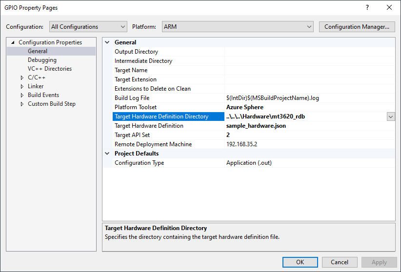

# Hardware definitions

Azure Sphere hardware is available from multiple vendors, and each vendor may expose features of the underlying chip in different ways. This folder contains definitions specific to individual hardware implementations.  

This README file describes how to [set the target hardware for a sample](#set-the-target-hardware-for-a-sample-application) and how to [extend the sample hardware definitions](#extend-the-sample-hardware-definitions) to support additional hardware features.

For additional information, see [Manage hardware dependencies](https://docs.microsoft.com/azure-sphere/app-development/manage-hardware-dependencies) in the online documentation. 

## Hardware

The samples support the following Azure Sphere hardware:

**Chips**

- [MediaTek MT3620](mt3620/)

**Modules**

- [AI-Link WF-M620-RSC1](ailink_wfm620rsc1/)
- [Avnet AES-MS-MT3620](avnet_aesms/)
- [USI USI-MT3620-BT-COMBO](usi_mt3620_bt_combo/)

**Development Kits**

- [MT3620 RDB](mt3620_rdb/)
- [Seeed MT3620 mini-dev board](seeed_mt3620_mdb/), which uses the AI-Link WF-M620-RSC1 module
- [Avnet MT3620 SK](avnet_mt3620_sk/), which uses the Avnet AES-MS-MT3620 module
- [USI MT3620 BT EVB](usi_mt3620_bt_evb/), which uses the USI USI-MT3620-BT-COMBO module

Each folder contains a JSON file and a header file that maps the board- or module-specific features to the underlying Azure Sphere chip.

The identifiers that the samples use for Azure Sphere features are abstracted into a file named sample_hardware.json, which maps them to peripherals in the board- and module-specific files.

## Set the target hardware for a sample application

To change the target hardware for a sample application, set the Project Properties to use the corresponding hardware definition from the samples repository.

1. Clone the [Azure Sphere samples repository](https://github.com/Azure/azure-sphere-samples) if you have not done so already.

   **Important:** Clone the entire samples repository, instead of downloading an individual sample. The target hardware definition files for all the samples are stored in the Hardware folder at the top level of the repository.

1. In Visual Studio, use **Project Properties** to set the Target Hardware Definition Directory for your hardware. The following example shows how to change the target for the GPIO sample:

   

   The Target Hardware Definition Directory identifies the folder that contains the hardware definition files for the target hardware.

     In the example, the ..\\..\\..\Hardware\mt3620_rdb folder contains the sample_hardware.json file, which maps identifiers in the Azure Sphere sample applications to peripherals on an MT3620 reference design board, such as the Seeed MT3620 Development Kit.

After you set the target hardware, the sample_hardware.h file for the selected hardware is added to your project. This file contains the SAMPLE_* definitions for the peripherals that the samples use. Visual Studio supports Intellisense in this context, so you can hover the cursor over an instance of a SAMPLE_*peripheral* identifier in the code to see additional hardware details.

The contents of the sample_hardware.json file is used during the build procedure to update the app_manifest.json file and in compiling and packaging the sample.
  
