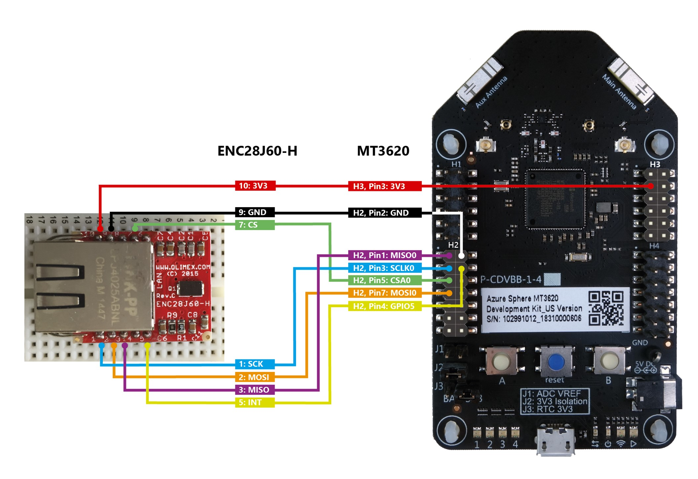
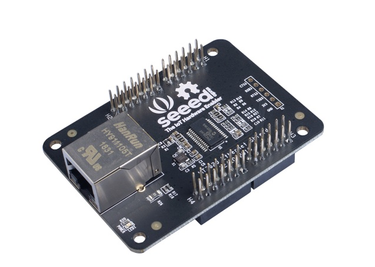

# Connecting Ethernet adapters to the MT3620 development board

This section provides instructions for connecting the following Ethernet boards and modules to the Azure Sphere MT3620 board.

- [Connection instructions for the Olimex ENC28J60-H development board](#Connection-instructions-for-the-Olimex-ENC28J60-H-development-board)
- [Connection instructions for the MT3620 Ethernet Shield](#Connection-instructions-for-the-MT3620-Ethernet-Shield)

***
## Connection instructions for the Olimex ENC28J60-H development board 
The [Olimex ENC28J60-H development board](https://www.olimex.com/Products/Modules/Ethernet/ENC28J60-H/) uses ISU port 0 (ISU0) to communicate with the MT3620 board via SPI.

 Use jumper wires to make the following connections between the ENC28J60-H board and the MT3620 board.

- ENC28J60-H 3V3: 10 to MT3620 3V3: Header 3 (upper right) Pin 3
- ENC28J60-H GND: 9 to MT3620 GND: Header 2 (lower left) Pin 2
- ENC28J60-H CS: 7 to MT3620 CSA0: Header 2 (lower left) Pin 1
- ENC28J60-H SCK: 1 to MT3620 SCLK0: Header 2 (lower left) Pin 3
- ENC28J60-H MOSI: 2 to MT3620 MOSI0: Header 2 (lower left) Pin 5
- ENC28J60-H MISO: 3 to MT3620 MISO0 RTS: Header 2 (lower left) Pin 7
- ENC28J60-H INT: 5 to MT3620 GPIO5: Header 2 (lower left) Pin 4

Refer to the following graphic for details.

***
## Connection instructions for the MT3620 Ethernet Shield 
The [MT3620 Ethernet Shield](https://www.seeedstudio.com/MT3620-Ethernet-Shield-v1-0-p-2917.html) uses the same board configuration package, and is internally wired to the same MT3620 development board GPIO pins as the Olimex ENC28J60-H Development Board.
It also uses the same ISU port (ISU0) to communicate with the MT3620 board via SPI. However, you connect the MT3620 Ethernet Shield directly to the interface headers on the MT3620 board.

