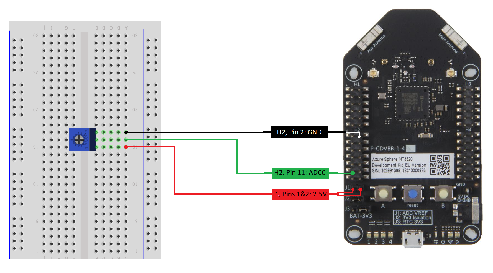

# Sample: ADC (High-level app)

This sample application demonstrates how to do analog-to-digital conversion on the MT3620 high-level core.

The application samples and displays the output from a simple variable voltage source once per second. It uses the MT3620 analog-to-digital converter (ADC) to sample the voltage.

The sample uses the following Azure Sphere libraries and requires [beta APIs](https://docs.microsoft.com/azure-sphere/app-development/use-beta).

| Library | Purpose |
|---------|---------|
| [adc](https://docs.microsoft.com/azure-sphere/reference/applibs-reference/applibs-adc/adc-overview) | Manages ADCs |
| [log](https://docs.microsoft.com/azure-sphere/reference/applibs-reference/applibs-log/log-overview) | Displays messages in the Visual Studio Device Output window during debugging |
| [eventloop](https://docs.microsoft.com/en-gb/azure-sphere/reference/applibs-reference/applibs-eventloop/eventloop-overview) | Invoke handlers for timer events |

## Contents

| File/folder | Description |
|-------------|-------------|
| ADC_HighLevelApp       |Sample source code and project files |
| README.md | This readme file |

## Prerequisites

The sample requires the following hardware:

1. [Seeed MT3620 Development Kit](https://aka.ms/azurespheredevkits) or other hardware that implements the [MT3620 Reference Development Board (RDB)](https://docs.microsoft.com/azure-sphere/hardware/mt3620-reference-board-design) design.

1. [10K ohm Potentiometer](https://www.digikey.com/product-detail/en/bourns-inc/3386P-1-103TLF/3386P-103TLF-ND/1232547?_ga=2.193850989.1306863045.1559007598-536084904.1559007598).

**Note:** By default, this sample targets [MT3620 reference development board (RDB)](https://docs.microsoft.com/azure-sphere/hardware/mt3620-reference-board-design) hardware, such as the MT3620 development kit from Seeed Studio. To build the sample for different Azure Sphere hardware, change the Target Hardware Definition Directory in the project properties. For detailed instructions, see the [README file in the Hardware folder](../../../Hardware/README.md).

## Prepare the sample

1. Ensure that your Azure Sphere device is connected to your computer, and your computer is connected to the internet.
1. Even if you've performed this setup previously, ensure that you have Azure Sphere SDK version 20.01 or above. At the command prompt, run **azsphere show-version** to check. Install the Azure Sphere SDK for [Windows](https://docs.microsoft.com/azure-sphere/install/install-sdk) or [Linux](https://docs.microsoft.com/azure-sphere/install/install-sdk-linux) as needed.
1. Enable application development, if you have not already done so, by entering the following line at the command prompt:

   `azsphere device enable-development`
1. Clone the [Azure Sphere samples](https://github.com/Azure/azure-sphere-samples) repo and find the ADC_HighLevelApp sample in the ADC folder.

## Set up hardware to display output

To prepare your hardware to display output from the sample, see "Set up hardware to display output" for [Windows](https://docs.microsoft.com/azure-sphere/install/development-environment-windows#set-up-hardware-to-display-output) or [Linux](https://docs.microsoft.com/azure-sphere/install/development-environment-linux#set-up-hardware-to-display-output).

## Set up the ADC connections

1. Connect MT3620 dev board pin H2.2 (GND) to an outer terminal of the potentiometer.
1. Connect both pin 1 and pin 2 of jumper J1 to the other outer terminal of the potentiometer. This connects the MT3620 2.5 V output to the ADC VREF pin and to the potentiometer.  
1. Connect MT3620 dev board pin H2.11 (GPIO41 / ADC0) to the center terminal of the potentiometer.



## Build and run the sample

See the following Azure Sphere Quickstarts to learn how to build and deploy this sample:

   -  [with Visual Studio](https://docs.microsoft.com/azure-sphere/install/qs-blink-application)
   -  [with VS Code](https://docs.microsoft.com/azure-sphere/install/qs-blink-vscode)
   -  [on the Windows command line](https://docs.microsoft.com/azure-sphere/install/qs-blink-cli)
   -  [on the Linux command line](https://docs.microsoft.com/azure-sphere/install/qs-blink-linux-cli)

## Observe the output

After you have built, deployed, and started the sample the ADC output will be displayed in the output terminal or window.
Adjust the potentiometer and observe that the displayed value changes. For example:

```sh
         Show output from: Device Output
         The out sample value is 2.500 V
         The out sample value is 2.483 V
         The out sample value is 2.337 V
         The out sample value is 2.055 V
```
