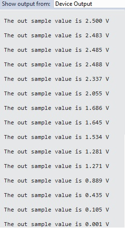

# Sample: ADC (High-level app)

This sample application demonstrates how to to do analog-to-digital conversion on the MT3620 high-level core.

The application samples and displays the output from a simple variable voltage source once per second. It uses the MT3620 analog-to-digital converter (ADC) to sample the voltage.

The sample uses the following Azure Sphere libraries.

| Library | Purpose |
|---------|---------|
| [adc](https://docs.microsoft.com/azure-sphere/reference/applibs-reference/applibs-adc/adc-overview) | Manages ADCs |
| [log](https://docs.microsoft.com/azure-sphere/reference/applibs-reference/applibs-log/log-overview) | Displays messages in the Visual Studio Device Output window during debugging |

## Contents
| File/folder | Description |
|-------------|-------------|
| ADC_HighLevelApp       |Sample source code and VS project files |
| ADC_HighLevelApp.sln |VS solution file |
| README.md | This readme file |

## Prerequisites

1. Clone the entire Azure Sphere samples repository locally if you haven't already done so:

     ```sh
      git clone https://github.com/Azure/azure-sphere-samples.git
     ```

1. [Seeed MT3620 Development Kit](https://aka.ms/azurespheredevkits) or other hardware that implements the [MT3620 Reference Development Board (RDB)](https://docs.microsoft.com/azure-sphere/hardware/mt3620-reference-board-design) design.
1. [10K ohm Potentiometer](https://www.digikey.com/product-detail/en/bourns-inc/3386P-1-103TLF/3386P-103TLF-ND/1232547?_ga=2.193850989.1306863045.1559007598-536084904.1559007598).

## Setup
**Note:** By default, this sample targets [MT3620 reference development board (RDB)](https://docs.microsoft.com/azure-sphere/hardware/mt3620-reference-board-design) hardware, such as the MT3620 development kit from Seeed Studios. To build the sample for different Azure Sphere hardware, change the Target Hardware Definition Directory in the project properties. For detailed instructions, see the [README file in the Hardware folder](../../../Hardware/README.md).

**Prep your device**

1. Ensure that your Azure Sphere device is connected to your PC, and your PC is connected to the internet.
1. Even if you've performed this set up previously, ensure that you have Azure Sphere SDK version 19.09 or above. In an Azure Sphere Developer Command Prompt window, run **azsphere show-version** to check. Download and install the [latest SDK](https://aka.ms/AzureSphereSDKDownload) as needed.
1. Enable [application development](https://docs.microsoft.com/azure-sphere/quickstarts/qs-blink-application#prepare-your-device-for-development-and-debugging), if you have not already done so by entering the following line in the Azure Sphere Developer Command Prompt window:

   `azsphere device prep-debug`

**Set up the ADC connections**

1. Connect MT3620 dev board pin H2.2 (GND) to an outer terminal of the potentiometer.
1. Connect both pin 1 and pin 2 of jumper J1 to the other outer terminal of the potentiometer. This connects the MT3620 2.5 V output to the ADC VREF pin and to the potentiometer.  
1. Connect MT3620 dev board pin H2.11 (GPIO41 / ADC0) to the center terminal of the potentiometer.

## Running the sample
  
1. Find the ADC_HighLevelApp sample in the ADC folder.
1. In Visual Studio, open ADC_HighLevelApp.sln.
1. Press F5 to compile and build the solution and load it onto the device for debugging.
1. In the Output window select "Show output from: Device Output". The application samples and displays the voltage divider output once every second.
1. Adjust the potentiometer and observe that the displayed value changes. 

    

## License
For details on license, see LICENSE.txt in this directory.

## Code of Conduct
This project has adopted the [Microsoft Open Source Code of Conduct](https://opensource.microsoft.com/codeofconduct/).