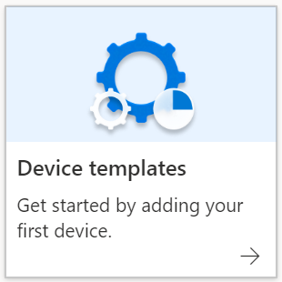

# Run the sample with Azure IoT Central

**IMPORTANT**:
- Follow the instructions in the [README.md](./README.md) file before you perform any of the steps described here.
- This sample uses the latest IoT Central message syntax and will not work with IoT Central applications created on or before July 7th, 2020. To run this sample with an older IoT Central application, follow the steps in the [Build and run the sample](#build-and-run-the-sample) section.

To run the sample with Azure IoT Central, you must:

- Create an Azure IoT Central application.
- Configure the Azure IoT Central application.
- Set up Azure IoT Central to work with your Azure Sphere tenant.
- Configure the sample application to work with your Azure Sphere tenant and devices.

You can then build and run the application. Later, you can enhance the Azure IoT Central application to support additional features.

## Create an Azure IoT Central application

1. Go to [Azure IoT Central](https://apps.azureiotcentral.com/build) in your browser.

1. Select **Custom apps** and sign in with your Microsoft account, or create a new account.

1. On the **Build** > **New application–Custom** page, use the default **Application name** and **URL** or modify them, if you prefer.

1. Under **Application template**, select **Custom application**.

1. Under **Pricing plan**, select **Free**, or select one of the **Standard** plans and provide your billing information.

1. Click **Create** at the bottom of the page to complete the operation.

## Configure your Azure IoT Central application

1. On the Dashboard for your application, select **Device Templates**.

   

1. On the **Select type** page, select **Azure Sphere Sample Device**. After making your selection, click **Next: Review** > **Create**.

1. On the device templates page for your Azure Sphere Sample Device, add two views to the sample device: one to send a command to the device, and another to show temperature and button press data.

   - To set up a view to send a command to the device, select **Views** > **Editing device and cloud data**.
   - Customize the **Form name** with "StatusLED".
   - Under **Property**, select **Status LED**, then **Add section**, and then click **Save** in the ribbon at the top of the form.

   

   - To set up a view of temperature and button press telemetry, select **Views** > **Visualizing the device**.
   - Customize the **View name** with "Temp and button press data".
   - Under **Telemetry**, use the dropdown menu to select **Temperature**, then **Add tile**.
   - Under **Telemetry**, use the dropdown menu to select **Button Press**, then **Add tile**.
   - Click **Save** in the ribbon at the top of the form.

   

1. Click **Publish** from the top menu bar so the device template can be used in the Azure IoT Central application.

   

## Set up Azure IoT Central to work with Azure Sphere

Verify the identity of your Azure Sphere tenant by following the steps in [set up Azure IoT Central](https://docs.microsoft.com/azure-sphere/app-development/setup-iot-central#step-2-download-the-tenant-authentication-ca-certificate). Start at step 2 and perform steps 2-5.

## Configure the sample application to work with your Azure Sphere tenant and devices

To configure the sample application, update the following parameters in the app_manifest.json file for AzureIoT:

- The allowed connections for your Azure Sphere device.
- The Scope ID for your Azure IoT Central application.
- The Tenant ID for your Azure Sphere device.

Follow these steps to gather the information and configure the application:

1. Find the app_manifest.json file in your sample directory and open it.

1. At the command prompt, run the ShowIoTCentralConfig program from the Windows or Linux folder in the sample repository. For example, on Windows, the path is Samples\AzureIoT\Tools\win-x64\ShowIoTCentralConfig.exe. When running this tool on a Linux machine you may need to explicitly set permissions. For example, from a terminal, run `chmod +x ShowIoTCentralConfig` to set permissions on the tool.

   Now follow the prompts that the tool provides, and copy the information from the output into the app_manifest.json file. The tool will require the following input:

   - The **IoT Central App URL** can be found in your browser address bar; for example, `https://myiotcentralapp.azureiotcentral.com/`.

   - The **API token** can be generated from your IoT Central application. In the Azure IoT Central application, select **Administration** > **API Tokens** > **Generate Token**, and then provide a name for the token; for example, "AzureSphereSample." Select **Administrator** as the role, and then click **Generate**. Copy the token to the clipboard. The token starts with **SharedAccessSignature**.

   - The **ID Scope** is in the Azure IoT Central application. Select **Administration** > **Device Connection** and then copy the **ID Scope**.

1. At the command prompt, run the following command to get the Tenant ID:

   `azsphere tenant show-selected`

   Paste the GUID for your tenant into the **DeviceAuthentication** field of the app_manifest.json file.

   Your updated app-manifest.json file should look like the following example:

   

1. Save the updated application manifest.

1. Ensure that the **Auto approve** option is enabled. From the Azure IoT Central Application, click **Administration** > **Device connection**, then on the **Auto approve** option, select **Enabled**.

## Build and run the sample

1. If you are using an IoT Central application that was created on or before July 7th, 2020, please make the following updates to the main.c file.
    - Open main.c and locate lines 751-762:
      ```c
      int statusLedValue = json_object_dotget_boolean(desiredProperties, "StatusLED");
      if (statusLedValue != -1) {
         statusLedOn = statusLedValue == 1;
         GPIO_SetValue(deviceTwinStatusLedGpioFd, statusLedOn ? GPIO_Value_Low : GPIO_Value_High);
      }

      // Report current status LED state
      if (statusLedOn) {
         TwinReportState("{\"StatusLED\":true}");
      } else {
         TwinReportState("{\"StatusLED\":false}");
      }
      ```
    - Replace lines 751-762 with the following code:
      ```c
      JSON_Object *LEDState = json_object_dotget_object(desiredProperties, "StatusLED");
      if (LEDState != NULL) {
         // ... with a "value" field which is a Boolean
         int statusLedValue = json_object_get_boolean(LEDState, "value");
         if (statusLedValue != -1) {
               statusLedOn = statusLedValue == 1;
               GPIO_SetValue(deviceTwinStatusLedGpioFd,
                           statusLedOn ? GPIO_Value_Low : GPIO_Value_High);
         }
      }

      // Report current status LED state
      if (statusLedOn) {
         TwinReportState("{\"StatusLED\":{\"value\":true}}");
      } else {
         TwinReportState("{\"StatusLED\":{\"value\":false}}");
      }
      ```
    - The application is now configured to run with the old IoT Central message format. For more information, please see the [IoT Central messaging documentation](https://docs.microsoft.com/azure/iot-central/core/concepts-telemetry-properties-commands).

1. Ensure that your device is connected to the internet.

1. Follow the steps in [Build a sample application](../../BUILD_INSTRUCTIONS.md).

1. See [Troubleshooting samples](../troubleshooting.md) if you encounter errors.

1. When the application starts, you should see output showing that the button and an LED have been opened, and that device authentication returned `AZURE_SPHERE_PROV_RESULT_OK`. The application then starts to send periodic messages with simulated temperatures to IoT Central.

1. Press button A. Device output shows the following message:

   ```
   Sending Azure IoT Hub telemetry: { "ButtonPress": "True" }
   INFO: IoTHubClient accepted the telemetry event for delivery
   ```

## Show your device data in Azure IoT Central

1. In your Azure IoT Central application, select **Devices** > **All Devices**. You should see your device listed as Unassociated and Unassigned. If you don’t see this, refresh the page.

1. Select your device and then select **Migrate**. Select the Azure Sphere Sample Device template, and click **Migrate**.

1. To view output from your Azure Sphere device, select **Devices** > **Azure Sphere Sample Device** and then select your device. You may change the device name at this point by selecting the name, modifying it, and selecting anywhere on the screen to save.

1. Select **View**, which is on the menu bar just under the device name. Note that the device is sending simulated temperatures at regular intervals. Each time you press button A, an event is added to the button press graph. The graphs show data averaged over 30 seconds and not every individual event will be visible on the graphs. To see the count of button presses, hover the cursor over the chart. Note that you will not see previous data on the Button Press chart initially and will instead see "Waiting for data".

1. Turn on an LED on your Azure Sphere device from the Azure IoT Central application. Select the **Form** tab, click the **Status LED** checkbox, and then select **Save**. In a few seconds, the LED will light up.

1. Trigger an alarm from the Azure IoT Central application. Select the **Command** tab and then click **Run**. Select the small history icon in the right corner of the Interface/Trigger Alarm box. This will show you the response to command from your sphere device. The device output will show the following message:

   ```
   ----- ALARM TRIGGERED! -----
   ```

## Troubleshooting

1. The following message in device output indicates a connection error:

   `IOTHUB_CLIENT_NO_CONNECTION`

   This error may occur if:

   - The **AllowedConnections** field has not been properly updated in the application manifest .json file.

   The application may generate output like "IoTHubClient accepted the message for delivery" while telemetry is generated. This indicates that the IoTHubClient has accepted the message for delivery but the data has not yet been sent to the IoT hub.

1. The following message in device output indicates an authentication error:

   `IoTHubDeviceClient_LL_CreateWithAzureSphereDeviceAuthProvisioning returned 'AZURE_SPHERE_PROV_RESULT_DEVICEAUTH_NOT_READY'.`

   This error may occur if:

   - The correct tenant ID is not present in the **DeviceAuthentication** field of the application manifest .json file.
   - The device has not been claimed.

1. The following message in device output indicates a device provisioning error:

   `IoTHubDeviceClient_LL_CreateWithAzureSphereDeviceAuthProvisioning returned 'AZURE_SPHERE_PROV_RESULT_PROV_DEVICE_ERROR'.`

   This error may occur if:

   - The [setup for Azure IoT Central](https://docs.microsoft.com/azure-sphere/app-development/setup-iot-central) has not been completed.
