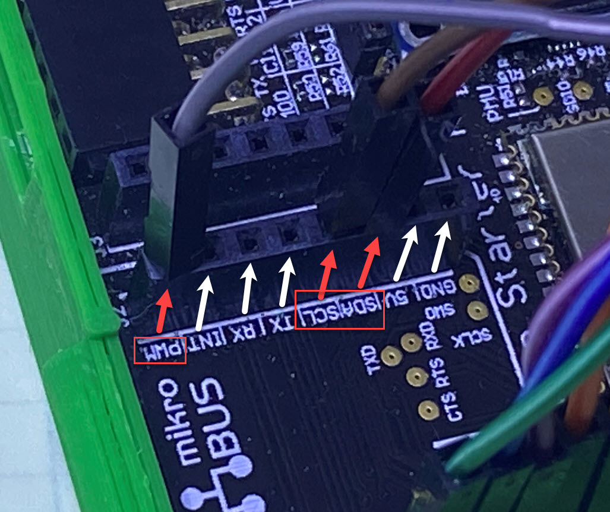
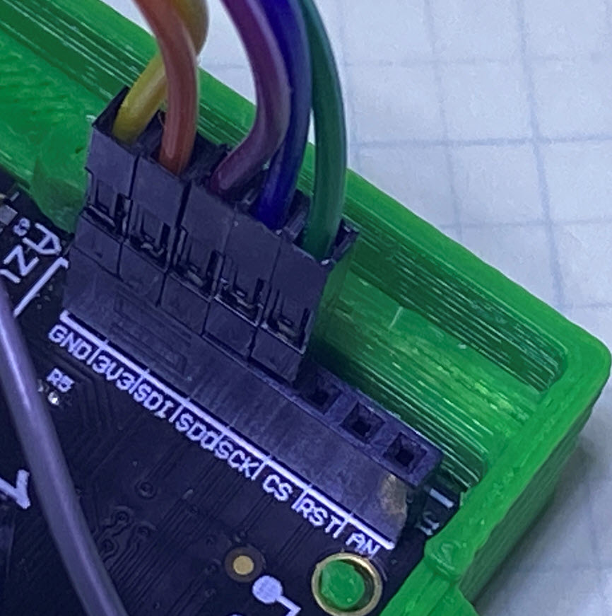

## Credits

This example originated from https://github.com/xiongyu0523/azure-sphere-arducam-mini-2mp-plus.  The project was updated to use CMake and modified to support the 5MP camera.

# ArduCAM mini 2MP/5MP Plus SPI camera 

This sample demonstrates capturing a JPEG picture using [ArduCAM mini 2MP/5MP PLUS]() SPI camera on Azure Sphere OS and upload the picture to Azure Blob service using libcurl to initiate [Put Blob](https://docs.microsoft.com/en-us/rest/api/storageservices/put-blob) REST API with [SAS authorization](https://docs.microsoft.com/en-us/rest/api/storageservices/delegate-access-with-shared-access-signature). 

## Configure Azure Blob and generate service SAS

1. To run this demo you need have a [storage account](https://docs.microsoft.com/en-us/azure/storage/common/storage-quickstart-create-account?tabs=azure-portal) and create a [blob container](https://docs.microsoft.com/en-us/azure/storage/blobs/storage-quickstart-blobs-portal)
2. Download [Azure Storage Explorer](https://azure.microsoft.com/en-us/features/storage-explorer/) and login with your Azure AD
3. In Storage Explorer, navigate to your container icon and right click to **Get Shared Access Signature**, create a Ad-hoc Service SAS with at least *Create* and *Write* permission. Copy **Query String**

## To build and run the sample

### Prep your device

1. Ensure that your Azure Sphere device is connected to your PC, and your PC is connected to the internet.
2. Even if you've performed this set up previously, ensure that you have Azure Sphere SDK version 19.09 or above. In an Azure Sphere Developer Command Prompt, run **azsphere show-version** to check. Download and install the [latest SDK](https://aka.ms/AzureSphereSDKDownload) as needed.
3. Open Azure Sphere Developer Command Prompt and issue the following command:

   ```
   azsphere dev edv
   ```
4. The demo is tested on RDB, Starter Kit Rev1 and Starter Kit Rev2 boards.  Connect camera as shown below. Detailed connections are:
   
    |  ArduCAM mini 2MP Plus | RDB  | Avnet SK Rev1/Rev2 |
    |  ----  | ----  | ---- | 
    | SCL  | H2-7 |  Click 1: Header 2: Pin 5 |
    | SDA  | H2-1 |  Click 1: Header 2: Pin 6 |
    | VCC  | H3-3 |  Click 1: Header 1: Pin 7 |
    | GND  | H3-2 |  Click 1: Header 1: Pin 8 |
    | SCK  | H4-7 |  Click 1: Header 1: Pin 4 | 
    | MISO  | H4-5 |  Click 1: Header 1: Pin 5 | 
    | MOSI  | H4-11 | Click 1: Header 1: Pin 6 | 
    | CS   | H1-10 |  Click 1: Header 2: Pin 1 | 
    
    
    
    
    
    You may choose to power your camera from an external source.  The connections are basically the same, just connect the 3.3V and GND from the camera to the exernal power supply, in this case the breadboard 3.3V rail.  Then connect a ground wire between the external power supply ground and the starter kit.
    
    
    
           
### To change the code to use the 2MP camera

Change the target_compile_definitions line in CMakeLists.txt from USE_OV5642 to USE_OV2640  
  
### Build and deploy the application

1. Start Visual Studio.
2. Open the CMakeLists.txt file
3. In main.c file, replace storageURL string with your **stroage account name** SASToken string with the **Query String** your created, and **pathFileName** with your blob container name.
4. In app_manifest.json file, fill your own **stroage account name** in AllowedConnections capability. 
5. Press **F5** to build and debug the application
6. In **Device Output** window, you will observe below logs:

```
Remote debugging from host 192.168.35.1, port 59937
Exmaple to capture a JPEG image from ArduCAM mini xMP Plus and send to Azure Blob

ArduCAM 5624 mini 5MP Plus is found
len = 75736
*   Trying 52.239.223.132:443...
* Connected to <your storage account>.blob.core.windows.net (52.239.223.132) port 443 (#0)
* successfully set certificate verify locations:
*   CAfile: /mnt/apps/eab90817-395b-4e40-b013-033b30a3cd19/certs/BaltimoreCyberTrustRoot.pem
  CApath: none
* ALPN, offering http/1.1
* ALPN, server did not agree to a protocol
* SSL connection using TLSv1.2 / ECDHE-RSA-AES256-GCM-SHA384
> PUT /sphere-pics/img/2ef94a26-ac47-41cf-934d-5ab91036e5ca.jpg<your SAS Token> HTTP/1.1
Host: <your storage account>.blob.core.windows.net
Accept: */*
x-ms-blob-type:BlockBlob
Content-Length: 75725
Expect: 100-continue

* Mark bundle as not supporting multiuse
< HTTP/1.1 100 Continue

* We are completely uploaded and fine
* Mark bundle as not supporting multiuse
< HTTP/1.1 201 Created
< Content-Length: 0
< Content-MD5: bCCjhMKBF62FQKg7GjDLsQ==
< Last-Modified: Mon, 23 Nov 2020 16:29:33 GMT
< ETag: "0x8D88FCCF5D7215B"
< Server: Windows-Azure-Blob/1.0 Microsoft-HTTPAPI/2.0
< x-ms-request-id: 2329925c-901e-006d-6db5-c14a85000000
< x-ms-version: 2019-02-02
< x-ms-content-crc64: T9yaTQlkfb0=
< x-ms-request-server-encrypted: true
< Date: Mon, 23 Nov 2020 16:29:32 GMT
< 
* Connection #0 to host <your storage account>.blob.core.windows.net left intact
App Exit

Child exited with status 0
```
   
7. Go to Azure Storage Explorer and double click your container, a (Random GUID).jpg* will be listed. Double click the file to open and inspect the image.
