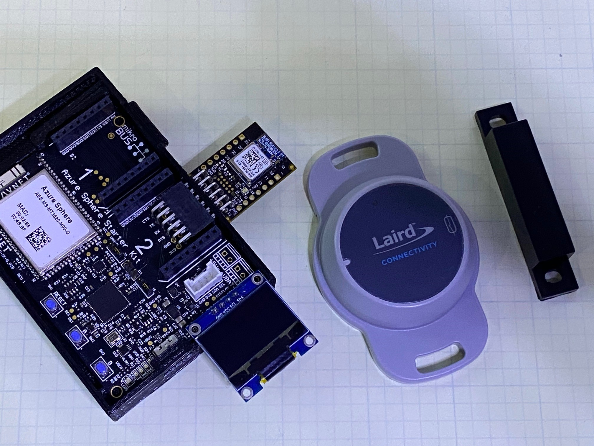
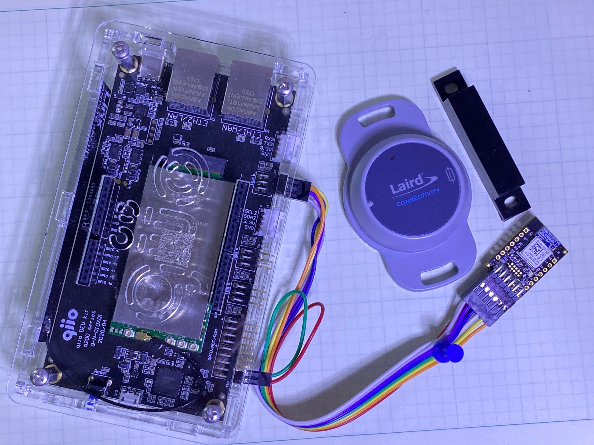

# Sample: AvnetBT510Sensor + TE HTU21D temperature and Humidity Sensor

This sample implements a application that can monitor and report sensor data for upto 6 BT510 BLE sensors.



This sample uses a BLE device connected to an Azure Sphere device to capture, parse and transmit BT510 Sensor data to Azure.  The Avnet BLE PMOD runs a Laird SmartBasic application (BT510 Repeater Gateway) that listens for broadcast messages from any BT510, then transmits the message over a UART connection to the Azure Sphere Starter Kit.  The Azure Sphere application parses the message, verifies that the BT510 is authorized to send data from the application and sends up any telemetry/events as telemetry to Azure.



## Required hardware

* [Avnet Azure Sphere Starter Kit](http://avnet.me/mt3620-kit)
* [Avnet BLE PMOD](https://www.avnet.com/shop/us/products/avnet-engineering-services/aes-pmod-nrf-ble-g-3074457345642996769)
* [Laird BT510](https://www.avnet.com/wps/portal/us/products/new-product-introductions/npi/laird-sentrius-bt510)

## Hardware Configuration

### Update the BLE PMOD fw/sw

The BLE PMOD needs to be updated with the latest SmartBasic firmware and then loaded with the SmartBasic application.

* Update the PMOD's onboard BL654 module to FW Version 29.4.6.0 or newer
   * [Link to firmware, scroll way down to documentation section](https://www.lairdconnect.com/wireless-modules/bluetooth-modules/bluetooth-5-modules/bl654-series-bluetooth-module-nfc)
* Load the $autorun$.BT510.gateway.sb SmartBasic application onto the BL654 module
   * [Laird Github Repo](https://github.com/LairdCP/BL654-Applications/tree/master/BT510Repeater)

### Connect the BLE PMOD to the StarterKit

* Solder a 2x6 Right angle header onto the Starter Kit
* Plug the updated BLE PMOD into the new 2x6 header
* Update the CMakeLists.txt file with your target hardware platform
   * avnet_mt3620_sk OR
   * avnet_mt3620_sk_rev2 OR
   * qiio-200-dev


## Build Options

The application behavior can be defined in the build_options.h file

* TARGET_QIIO_200 enables support for using the cellular enabled qiio-200 Azure Sphere Development kit 
   * See the sample_appliance.h file in the hardware/qiio-200-dev folder for interface details
* USE_ETH0 enables support for an optional ETH Click board in Click Site 1
* USE_IOT_CONNECT enables support to connect to Avnet IoTConnect Cloud solution platform

## Runtime configuration

The application is configured from the cloud and from the BT510 device configuration application

### Authorize BT510s to connect to the appliation

Since this device could be deployed in an enviornment with many different BT510 devices, you must explicitly authorize/identify the devices that the application will use for telemetry reporting.  To authorize a BT510 enter the BLE MAC address (labled on the back of the BT510) into one of the avaliable device twins labeled "authorizedMacX" where X is a value between 1-6.  The MAC should be in upper case and in the following format:  ```C9-63-9C-48-6E-A6```

### Configure the BT510 device name

The Azure Sphere application will use the advertised Device Name of the BT510 and append it to the telemetry keys and device twin names.  To configure the BT510 name you must download and install the LC BT510 mobile application onto your mobile device, connect to your BT510 and change the name on the Settings tab/page.  The application will send up device twins and telemetry data prepending this name to each key.  It's important that your authorized BT510s all have unique names.  Additionally, these names should not be greater than 24 charcters long.


Example:  The message below was generated from two BT510s.  One named Basement and one named Coach.

```Telemetry message: {"tempBasement":21.14,"batBasement":2.989,"rssiBasement":-71,"tempCoach":21.42,"batCoach":3.063,"rssiCoach":-65}```

### Avnet's IoTConnect configuration

If you're using Avnet's IoTConnect cloud solution you can use the device template JSON file located in the IoTConnect folder to define all the device to Cloud (D2C) messages and device twins.

Note that this device template makes the assumption that there are two BT510 devices.  One named "Coach" and one named "Basement."  You can easily edit this file to use the names of your devices and add additional devices if needed.

### Configure the application to connect to your Azure Solution

Use the instructions below to configure your app_manifest.json file to allow a connection to an Azure IoT Hub.

**IMPORTANT**: This sample application requires customization before it will compile and run. Follow the instructions in this README and in IoTCentral.md and/or IoTHub.md to perform the necessary steps.

This application does the following:

Before you can run the sample, you must configure either an Azure IoT Central application or an Azure IoT hub, and modify the sample's application manifest to enable it to connect to the Azure IoT resources that you configured.

By default, this sample runs over a Wi-Fi connection to the internet. To use Ethernet instead, make the following changes:

1. Configure Azure Sphere as described in [Connect Azure Sphere to Ethernet](https://docs.microsoft.com/azure-sphere/network/connect-ethernet).
1. Add an Ethernet adapter to your hardware. If you are using an MT3620 RDB, see the [wiring instructions](../../HardwareDefinitions/mt3620_rdb/EthernetWiring.md).
1. Add the following line to the Capabilities section of the app_manifest.json file:

   `"NetworkConfig" : true`

1. In main.c, ensure that the global constant NetworkInterface is set to "eth0". In source file AzureIoT/main.c, search for the following line:

   `static const char NetworkInterface[] = "wlan0";`

   and change it to:

   `static const char NetworkInterface[] = "eth0";`

1. In main.c, add the following lines before any other networking calls:

    ```c
     int err = Networking_SetInterfaceState("eth0", true);
     if (err == -1) {
           Log_Debug("Error setting interface state %d\n",errno);
           return -1;
       }
    ```

The sample uses the following Azure Sphere application libraries:

|Library   |Purpose  |
|---------|---------|
|log     |  Displays messages in the Device Output window during debugging  |
| networking | Determines whether the device is connected to the internet |
| gpio | Manages buttons A and B and LED 4 on the device |
|storage    | Gets the path to the certificate file that is used to authenticate the server      |
| [EventLoop](https://docs.microsoft.com/azure-sphere/reference/applibs-reference/applibs-eventloop/eventloop-overview) | Invoke handlers for timer events |

## Prerequisites

The sample requires the following software:

- Azure Sphere SDK version 20.07 or higher. At the command prompt, run **azsphere show-version** to check. Install [the Azure Sphere SDK](https://docs.microsoft.com/azure-sphere/install/install-sdk), if necessary.
- An Azure subscription. If your organization does not already have one, you can set up a [free trial subscription](https://azure.microsoft.com/free/?v=17.15).

## Preparation

**Note:** By default, this sample targets [MT3620 reference development board (RDB)](https://docs.microsoft.com/azure-sphere/hardware/mt3620-reference-board-design) hardware, like the MT3620 development kit from Seeed Studios. To build the sample for different Azure Sphere hardware, change the Target Hardware Definition Directory in the project properties. For detailed instructions, see the [README file in the HardwareDefinitions folder](../../HardwareDefinitions/README.md).

1. Set up your Azure Sphere device and development environment as described in the [Azure Sphere documentation](https://docs.microsoft.com/azure-sphere/install/overview).
1. Clone the Azure Sphere Samples repository on GitHub and navigate to the AzureIoT folder.
1. Connect your Azure Sphere device to your computer by USB.
1. Enable a network interface on your Azure Sphere device and verify that it is connected to the internet.
1. Open an Azure Sphere Developer Command Prompt and enable application development on your device if you have not already done so:

   **azsphere device enable-development**

## Run the sample

- [Run the sample with Azure IoT Central](./IoTCentral.md)
- [Run the sample with an Azure IoT Hub](./IoTHub.md)
