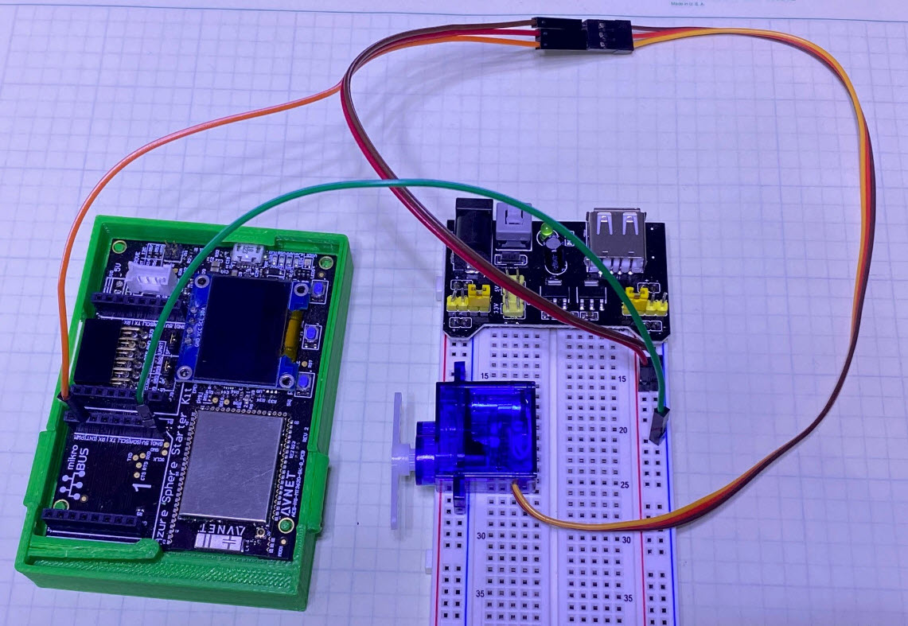
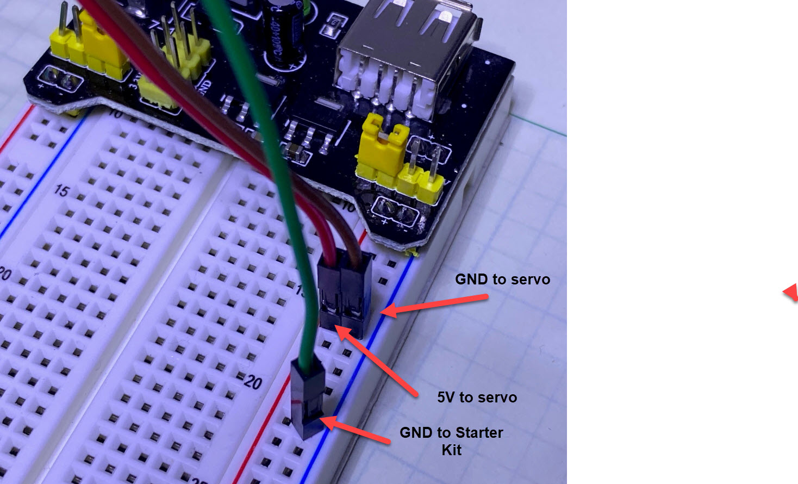

# Servo Example using the PWM interface

This folder contains an example application that drives a servo using the Azure Sphere pwm hardware interface.

## Connections

### Starter Kit Connections
| Signal | Starter Kit connection Rev1/Rev2 |
| ---- | ---- |
| pwm | Click 1: Header 2: Pin 2 |
| GND | Click 1: Header 2: Pin 8 |

### Servo Connections

Note it's recommeded that your servo motor be powered from a source othere than the Starter Kit.  This is to isolate the starter kit from the signal noise that the motor will generate.

| Signal | Servo |
| --- | --- |
| pwm | SK see table above |
| GND | External Power Supply GND connection |
| VCC | External Power Supply 5V DC connection |

## Application Operation

The application starts up and monitors for button presses on the Starter Kit

Button A moves the servo +5 degrees
Button B moves the servo +20 degrees

When SERVO_MAX_ANGLE is exceeded, the servo angle is reset to SERVO_MIN_ANGLE

## Application (Servo) configuration
There are two places in the project to adjust things for your servo.

Constants for the operation can be set in servo.h

Servo perodiods/cycle duty, and other items can be set in main.c around line 83

## Note
This application has been tested with a small smraza SG90 micro servo from [amazon](https://www.amazon.com/gp/product/B07L2SF3R4/ref=ppx_yo_dt_b_asin_title_o08_s00?ie=UTF8&psc=1)
