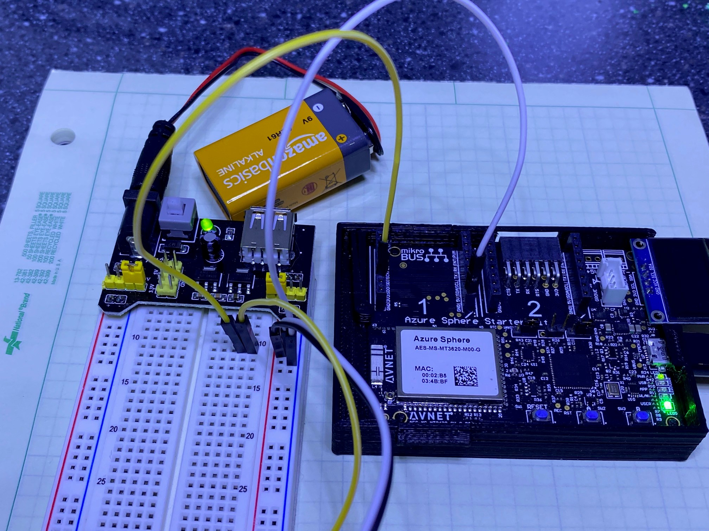

# Credits

This project leverages the work done by user @judios in the repo found [here](https://github.com/MikroElektronika/mikrosdk_click_v2.git)

# Simple application to drive neoPixel devices

This project used the High Level GPIO example and cycles the attached neoPixel device through Red, Green, Blue, White, Off for each buttonA press.

# WS2812B Led Strips Driver for Azure Sphere

This Project presents a driver for WS2812B Led Strips to be used with Azure Sphere. 

The driver was created with the main ideas from this [post](https://jeelabs.org/book/1450d)

The technique described in the post uses the SPI hardware of a LPC810 MCU in order to send the signal to the WS2812B strip.

## WS2812B signal requirements

From the WS2812B datasheet, each led requires 24bits (3 bytes. Green, Red, Blue) to set the color. These bits are not given as HIGH for "1" and LOW for "0"", rather a signal of 600ns HIGH + 300ns LOW is required for a "1", and a signal of 300ns HIGH + 600ns LOW is required for a "0"". These values have been chosen arbitrarily from the aceptable range.


Therefore the translation 1 = 110, 0 = 100 can be used to send the signal to the WS2812B led strip through the SPI MOSI. Provided that the clock of the SPI is set to achieve 300ns per bit. Which is exactly 3.33Mhz, but can be aproximated to 3.4Mhz.

Since there are 3 spi bits needed per WS2812B bit, 72 spi bits are needed per led. These are broken into 3 sets of 3 bytes, one set per color.

The technique in the post uses two words of 12 bits to set each color of the led. However, Azure Sphere SDK does not allows to change the word size of the SPI, and it is not really needed. One can use three bytes (uint8_t) per color:

```
b1 : 1#0 1#0 1#
b2 : 0 1#0 1#0 1
b3 : #0 1#0 1#0 
```

Sending these three bytes in sequence will produce the 8 WS2812b bits required:
```
b1, b2, b3 :  1#0 1#0 1#0 1#0 1#0 1#0 1#0 1#0
```
Note, the second bit in each triplet is the one carrying the value, the bits 7, 6, and 5 are set in b1; bits 4, and 3 are set in b2; bits 2, 1, 0 are set in b3.

```c
	wscolor->b1 = 0b10010010;
	wscolor->b2 = 0b01001001;
	wscolor->b3 = 0b00100100;
	if (value == 0) return;
	if (0b10000000 & value) wscolor->b1 += 0b01000000;
	if (0b01000000 & value) wscolor->b1 += 0b00001000;
	if (0b00100000 & value) wscolor->b1 += 0b00000001;
	if (0b00010000 & value) wscolor->b2 += 0b00100000;
	if (0b00001000 & value) wscolor->b2 += 0b00000100;
	if (0b00000100 & value) wscolor->b3 += 0b10000000;
	if (0b00000010 & value) wscolor->b3 += 0b00010000;
	if (0b00000001 & value) wscolor->b3 += 0b00000010;
```

## WS2811 Driver

Following the same approach, a driver for the WS2811 ic was created. In this case, a signal of 1200ns HIGH + 1200ns LOW is required for a "1", and a signal of 400ns HIGH + 2000ns LOW is required for a "0". The translation will then need 6 spi bits per WS2811 bit required.

```
1 = 111000
0 = 100000
```

Here, there are 24 spi bits needed for each color. Then, uint16_t type was used instead for b1, b2, and b3

## To connect the neoPixel device to the Avnet Starter Kit

To connect the neoPixel directly to the starter kit use the table below

| Signal | neoPixel device |Starter Kit | 
| --- | --- | --- |
| 5V | 5V Power | Click Socket 1, Header 2, Pin 7 )(5V)|
| GRD | GRD | Click Socket 1, Header 2, Pin 8 (GND)|
| Data | Data Input | Click Socket 1, Header 1, Pin 6 (SDI) |

You may want to use an external power supply to feed the 5V to your neoPixel.  If so, use the table below for the connections

| Signal | neoPixel | Starter Kit | Breadboard |
| --- | --- | --- | -- |
| 5V |  5V Power | N.C. | 5V rail |
| GRD | GRD | Click Socket 1, Header 2, Pin 8 (GND)| Ground rail |
| Data | Data Input | Click Socket 1, Header 1, Pin 6 (SDI) | common Data pins |



## Known issues

There is currently an issue where the MT3620 drives the data line high between the application sending zeros and the data.  When this happens, led 0 lights the green element.  I'm currently looking for a way to resolve this issue.


