# Run the sample with Azure IoT Central

**IMPORTANT**: Follow the instructions in the [README.md](./README.md) file before you perform any of the steps described here.

To run the sample with Azure IoT Central, you must:

- Create an Azure IoT Central application
- Set up Azure IoT Central to work with your Azure Sphere tenant
- Configure the sample code with information about your Azure Sphere tenant and Azure IoT Central application

You can then build and run the application. Later, you can enhance the Azure IoT Central application to support additional features.

## Create an Azure IoT Central application

1. Go to [Azure IoT Central](https://apps.azureiotcentral.com/create) in your browser and sign in with your Azure credentials.
1. On the Create Application page, choose the Trial payment plan and the Custom Application template. Accept the default values for the Application Name and URL, enter contact information, and then click **Create** at the bottom of the page.

1. On the Home Page, select Create Device Templates.

   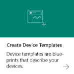

1. On the **Device Templates > New Template > Custom Template** page, enter `AzureSphere` as the device name and click **Create**.
 
   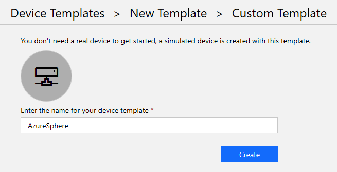

1. On the Device Template page, click New Measurement and select Telemetry.

1. Set the Display Name and Field Name to `Temperature`. The Field Name must exactly match the name in the sample code, so this value is case-sensitive. Set Units to `Degrees`, and set the Minimum Value and Maximum Value to `0` and `100`, respectively. Then click **Save**.

   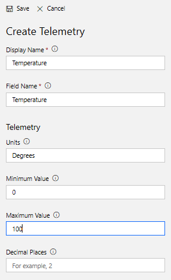

1. Click New Measurement and select Event.
1. Set the Display Name and Field Name to `ButtonPress`. The Field Name must be the same as the variable name used in the sample code, so this value is case-sensitive. Then click **Save**.

   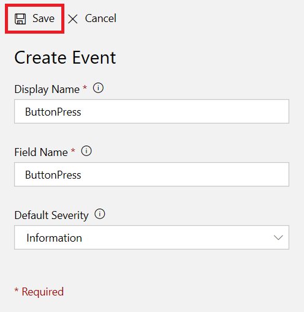

1. On the left side menu, select Device Explorer.

1. On the Explorer page, click **+** to add a new device, and select Real from the drop-down menu.

   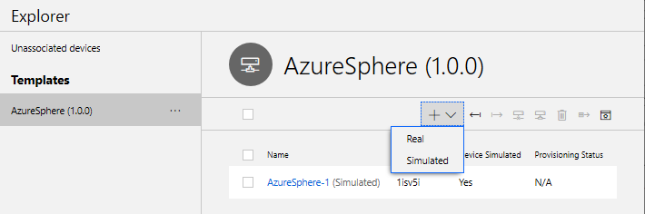

1. In an Azure Sphere Developer Command Prompt, type the following command.

   `azsphere device show-attached`

      **Note:** The Create New Device dialog box in Azure IoT Central requires that the device ID be in lowercase characters. You can use the ToLower function in PowerShell to convert, if necessary. In an Azure Sphere Developer Command Prompt, enter the following command, which gets the ID of the attached device and converts it to lowercase: 

   ```sh
   powershell -Command ((azsphere device show-attached)[0] -split ': ')[1].ToLower()
   ```
   
   Copy the lowercase device ID and paste it into the Device ID field of the Create New Device dialog box. The default device name is the device ID with "AzureSphere -" prepended. You can use this name or shorten it if you prefer. Then click **Create**.  

   Device Explorer should now show both the real device you just created and a simulated Azure Sphere device.

## Set up Azure IoT Central to work with Azure Sphere

Verify the identity of your Azure Sphere tenant by following the steps in the online documentation to [set up Azure IoT Central](https://docs.microsoft.com/azure-sphere/app-development/setup-iot-central).

## Configure the sample application to work with your Azure Sphere tenant and devices

To configure the sample application, you'll need to supply the following information in the app_manifest.json file for AzureIoT:

- The Tenant ID for your Azure Sphere device
- The Scope ID for your Azure IoT Central application
- The IoT hub URL for your Azure IoT Central application
- The Azure DPS global endpoint address

Follow these steps to gather the information and configure the application:

1. Open AzureIoT.sln in Visual Studio.
1. In Solution Explorer, find the app_manifest.json file and open it.
1. In an Azure Sphere Developer Command Prompt, issue the following command to get the tenant ID. Copy the returned value and paste it into the **DeviceAuthentication** field of the app_manifest.json file:

   `azsphere tenant show-selected`
1. In an Azure Sphere Developer Command Prompt, run the ShowIoTCentralConfig.exe program from the sample repository (the ShowIoTCentralConfig program is located in the AzureIoT\Tools folder). For example:

   `ShowIoTCentralConfig`

   When prompted, log in with the credentials you use for Azure IoT Central.

   Copy the information from the output into the app_manifest.json file in Visual Studio.

**Note**: Your organization might require consent for the ShowIoTCentralConfig tool to access your Azure IoT Central data in the same way that the Azure API requires such consent. In some organizations, [enterprise application permissions](https://docs.microsoft.com/azure-sphere/install/admin-consent) must be granted by an IT administrator.
  
## Build and run the sample

1. In Visual Studio, save the modified app_manifest.json file.
1. Ensure that your device is connected to the internet.
1. Press F5 to compile and build the solution, load it onto the device, and start debugging.

   When the application starts, you should see output showing that buttons and an LED have been opened, and that device authentication returned `AZURE_SPHERE_PROV_RESULT_OK`. The application then starts to send periodic messages with simulated temperatures to IoT Central.

1. Press button A. The Device Output display in Visual Studio shows the following message:

   ```
   Sending IoT Hub Message: { "ButtonPress": "True" }
   INFO: IoTHubClient accepted the message for delivery
   ```

1. In Azure IoT Central, go to **Device Templates** and select your template. Note that the device is sending simulated temperatures at regular intervals. Each time you press button A, a diamond appears along the bottom of the graph. You might need to refresh the window to see the data:

   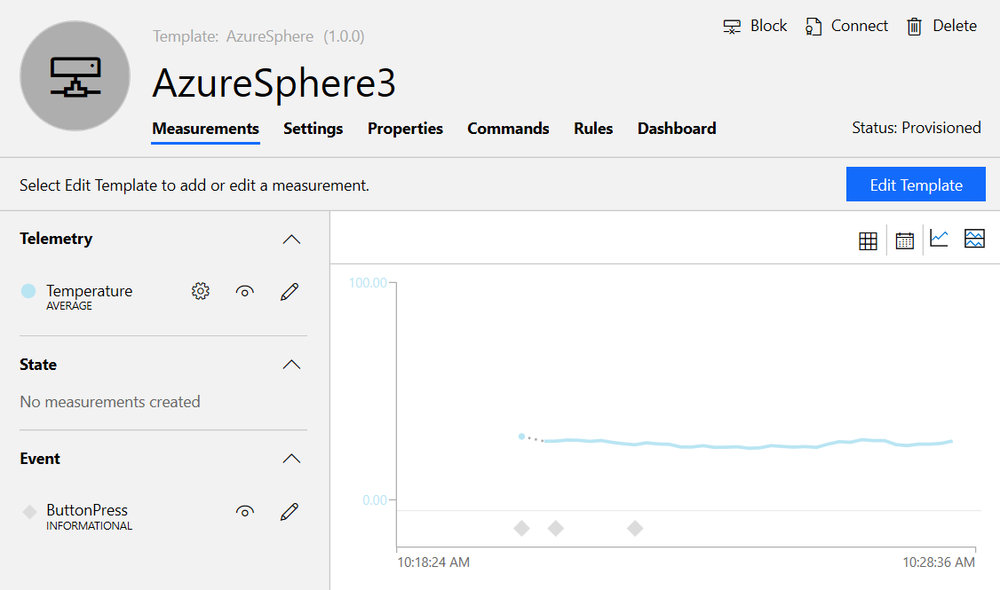

### Add new measurements, settings, and properties

You can now add additional measurements, settings, and properties to the device template to see more features of the Azure IoT Central device template.

If you press button B on the device, the sample application sends a simulated orientation state to Azure IoT Central. To track orientation state:

1. In [Azure IoT Central](https://apps.azureiotcentral.com/create), open **Device Templates** and then select your template. On the template page, select **New Measurement** and then **State**. Configure the Display Name and Field Name to `Orientation`. The Field Name must be the same as the variable name used in the sample code, so this value is case-sensitive.

   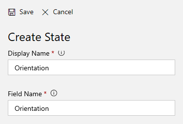

1. Add two values for the state: Up and Down. No display names are required. Then click **Save**.

   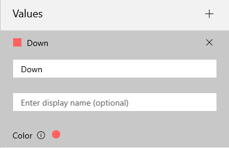

1. Press button B to change the simulated orientation value. Azure IoT Central displays the color-coded orientation in a bar chart along with the temperature and button-press events.

   

To turn LED 4 on or off from the Azure IoT Central application: 

1. In Azure IoT Central, select **Settings** and then choose Toggle. 

   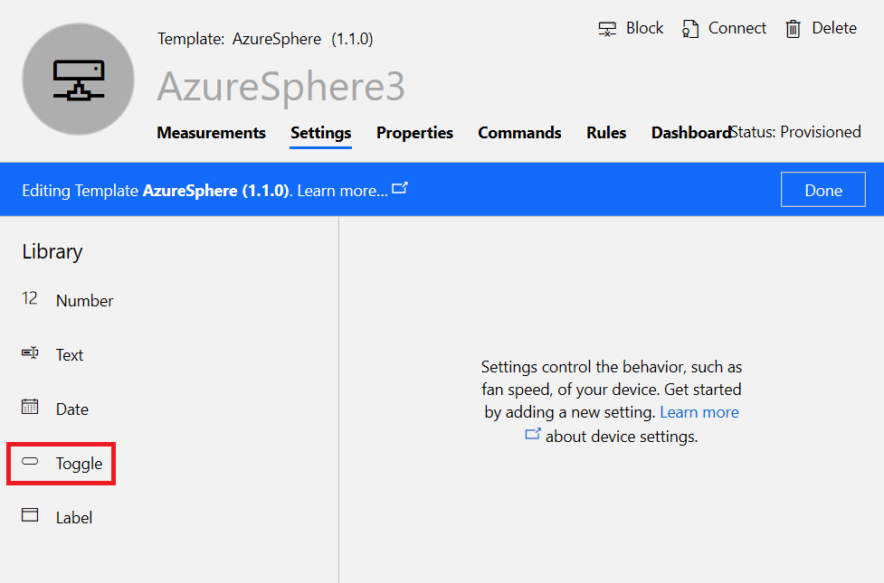

1. Configure the Toggle Display Name to Status LED, the Field Name to StatusLED, the ON and OFF Display Text to ON and OFF, and the Initial Value to Off. The Field Name must exactly match the name in the sample code. Then click **Save**.

   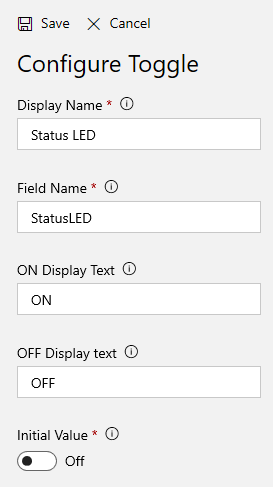

1. If Azure IoT Central displays a dialog box about creating a new version of the template, accept the new version number and create the template. You must then migrate the device to the new template. In Device Explorer, select your device, then click the Migrate icon.

   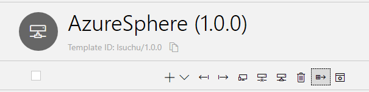

 1. To turn the LED on, return to Device Explorer and select **Settings** for your device. Slide the toggle to the right and then click **Update**. In a few seconds, the LED lights up.

   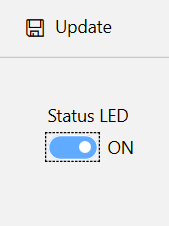

## Troubleshooting

The following sections describe how to recover from common errors.

### Visual Studio build errors

- Visual Studio returns the following error if the application fails to compile:

   `1>C:\Program Files (x86)\Microsoft Visual Studio\2017\Enterprise\Common7\IDE\VC\VCTargets\Application Type\Linux\1.0\AzureSphere.targets(105,5): error MSB6006: "arm-poky-linux-musleabi-gcc.exe" exited with code 1.`

   This error may occur for many reasons. Most often, the reason is that you did not clone the entire Azure Sphere Samples repository from GitHub. The samples depend on the hardware definition files that are supplied in the Hardware folder of the repository.

### To get detailed error information

By default, Visual Studio may only open the Error List panel, so that you see error messages like this:

`1>C:\Program Files (x86)\Microsoft Visual Studio\2017\Enterprise\Common7\IDE\VC\VCTargets\Application Type\Linux\1.0\AzureSphere.targets(105,5): error MSB6006: "arm-poky-linux-musleabi-gcc.exe" exited with code 1.`

To get more information, open the Build Output window. To open the window, select **View->Output**, then choose **Build** on the drop-down menu. The Build menu shows additional detail, for example:

```
1>------ Rebuild All started: Project: AzureIoT, Configuration: Debug ARM ------
1>main.c:36:10: fatal error: hw/sample_hardware.h: No such file or directory
1> #include <hw/sample_hardware.h>
1>          ^~~~~~~~~~~~~~~~~~~~~~
1>compilation terminated.
1>C:\Program Files (x86)\Microsoft Visual Studio\2017\Enterprise\Common7\IDE\VC\VCTargets\Application Type\Linux\1.0\AzureSphere.targets(105,5): error MSB6006: "arm-poky-linux-musleabi-gcc.exe" exited with code 1.
1>Done building project "AzureIoT.vcxproj" -- FAILED.
========== Rebuild All: 0 succeeded, 1 failed, 0 skipped ==========
```

In this case, the error is that hardware definition files aren't available.

The **Tools -> Options -> Projects and Solutions -> Build and Run** panel provides further controls for build verbosity.

### Application errors

The following message in the Visual Studio Device Output indicates an authentication error:

   `IoTHubDeviceClient_LL_CreateWithAzureSphereDeviceAuthProvisioning returned 'AZURE_SPHERE_PROV_RESULT_DEVICEAUTH_NOT_READY'.'`

This error may occur if:

- The correct tenant ID is not present in the **DeviceAuthentication** field of the application manifest
- The device has not been claimed

The following message in the Visual Studio Device Output indicates a device provisioning error:

   `IoTHubDeviceClient_LL_CreateWithAzureSphereDeviceAuthProvisioning returned 'AZURE_SPHERE_PROV_RESULT_PROV_DEVICE_ERROR'.'`

This error may occur if:

- The [setup for Azure IoT Central](https://docs.microsoft.com/azure-sphere/app-development/setup-iot-central) or [Azure IoT Hub](https://docs.microsoft.com/azure-sphere/app-development/setup-iot-hub) has not been completed
