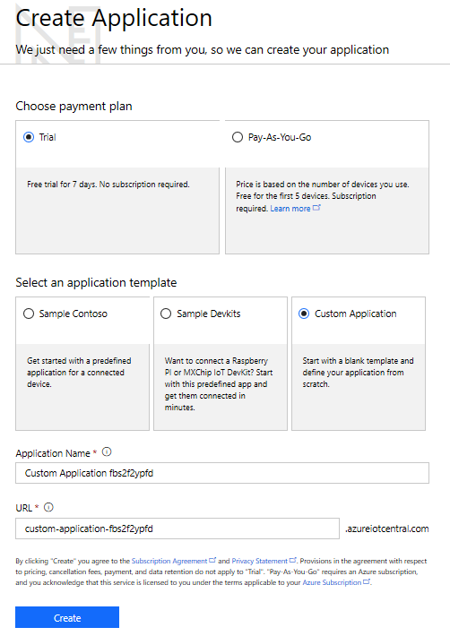
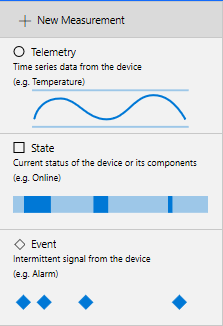
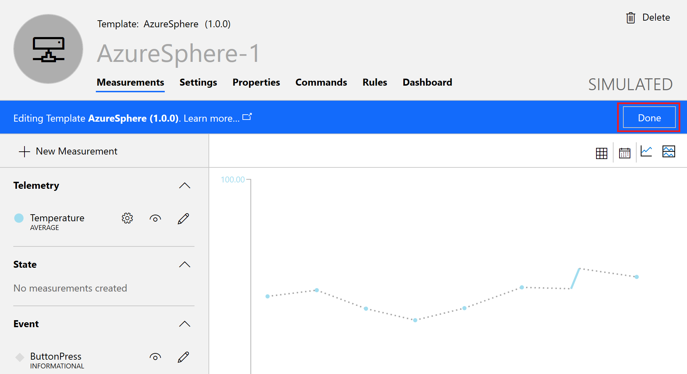
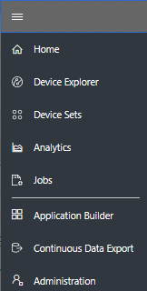

# Sample: AzureIoT

This sample demonstrates how to use the Azure IoT SDK C APIs in an Azure Sphere application to communicate with Azure IoT Central or Azure IoT Hub. This application does the following:

- Sends simulated temperature telemetry to Azure IoT Central or an Azure IoT Hub at regular intervals.
- Sends a button-press event to Azure IoT Central or an Azure IoT Hub when you press button A on the MT3620 development board.
- Sends simulated orientation state to Azure IoT Central or an Azure IoT Hub when you press button B on the MT3620 development board.
- Controls one of the LEDs on the MT3620 development board when you change a toggle setting on Azure IoT Central or edit the device twin on Azure IoT Hub.

By default, this sample runs over a Wi-Fi connection to the internet. To use Ethernet instead, make the following changes:
1. Set up the hardware as described in [Connect Azure Sphere to Ethernet](https://docs.microsoft.com/en-us/azure-sphere/network/connect-private-network) and if using an MT3620 RDB, see [add an Ethernet adapter to your development board](../../../Hardware/mt3620_rdb/EthernetWiring.md).
1. Add the following line to the Capabilities section of the app_manifest.json file:
   `"NetworkConfig" : "true"`
1. In main.c, add a call to `Networking_SetInterfaceState` immediately after the initial LogDebug calls that identify the application. For example:

```c
int main(int argc, char *argv[])
{
    Log_Debug("cURL easy interface based application starting.\n");
    Log_Debug("This sample periodically attempts to download a webpage, using curl's 'easy' API.");

    err = Networking_SetInterfaceState("eth0", true);
    if (err < 0) {
        Log_Debug("Error setting interface state %d\n",errno);
        return -1;
    }
```

The sample uses these Azure Sphere application libraries.

|Library   |Purpose  |
|---------|---------|
|log     |  Displays messages in the Visual Studio Device Output window during debugging  |
| networking | Determines whether the device is connected to the internet.
| gpio | Manages buttons A and B and LED 4 on the device
|storage    | Gets the path to the certificate file that is used to authenticate the server      |

## Prerequisites

The sample requires the following software:

- Azure Sphere SDK version 19.05 or later. In an Azure Sphere Developer Command Prompt, run **azsphere show-version** to check. Download and install the [latest SDK](https://aka.ms/AzureSphereSDKDownload) if necessary.
- An Azure subscription. If your organization does not already have one, you can set up a [free trial subscription](https://azure.microsoft.com/free/?v=17.15).

## Preparation

**Note:** By default, this sample targets [MT3620 reference development board (RDB)](https://docs.microsoft.com/azure-sphere/hardware/mt3620-reference-board-design) hardware, such as the MT3620 development kit from Seeed Studios. To build the sample for different Azure Sphere hardware, change the Target Hardware Definition Directory in the project properties. For detailed instructions, see the [README file in the Hardware folder](../../Hardware/README.md). 

1. Set up your Azure Sphere device and development environment as described in the [Azure Sphere documentation](https://docs.microsoft.com/azure-sphere/install/overview).
1. Clone the Azure Sphere Samples repository on GitHub and navigate to the AzureIoT folder.
1. Connect your Azure Sphere device to your PC by USB.
1. Enable a network interface on your Azure Sphere device and verify that it is connected to the internet.
1. Open an Azure Sphere Developer Command Prompt and enable application development on your device if you have not already done so:

   `azsphere device prep-debug`

1. Follow the steps in  [Run the sample with Azure IoT Central](#run-the-sample-with-iot-central) or [Run the sample with an IoT Hub](#run-the-sample-with-an-iot-hub).

## Run the sample with Azure IoT Central

To run the sample with Azure IoT Central, you must first:

- Create an Azure IoT Central application
- Set up Azure IoT Central to work with your Azure Sphere tenant
- Configure the sample code with information about your Azure Sphere tenant and Azure IoT Central application

You can then build and run the application. Later, you can enhance the Azure IoT Central application to support additional features.

### Create an Azure IoT Central application

1. Go to [Azure IoT Central](https://apps.azureiotcentral.com/create) in your browser and sign in with your Azure credentials.
1. On the Create Application page, choose the Trial payment plan and the Custom Application template. Accept the default values for the Application Name and URL, and then click **Create**.

   

1. On the Home Page, select Create Device Templates.

   

1. On the **Application Builder > Device Templates > Custom** page, enter AzureSphere as the device name and click **Create**.


2. On the Custom Application page, select Edit Template on the right, then click New Measurement and select Telemetry.

      
1. Set the Display Name and Field Name to Temperature. The Field Name must exactly match the name in the sample code, so this value is case-sensitive. Set Units to Degrees, and set the Minimum Value and Maximum Value to 0 and 100, respectively.  Then click **Save**.

   

1. Select New Measurement and select Event.
1. Set the Display Name and Field Name to ButtonPress. The Field Name must be the same as the variable name used in the sample code, so this value is case-sensitive. Then click **Save**.

    

1. Click **Done** to finish editing the Device Template.  

   

1. On the left side menu, select Device Explorer.

   

1. On the Explorer page, click **+** to add a new device, and select Real from the drop-down menu.

   

1. In an Azure Sphere Developer Command Prompt, type the following command.

   `azsphere device show-attached`

      **Note:** The Create New Device dialog box in Azure IoT Central requires that the device ID be in lowercase characters. You can use the ToLower function in PowerShell to convert, if necessary. In an Azure Sphere Developer Command Prompt, type the following command, which gets the ID of the attached device and converts it to lowercase: 

   ```sh
   C:\>powershell -Command ((azsphere device show-attached)[0] -split ': ')[1].ToLower()
   ```
   Copy the lowercase device ID and paste it into the Device ID field of the Create New Device dialog box. The default device name is the device ID with "AzureSphere -" prepended. You can use this name or shorten it if you prefer. Then click **Create**.  

   The Custom Application page in Device Explorer should now show both the real device you just created and a simulated Azure Sphere device.

### Set up Azure IoT Central to work with Azure Sphere

Verify the identity of your Azure Sphere tenant by following the steps in [Set up Azure IoT Central to work with Azure Sphere](https://docs.microsoft.com/azure-sphere/app-development/setup-iot-central).

### Configure the sample application to work with your Azure Sphere tenant and devices

To configure the sample application, you'll need to supply the following information in the app_manifest.json file for AzureIoT:

- The Tenant ID for your Azure Sphere device
- The Scope ID for your Azure IoT Central application
- The IoT hub URL for your Azure IoT Central application
- The Azure DPS global endpoint address

Follow these steps to gather the information and configure the application:

1. Open AzureIoT.sln in Visual Studio.
1. In Solution Explorer, find the app_manifest.json file and open it.
1. In an Azure Sphere Developer Command Prompt, issue the following command to get the tenant ID. Copy the returned value and paste it into the **DeviceAuthentication** field of the app_manifest.json file:

   `azsphere tenant show-selected`
1. In an Azure Sphere Developer Command Prompt, run the ShowIoTCentralConfig.exe program from the sample repository (the ShowIoTCentralConfig program is located in the AzureIoT\Tools folder). For example:

   `ShowIoTCentralConfig`

   When prompted, log in with the credentials you use for Azure IoT Central.

   Copy the information from the output into the app_manifest.json file in Visual Studio.

**Note**: Your organization might require consent for the ShowIoTCentralConfig tool to access your Azure IoT Central data in the same way that the Azure API requires such consent. In some organizations, [enterprise application permissions](https://docs.microsoft.com/azure-sphere/install/admin-consent) must be granted by an IT administrator.
  
### Build and run the sample

1. In Visual Studio, save the modified app_manifest.json file.
1. Press F5 to compile and build the solution and load it onto the device for debugging.
1. Press button A. The Device Output display in Visual Studio shows the following message:

   ```
   Sending IoT Hub Message: { "ButtonPress": "True" }
   INFO: IoTHubClient accepted the message for delivery
   ```

1. In Azure IoT Central, go to **Device Explorer**, select the box next to your device, and click on its name. The device telemetry page appears.
1. In **Device Explorer**, note that the device is sending simulated temperatures at regular intervals. Each time you press button A, a diamond appears along the bottom of the graph. You might need to refresh the window to see the data:

   

### Add new measurements, settings, and properties

You can now add additional measurements, settings, and properties to the device template to see more features of the Azure IoT Central device template.

If you press button B on the device, the sample application sends a simulated orientation state to Azure IoT Central. To track orientation state:

1. In [Azure IoT Central](https://apps.azureiotcentral.com/create), open **Device Explorer** and then select your device. On the device page, click **Edit Template** and then **New Measurement**. On the left, select **State**. Configure the Display Name and Field Name to Orientation. The Field Name must be the same as the variable name used in the sample code, so this value is case-sensitive.

   

1. Add two values for the state: Up and Down. No display names are required. Then click **Save**.

   

1. Click **Done** to indicate that you've finished editing the template. 

1. Press button B to change the simulated orientation value. Azure IoT Central displays the color-coded orientation in a bar chart along with the temperature and button-press events.

   

To turn LED 4 on or off from the Azure IoT Central application: 

1. In Azure IoT Central, navigate to your device and select it. Click **Settings** and then **Edit Template**. On the left, select Toggle.

   

1. Configure the Toggle Display Name to Status LED, the  Field Name to StatusLED, the ON and OFF Display Text to ON and OFF, and the Initial Value to Off. The Field Name must exactly match the name in the sample code. Then click **Save**.

   

   If Azure IoT Central displays a dialog box about creating a new version of the template, accept the new version number and create the template.

1. To turn the LED on, slide the toggle to the right and then click **Update**. In a few seconds, the LED lights up blue.

   

## Run the sample with an IoT hub

As an alternative to running the sample with Azure IoT Central, you can run it with your own Azure IoT Hub. To run the sample with an IoT hub you must first:

- Configure an IoT hub to work with Azure Sphere
- Configure the sample code with information about your Azure Sphere tenant and your IoT hub

You can then build the application and, if you want, use a device twin to support additional features.

### Configure an IoT hub

[Set up an IoT hub for Azure Sphere](https://docs.microsoft.com/azure-sphere/app-development/setup-iot-hub), if you have not already done so. If you have run the [Azure IoT Hub sample application](https://docs.microsoft.com/azure-sphere/app-development/azure-iot-sample), you have already set up an IoT hub.

### Configure the sample application to work with your Azure IoT Hub

To configure the sample application, you'll need to supply the following information in the app_manifest.json file for AzureIoT:

- The Tenant ID for your Azure Sphere device
- The Scope ID for your device provisioning service (DPS) instance
- The Azure IoT Hub URL for your IoT hub

Follow these steps to gather the information and configure the application:

1. Open AzureIoT.sln in Visual Studio.
1. In Solution Explorer, find the app_manifest.json file and open it.
1. In an Azure Sphere Developer Command Prompt, use the following command to get the tenant ID. Copy the returned value and paste it into the **DeviceAuthentication** field of the app_manifest.json file:

   `azsphere tenant show-selected`
1. Log in to [Azure Portal](https://portal.azure.com) and navigate to your DPS.
1. In the summary screen at the top right, copy the ID Scope value and paste it into the **CmdArgs** field of the app_manifest.json file.
1. Under Settings, select Linked IoT Hubs. Copy the hostname(s) for the Azure IoT Hub(s) and add them to the **AllowedConnections** field of the app_manifest.json file.

1. Save the modified app_manifest.json file.

### Build and run the sample

1. In Visual Studio, open **View > Cloud Explorer**. [Navigate to your Azure subscription](https://docs.microsoft.com/visualstudio/azure/vs-azure-tools-resources-managing-with-cloud-explorer) and select your IoT hub resource.

1. Press F5 to compile and build the solution and load it onto the device for debugging.
1. On the **Actions** tab of Cloud Explorer, select **Start Monitoring D2C Message**.
1. In the Visual Studio Output window, navigate to Show output from: IoT Hub. This window displays information about each device-to-cloud (D2C) message that the IoT hub receives.
1. After a short delay, the IoT hub output should display messages that begin with text like this and continue for several lines:

   `[Monitor D2C Message] [1/30/2019 2:36:33 PM] Message received on partition 0:{ "Temperature": "33.85" }`
1. Press button A on the MT3620 development board to send a button-press notification to the IoT hub. The IoT hub output displays a message indicating a button-press.
1. Press button B on the MT3620 development board to send a simulated device orientation to the IoT hub. The IoT hub output displays a message indicating a message containing the device orientation.

## Edit device twin to change properties

You can now edit the device twin to change properties. For example, follow these steps to turn LED 4 on or off by changing a property in the device twin:

1. Log in to [Azure Portal](https://portal.azure.com) and select your IoT hub resource.
1. On the left-side menu under Explorers, select IoT Devices, and then double-click the device ID for your device.
1. On the Device Details page, select Device Twin. 
1. In the **properties** field, under **"desired"**, add `"StatusLED": { "value": true},` as shown in this excerpt:

   ```json
   "properties": {
       "desired": {
         "StatusLED": {
            "value": true
         },
         "$metadata": {
           "$lastUpdated": "2019-01-30T22:18:19.612025Z",
   ```

1. Click **Save** to update the twin and notify the application.
In a few seconds, the LED lights up blue.
 
## Troubleshooting

The following sections describe how to recover from common errors.

### Visual Studio build errors

- Visual Studio returns the following error if the application fails to compile:

   `1>C:\Program Files (x86)\Microsoft Visual Studio\2017\Enterprise\Common7\IDE\VC\VCTargets\Application Type\Linux\1.0\AzureSphere.targets(105,5): error MSB6006: "arm-poky-linux-musleabi-gcc.exe" exited with code 1.`

   This error may occur for many reasons. Most often, the reason is that you did not clone the entire Azure Sphere Samples repository from GitHub. The samples depend on the hardware definition files that are supplied in the Hardware folder of the repository.

### To get detailed error information

By default, Visual Studio may only open the Error List panel, so that you see error messages like this:

`1>C:\Program Files (x86)\Microsoft Visual Studio\2017\Enterprise\Common7\IDE\VC\VCTargets\Application Type\Linux\1.0\AzureSphere.targets(105,5): error MSB6006: "arm-poky-linux-musleabi-gcc.exe" exited with code 1.`

To get more information, open the Build Output window. To open the window, select **View->Output**, then choose **Build** on the drop-down menu. The Build menu shows additional detail, for example:

```
1>------ Rebuild All started: Project: AzureIoT, Configuration: Debug ARM ------
1>main.c:36:10: fatal error: hw/sample_hardware.h: No such file or directory
1> #include <hw/sample_hardware.h>
1>          ^~~~~~~~~~~~~~~~~~~~~~
1>compilation terminated.
1>C:\Program Files (x86)\Microsoft Visual Studio\2017\Enterprise\Common7\IDE\VC\VCTargets\Application Type\Linux\1.0\AzureSphere.targets(105,5): error MSB6006: "arm-poky-linux-musleabi-gcc.exe" exited with code 1.
1>Done building project "AzureIoT.vcxproj" -- FAILED.
========== Rebuild All: 0 succeeded, 1 failed, 0 skipped ==========
```

In this case, the error is that hardware definition files aren't available.

The **Tools -> Options -> Projects and Solutions -> Build and Run** panel provides further controls for build verbosity.
### Application errors

The following message in the Visual Studio Device Output indicates an authentication error:

   `IoTHubDeviceClient_LL_CreateWithAzureSphereDeviceAuthProvisioning returned 'AZURE_SPHERE_PROV_RESULT_DEVICEAUTH_NOT_READY'.'`

This error may occur if:

- The correct tenant ID is not present in the **DeviceAuthentication** field of the application manifest
- The device has not been claimed

The following message in the Visual Studio Device Output indicates a device provisioning error:

   `IoTHubDeviceClient_LL_CreateWithAzureSphereDeviceAuthProvisioning returned 'AZURE_SPHERE_PROV_RESULT_PROV_DEVICE_ERROR'.'`

This error may occur if:

- The [setup for Azure IoT Central](https://docs.microsoft.com/azure-sphere/app-development/setup-iot-central) or [Azure IoT Hub](https://docs.microsoft.com/azure-sphere/app-development/setup-iot-hub) has not been completed


## License
For details on license, see LICENSE.txt in this directory.

## Code of Conduct
This project has adopted the [Microsoft Open Source Code of Conduct](https://opensource.microsoft.com/codeofconduct/).