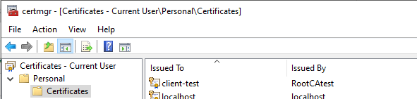
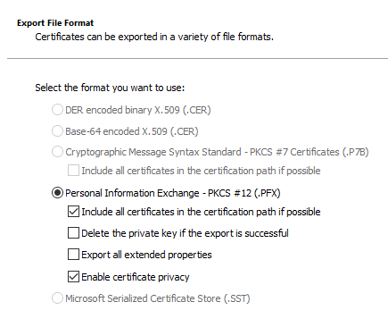

# How to generate certificates for use with samples

To run the Cert_HighLevelApp or to run the WiFi_HighLevelApp with EAP-TLS networking, you need to install two certificates on your Azure Sphere device:

- A Root CA certificate
- A client certificate

For testing, you can use self-signed certificates, which cannot be used with a real-world EAP-TLS network. This document describes how to generate and install the self-signed certificates.

## Required software

To generate the certificates on Windows, you'll need:

- OpenSSL. If you don't already have it, you can download a recommended installation package from [openssl.org’s official wiki page]( https://wiki.openssl.org/index.php/Binaries) and install it your PC.

- Windows Powershell. To find PowerShell, type "PowerShell" in the Search box.

The examples show how to generate and install a Root CA certificate and a client certificate. These examples are for use with the sample applications only; the certificates cannot be used with a real-world EAP-TLS network. Real EAP-TLS networks expect to receive certificates that they recognize as signed by their own authentication servers.

## Step 1. Create Root CA and client certificates

To create a self-signed root CA certificate:

1. Open a PowerShell command shell.

1. At the prompt, enter a command in the following form to create a root CA certificate. Replace `<root-CA-certificate-name>` with a name for the Root CA certificate.

    ```powershell
    PS C:\Users\User> $cert = New-SelfSignedCertificate -Type Custom -KeySpec Signature `
    -Subject "CN=<root-CA-certificate-name>" -KeyExportPolicy Exportable `
    -HashAlgorithm sha256 -KeyLength 2048 `
    -CertStoreLocation "Cert:\CurrentUser\My" -KeyUsageProperty Sign -KeyUsage CertSign
   ```

1. To create a client certificate from the Root CA certificate, enter a command in the following form. Replace `<client-certificate-name>` with a name for the client certificate.

   ```powershell
    PS C:\Users\User> New-SelfSignedCertificate -Type Custom -DnsName P2SChildCert -KeySpec Signature `
    -Subject "CN=<client-certificate-name>" -KeyExportPolicy Exportable `
    -HashAlgorithm sha256 -KeyLength 2048 `
    -CertStoreLocation "Cert:\CurrentUser\My" `
    -Signer $cert -TextExtension @("2.5.29.37={text}1.3.6.1.5.5.7.3.2")
    ```

   The output should look similar to the following:

   ```console
   PSParentPath: Microsoft.PowerShell.Security\Certificate::CurrentUser\My

   Thumbprint                                Subject
   ----------                                -------
   21B500E57CCA81C5199A6FB360CEF85E8CBEA36B  CN=Client-test
   ```

## Step 2. Export certificates from Certificate Manager

To export the Root CA certificate:

1. Open the Certificate Manager by typing "certificate" in the Windows Search box, and then selecting Manage user certificates.
1. Open the Personal folder and the Certificates folder. The certificates you just generated should appear in the right pane.
   

1. Right-click the Root CA certificate you created and select **All tasks>Export**. In the Certificate Export Wizard, select **Next**.
1. Select "No, do not export the private key," and **Next**.
1. Select "Base-64 encoded X.509 format" and **Next**.
1. Enter the path and filename to which to export the certificate, and **Next**. Select Finish to export the certificate. On success, a .cer file that contains the certificate will be exported to the specified location.
1. If you plan to run the Cert_HighLevelApp sample, repeat the preceding steps to export a second Root CA certificate that has a different name.

To export the client certificate and private key:

1. In the Certificate Manager, right-click the client certificate you created and select **All tasks>Export**. In the Certificate Export Wizard, select **Next**.
1. Select "Yes, export the private key," and **Next**.
1. Accept the default format settings and then select **Next**:
   
1. If you want to protect the private key with a password:

   - Check the Password: box
   - Type and confirm the password
   - Change the Encryption type to AES256-SHA256

1. Enter the path and filename to which to export the certificate and select **Next**.
1. Select **Finish** to export the certificate public and private keys. On success, a .pfx file that contains both the certificate and the key will be exported to the specified location.

## Step 3. Convert the certificates to .pem format

To convert the Root CA certificate:

1. Open a [command-line interface](https://learn.microsoft.com/azure-sphere/reference/overview)  using PowerShell, Windows command prompt, or Linux command shell.
1. Type an OpenSSL command in the following format to convert the exported .cer file to .pem format:

   `x509 -in <root-ca-cert>.cer -outform pem -out <root-ca-cert>.pem`

   If the conversion succeeds, the .pem file will be present in the location you specified.

To convert the client certificate and private key pair requires multiple steps. First you export the client certificate from the .pfx file into a .cer file. Then you extract the the private key from the same .pfx file into a separate .cer file. Finally, you convert the files to .pem format.

1. Run OpenSSL.
1. Use an OpenSSL command in the following form to convert the .pfx file to a .cer file:

   `pkcs12 -in <client-cert>.pfx -clcerts -nokeys -out <client-cert>.cer`

1. If you applied a password when you exported the .pfx file using Certificate Manager, OpenSSL prompts to you enter it:

   `Enter Import Password:`

   Note that the password you type is not displayed. `MAC verified OK` indicates you provided the correct password. On successful creation, the .cer file is at the location you specified.

1. Extract the private key into a separate .cer file:

   `pkcs12 -in <client-cert>.pfx -nocerts -out <private-key>.cer`

   Again, if you exported the .pfx file from the certificate manager with a password you will be prompted to enter it now. You will also be prompted to create a PEM pass phrase for the resulting .cer file. For simplicity during testing, you can use the same string as both the password and the PEM pass phrase.

    Upon success, the new <private-key>.cer file will be present in the location you specified.

1. Convert the <client-cert>.cer file to .pem format:

   `x509 -in <client-cert>.cer -outform pem -out <client-cert>.pem`

1. Convert the <private-key>.cer file to a <private-key>.pem file.

   If you applied a password when you created the file, use the following command:

   `rsa -in <private-key>.cer -des3 -out <private-key>.pem`

   You will be prompted to enter the password and the PEM pass phrase.

    If you didn't apply a password, omit the -des3 option.

    On success, you should see the .pem file in the specified location.

1. Type 'q' to exit from OpenSSL.

You can now use these certificates with the Cert_HighLevelApp sample.
