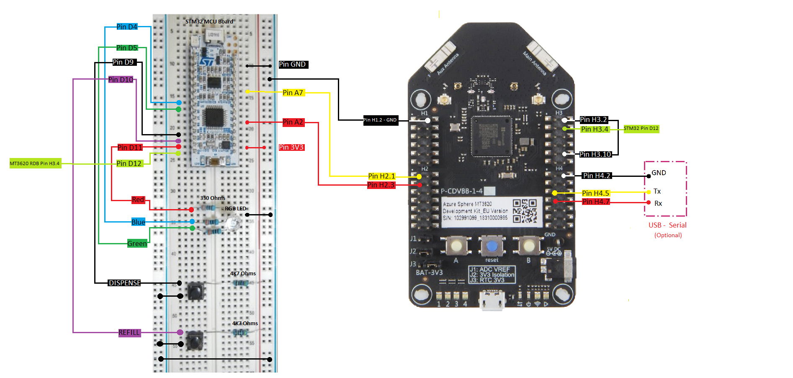

# Build and deploy the External MCU, Low Power reference solution

To build and run this application you will need to do the following:

- Wire up the external MCU and connect it to an Azure Sphere development board.
- Create an IoT Central application and add views.
- Build and deploy the external MCU and MT3620 high-level apps.

## Prerequisites

Set up your device and development environment as described in the [Azure Sphere documentation](https://docs.microsoft.com/azure-sphere/install/overview).  

**Parts list:**

| Quantity        |Item        |
| ------------- |-------------|
| 1|NUCLEO-L031K6 - Dev Board |
| 1|RGB LED|
| 1|Gadgeteer USB-Serial interface module (optional) |
| 3|330 Ohm Resistor |
| 2|4K7 Resistor |
| 1| Breadboard and pre cut M-M jumper leads|
| 2|Tactile Switch |
|1 |150mm F-F jumper leads |
|7 |200mm M-F jumper leads |
|5 |200mm M-M jumper leads |

## Wire up the external MCU and connect it to an Azure Sphere development board

Make the following connections between the STM NUCLEO-L031K6 and MT3620 dev boards using the jumper wires:

- external MCU pin D4 to 330 ohm resistor to RGB LED Pin Blue
- external MCU pin D5 to 330 ohm resistor to RGB LED Pin Green
- external MCU pin D9 to Dispense button
- external MCU pin D10 to Refill button
- external MCU pin D11 to 330 ohm resistor to RGB LED Pin Red
- external MCU pin D12 to MT3620 RDB pin H3.4
- Dispense button to 4.7K pull-up resistor; 4.7K pull-up resistor to power strip (+)
- Dispense button to ground strip (-) 
- Refill button to 4.7K pull-up resistor; 4.7K pull-up resistor to power strip (+)
- Refill button to circuit ground strip (-)
- RGB LED ground pin to ground strip (-)
- external MCU pin 3.3v to power strip (+)
- external MCU pin A2 to MT36220 RDB pin H2.3
- external MCU pin A7 to MT3620 RDB pin H2.1
- Ground strip to MT3620 RDB pin H1.2 (GND)
- external MCU pin GND to ground strip.
- MT3620 RDB pin H3.2 to MT3620 RDB pin H3.10.

    **Note:** The connection between MT3620 RDB pins H3.2 and H3.10 is not required for RDB versions 1.6 and later.

**Optional debug UART connections**

Output from Log_Debug can also be seen on the optional debug UART. This can be useful for observing application behavior without a debugger connection. For example, after device shutdown or restart.

- MT3620 RDB pin H4.2 to USB-Serial GND
- MT3620 RDB pin H4.5 to USB-Serial P4
- MT3620 RDB pin H4.7 to USB-Serial P5

## Build and deploy the MCU app

If you haven't done so already:

- Download and install the [STM32Cube IDE](https://www.st.com/en/development-tools/stm32cubeide.html#get-software).

- Connect the Azure Sphere development board and the NUCLEO-L031K6 developer board to your computer via USB.

To build and run the MCU app do the following:

1. Open the STM32Cube IDE.
1. In the **File menu** select **Open Projects from File System**.
1. In the **Import Projects from File System or Archive** window, click **Directory** and navigate to the *McuSoda* folder. Click **Select Folder**.
1. Click **Finish**.
1. In the **Project** menu select **Build All**
1. In the **Run** menu select **Run** or **Debug**.

    **Note:**  The first time you run or debug, a configuration menu will pop up. Select the defaults.

## Create an IoT Central application and add views

To create an IoT Central app, see [IOT Central Setup](./IOTCentralSetup.md).

## Build and deploy the Azure Sphere MT3620 high-level app

To build and run the high-level app, follow the instructions in [Build a sample application](../../BUILD_INSTRUCTIONS.md).

## Run the app

**MCU Interactions:**

On startup the external MCU turns on and waits for the Azure Sphere MT3620 to send it a flavor and color. When the External MCU receives the flavor color from the MT3620, it will turn on the soda dispense color. Each time a new flavor is sent, the external MCU will update the dispense flavor color.

Every 2 minutes, the MT3620 will wake up the external MCU collect data and send the data to IoT Central. This is a default parameter to show data updates in the sample but should be changed to a longer time period for use in a production low power application.

**IoT Central interactions**

1. On startup, the MT3620 connects to IoT Central.
1. Go to IoT Central and select "devices" and migrate the new device that appears to the Soda Machine Device Template.
1. Select the device and then select "Next Flavor".
1. In the flavor box, provide the new flavor name (such as "Cherry") and set the color with the drop down then select save.
1. In the debug output from the MT3620, you will see the device receive the new flavor and pass it to the external MCU which will light up with the new flavor color.

**User interactions**

- Press the **Dispense** button (connected to pin D9 on the NUCLEO-L031K6 board) to dispense one unit of the soda. The external MCU RGB LED will flash once with the current flavor.

- Press the **Refill** button (connected to pin D10 on the NUCLEO-L031K6 board) to refill the soda machine syrups and carbonated water.

## Build your own solution

To change the following settings, open the configuration.h file (*.../LocalSamples/DeviceToCloud/ExternalMcuLowPower/common/configuration.h*), which is located in the folder and change the value of the corresponding constant.

| Setting  |Default value  | Description  |
| ------------- |-------------| -----|
| MachineCapacity |5 |The capacity (maximum units) of the soda machine |
|LowDispenseAlertThreshold|2|The number of remaining units that will initiate a low stock alert.

## License
For details on license, see LICENSE.txt in this directory.

## Code of Conduct
This project has adopted the [Microsoft Open Source Code of Conduct](https://opensource.microsoft.com/codeofconduct/).