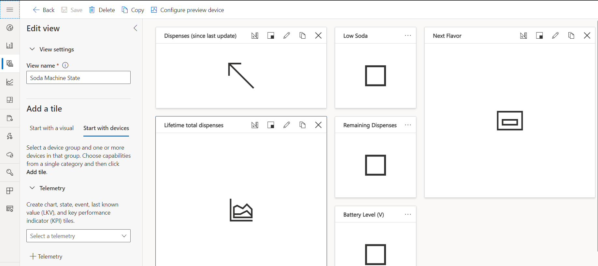
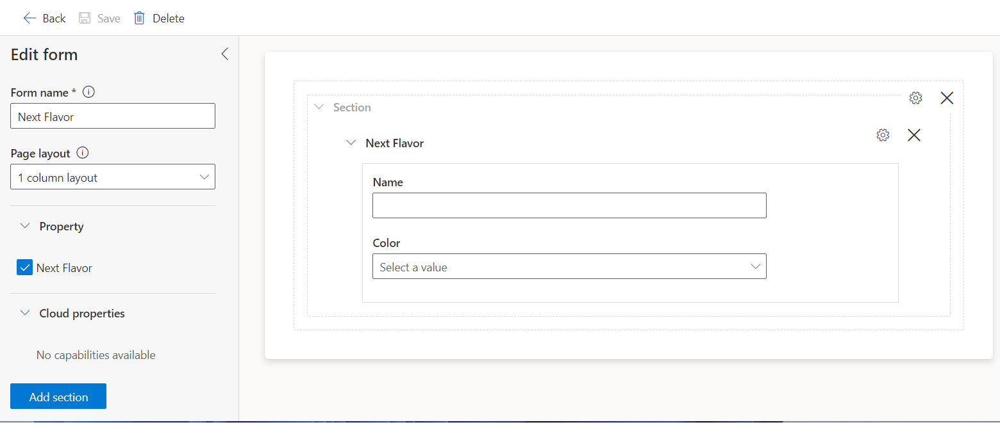

# IoT Central Setup

## Create an Azure IoT Central application

1. Go to [Azure IoT Central](https://apps.azureiotcentral.com/build) in your browser.
1. Choose Custom apps and sign in with your Microsoft account, or create a new account.
1. Use the default Application name and URL or modify it, if you prefer.
1. Under Application template, choose Custom Application.
1. Either choose 7 day free trial and provide your contact info, or provide your billing info.
1. Click **Create** at the bottom of the page.

## Configure the Azure IoT Central application

1. In the left navigation pane on the Home Page, select **Device Templates**
1. In the **Device Templates** pane, select **+ (New)**.
1. In the **Select Template Type** pane, select **IoT Device > Next: Customize**. 
1. Fill in the Device template name with any name you choose (for example: Soda Machine) and select **Next: Review > Create**. 
1. Select **Import capability model** and select the SodaMachineTemplate.json file from the root folder of the reference solution. 

## Add the views

Add two Views to the Device Template, one to display the soda machine state and one to select the next flavor.

   To display the soda machine state:

   1. Select **Views > Visualizing the device**.
   1. Customize the **View name** with "Soda Machine State".
   1. Under **Telemetry**, use the use the dropdown menu to select **Dispenses (since last update)**, then **Add tile**. Use the **Change Visualization** button on the graph to change the view to a KPI. You may also resize the graph using the **Size Available** button to **2x1**.
   1. Under **Telemetry**, use the dropdown menu to select **Lifetime total dispenses**, then **Add tile**. Select the **Settings** button on the graph and then select the **Settings** button on the **Lifetime total dispenses** telemetry value to change the data aggregation from Average to Sum. Select **Update** to save the graph option.
   1. Under **Telemetry**, use the dropdown menu to select **Low Soda**, then **Add tile**. Use the **Change Visualization** button on the graph to change the view to the **Last Known Value**. You may also resize the graph using the **Size Available** button to **1x1**.
   1. Under **Telemetry**, use the dropdown menu to select **Remaining Dispenses**, then **Add tile**. Use the **Change Visualization** button on the graph to change the view to the **Last Known Value**. You may also resize the graph using the **Size Available** button to **1x1**.
   1. Under **Telmetry**, use the dropdown menu to select **Battery Level (V)**, then **Add tile**. Use the Change Visualization button on the graph to change the view to the **Last Known Value**. You may also resize the graph using the **Size Available** button to **1x1**.
   1. Under **Property**, use the dropdown menu to select **Name**, then **Add tile**.
   1. The view should look like the following image. Select **Save**.

       

   To select the next flavor:

   1. Select **Views > Editing device and cloud data**
   1. Customize the **Form name** with "Next Flavor".
   1. Under **Property**, select **Next Flavor**, then **Add section**.
   1. The view should look like the following image. Select **Save**.
   1. Select **Publish > Publish**.

       

## Set up Azure IoT Central to work with Azure Sphere

1. Verify the identity of your Azure Sphere tenant by following the steps in [set up Azure IoT Central](https://docs.microsoft.com/azure-sphere/app-development/setup-iot-central#step-2-download-the-tenant-authentication-ca-certificate). Start at step 2 and perform steps 2-5.

1. Configure the sample application to work with your Azure Sphere tenant and devices.

   To configure the sample application, you'll need to supply the following information in the app_manifest.json file for AzureIoT:

   - The Tenant ID for your Azure Sphere device
   - The Scope ID for your Azure IoT Central application
   - The allowed connections for your Azure Sphere device
  
    Follow these steps to gather the information and configure the application:

    1. Find the app_manifest.json file in your sample directory and open it.

    1. At the command prompt, run the ShowIoTCentralConfig program from the Windows or Linux folder in the sample repository. For example: On Windows, the path is Samples\AzureIoT\Tools\win-x64\ShowIoTCentralConfig.exe. When running this tool on a Linux machine you may need to explicitly set permissions. For example: From a terminal, run `chmod +x ShowIoTCentralConfig` to set permissions on the tool.

    1. Follow the prompts that the tool provides, and copy the information from the output into the app_manifest.json file. The tool will require the following input:

       *IoT Central App URL* – this can be found in your browser address bar. For Example: http://myiotcentralapp.azureiotcentral.com/. Paste the URL into the **AllowedConnections** field of the app manifest.

       *API token* – this can be generated from your IoT Central application. In the Azure IoT Central application, select **Administration** > **API Tokens** > **Generate Token**, and then provide a name for the  token. For example, "AzureSphereSample" - select **Administrator** as the role, and then click **Generate**. Copy the token to the clipboard. The token starts with **SharedAccessSignature**.

       *ID Scope* - In the Azure IoT Central application, select **Administration** > **Device Connection** and then copy everything in this section and paste it into the **CmdArgs** field of the app manifest.

    1. At the command prompt, run the `azsphere tenant show-selected` command to get the tenant ID (a GUID). In the [app_manifest.json file](https://docs.microsoft.com/en-us/azure-sphere/app-development/app-manifest), set the value of the **DeviceAuthentication** capability to your tenant ID.  
      
    1. Save the updated application manifest.

    1. Ensure that the **Auto approve** option is enabled. From the Azure IoT Central Application, click **Administration** > **Device connection**, then on the **Auto approve** option, select **Enabled**.

