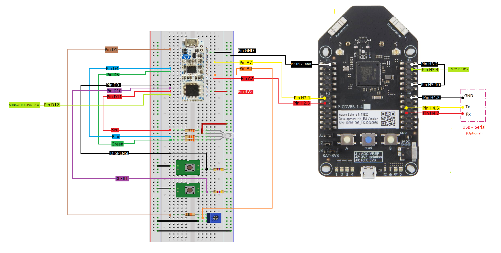

# Sample: Device to Cloud - external MCU, low power

This sample demonstrates how you might use an Azure Sphere device as an interface between an external MCU, not connected to the internet, and an IoT application platform such as IoT Central. The solution is implemented to optimize for low power by incorporating features such as the Azure Sphere device [Power Down state](https://docs.microsoft.com/azure-sphere/app-development/power-down#power-down-state) when it's not collecting data from the MCU or communicating with IoT Central.

This solution models a soda machine that regularly sends usage data to IoT Central and receives new flavor recipes from IoT Central. An external MCU is used to implement the soda machine model. An Azure Sphere MT3620 provides the communication interface between the MCU and IoT Central. Soda machine managers can use views in IoT Central to see which machines are low on stock and need refills and which machines are used more. They can also use IoT Central to send new flavors to soda machines.

When the user initiates an action, the external MCU wakes, increments its usage count, stores the new value, and returns to low power mode. If it detects a low inventory level it informs the Azure Sphere MT3620. The Azure Sphere MT3620, connected to the MCU via UART, periodically collects the data from the MCU and sends it to IoT Central. The Azure Sphere MT3620 also receives, and passes on to the MCU, configuration data from IoT Central.

**Note:** This README describes how to build, deploy, and run this sample with a breadboard-based hardware design and off-the-shelf hardware. Alternatively, you can use a printed circuit board (PCB) that integrates an MT3620 module and an external MCU. To use the PCB instead of a breadboard with this sample, see the [low-power hardware reference design](https://github.com/Azure/azure-sphere-hardware-designs/tree/main/P-MT3620EXMSTLP-1-0/README.md) instructions.

**Note:** This sample writes data to and erases data from the flash. Be aware that repeatedly updating the flash eventually wears it out and makes it invalid.

The sample uses the following Azure Sphere libraries.

| Library | Purpose |
|---------|---------|
| [application](https://docs.microsoft.com/azure-sphere/reference/applibs-reference/applibs-eventloop/eventloop-overview) | Communicates with the real-time capable application running on the external MCU. |
| [eventloop](https://docs.microsoft.com/azure-sphere/reference/applibs-reference/applibs-eventloop/eventloop-overview) | Invokes handlers for I/O timer events. |
| [gpio](https://docs.microsoft.com/azure-sphere/reference/applibs-reference/applibs-gpio/gpio-overview) | Manages status LEDs on the Azure Sphere MT3620. |
| [log](https://docs.microsoft.com/azure-sphere/reference/applibs-reference/applibs-log/log-overview) | Displays messages in the Device Output window during debugging. |
| [networking](https://docs.microsoft.com/azure-sphere/reference/applibs-reference/applibs-networking/networking-overview) | Manages the network configuration of the Azure Sphere MT3620. |
| [powermanagement](https://docs.microsoft.com/azure-sphere/reference/applibs-reference/applibs-power/power-overview) | Manages the power state of the Azure Sphere MT3620. |
| [storage](https://docs.microsoft.com/azure-sphere/reference/applibs-reference/applibs-storage/storage-overview) | Stores the data collected from the MCU. |
| [sysevent](https://docs.microsoft.com/azure-sphere/reference/applibs-reference/applibs-sysevent/sysevent-overview) | Registers for system event notifications. |
| [uart](https://docs.microsoft.com/azure-sphere/reference/applibs-reference/applibs-uart/uart-overview) | Manages communication with the MCU. |

## Contents

| File/folder              | Description |
|--------------------------|-------------|
| `BuildMcuToCloud.md`       | Instructions for building, deploying, and running this sample application. |
| `IOTCentralSetup.md`       | Instructions for creating the IoT Central application. |
| `README.md`                | This README file. |
| `AzureSphere_HighLevelApp` | Folder containing the configuration files, source code files, and other files needed for the high-level application that runs on the Azure Sphere MT3620. |
| `common`                   | Folder containing common header files and source code files. |
| `HardwareDefinitions`      | Folder containing the hardware definition files for various Azure Sphere boards. |
| `McuSoda`                  | Folder containing the configuration files, source code files, and other files needed for the soda machine application that runs on the external MCU. |

## Prerequisites

- A [Seeed MT3620 Development Kit](https://aka.ms/azurespheredevkits) or other hardware that implements the [MT3620 Reference Development Board (RDB)](https://docs.microsoft.com/azure-sphere/hardware/mt3620-reference-board-design) design.

- Set up your device and development environment as described in the [Azure Sphere documentation](https://docs.microsoft.com/azure-sphere/install/overview).

- Ensure that you have all of the parts that are listed in the following list.

   | Quantity      | Item        |
   | ------------- |-------------|
   | 1 | STM NUCLEO-L031K6 - Dev Board |
   | 1 | RGB LED (common anode)|
   | 1 | USB-Serial interface module (optional) |
   | 3 | 330 Ohm Resistor |
   | 2 | 4K7 Resistor |
   | 1 | 10K Resistor |
   | 1 | 10K Potentiometer |
   | 1 | Breadboard and pre cut M-M jumper leads|
   | 2 | Tactile Switch |
   | 1 | 150mm F-F jumper leads |
   | 7 | 200mm M-F jumper leads |
   | 8 | 200mm M-M jumper leads |

## Setup

1. Clone the [Azure Sphere samples](https://github.com/Azure/azure-sphere-samples) repository and find the *DeviceToCloud* sample in the *DeviceToCloud* folder or download the zip file from the [Microsoft samples browser](https://docs.microsoft.com/samples/azure/azure-sphere-samples/DeviceToCloud/).

1. Make the following connections between the external MCU (STM NUCLEO-L031K6) and Azure Sphere MT3620 development boards using the jumper wires:

   - External MCU pin D1 to 10K resistor; 10K resistor to first outer terminal of 10k potentiometer.
   - External MCU pin D4 to 330 ohm resistor to RGB LED Pin Blue
   - External MCU pin D5 to 330 ohm resistor to RGB LED Pin Green
   - External MCU pin D9 to Dispense button
   - External MCU pin D10 to Refill button
   - External MCU pin D11 to 330 ohm resistor to RGB LED Pin Red
   - External MCU pin D12 to MT3620 RDB pin H3.4
   - Dispense button to 4.7K pull-up resistor; 4.7K pull-up resistor to power strip (+)
   - Dispense button to ground strip (-)
   - Refill button to 4.7K pull-up resistor; 4.7K pull-up resistor to power strip (+)
   - Refill button to circuit ground strip (-)
   - Second outer terminal of 10K potentiometer to ground strip.
   - RGB LED common anode pin (typically the longest of all the pins) to power strip (+)
   - External MCU pin GND to ground strip.
   - External MCU pin 3.3v to power strip (+)
   - External MCU pin A2 to MT36220 RDB pin H2.3
   - External MCU pin A3 to center terminal of 10K potentiometer
   - External MCU pin A7 to MT3620 RDB pin H2.1
   - Ground strip to MT3620 RDB pin H1.2 (GND)
   - MT3620 RDB pin H3.2 to MT3620 RDB pin H3.10.

   

   **Note:**

   - The connection between MT3620 RDB pins H3.2 and H3.10 is not required for RDB versions 1.6 and later.

   - This sample was updated in 20.11 and the common cathode RGB LED has been replaced by a common anode RGB LED. If you use hardware built for the older version of the sample, the RGB LED polarity will be reversed (turn on when it should turn off, and vice versa). If needed, you can modify the code:

      In the `McuSoda\Core\Src\flavor.c` file, find the following code in the `UpdateLedStatus` function:

      ```c
      static const GPIO_PinState ledOnState = GPIO_PIN_RESET;
      static const GPIO_PinState ledOffState = GPIO_PIN_SET;
      ```

      Modify the code as follows for a common cathode RGB LED:

      ```c
      static const GPIO_PinState ledOffState = GPIO_PIN_RESET;
      static const GPIO_PinState ledOnState = GPIO_PIN_SET;
      ```

### Optional debug UART connections

Output from Log_Debug can also be seen on the optional debug UART. This can be useful for observing application behavior without a debugger connection. For example, after device shutdown or restart.

- MT3620 RDB pin H4.2 to USB-Serial Ground pin
- MT3620 RDB pin H4.5 to USB-Serial Tx pin
- MT3620 RDB pin H4.7 to USB-Serial Rx pin

## Build and run the sample

Follow the instructions in [BuildMcuToCloud.md](./BuildMcuToCloud.md) to build and run this sample.

## Next steps

- For an overview of Azure Sphere, see [What is Azure Sphere](https://docs.microsoft.com/azure-sphere/product-overview/what-is-azure-sphere).
- To learn more about Azure Sphere application development, see [Overview of Azure Sphere applications](https://docs.microsoft.com/azure-sphere/app-development/applications-overview).
- To learn about how to manage power in Azure Sphere devices, see [Manage Power Down state](https://docs.microsoft.com/azure-sphere/app-development/power-down) and [Set power profiles](https://docs.microsoft.com/azure-sphere/app-development/set-power-profiles).
