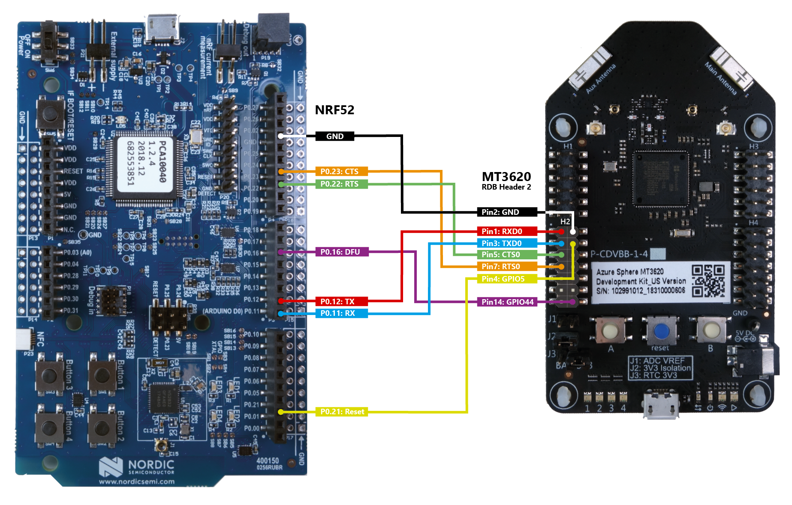

# Sample: External MCU update

Your product may incorporate other MCUs with your Azure Sphere device, and [those other MCUs may require updates](https://docs.microsoft.com/azure-sphere/deployment/external-mcu-update). Assuming the other MCUs permit updates to be loaded over the connection you establish with the Azure Sphere device, for example over UART, you can use the Azure Sphere device to securely deliver those updates.

This reference solution demonstrates how you might use an Azure Sphere device to deploy an update to an external MCU device. This solution contains an Azure Sphere application that deploys firmware to the Nordic nRF52 Development Kit over UART. This application can itself be updated remotely via [over-the-air updates](https://docs.microsoft.com/azure-sphere/deployment/deployment-overview), ensuring that the software versions of this application and the MCU firmware are always in sync.

The sample uses the following Azure Sphere libraries.

| Library | Purpose |
|---------|---------|
| [eventloop](https://docs.microsoft.com/azure-sphere/reference/applibs-reference/applibs-eventloop/eventloop-overview) | Invokes handlers for I/O timer events. |
| [gpio](https://docs.microsoft.com/azure-sphere/reference/applibs-reference/applibs-gpio/gpio-overview) | Manages the buttons and LEDs on the device. |
| [log](https://docs.microsoft.com/azure-sphere/reference/applibs-reference/applibs-log/log-overview) | Displays messages in the Device Output window during debugging. |
| [storage](https://docs.microsoft.com/azure-sphere/reference/applibs-reference/applibs-storage/storage-overview) | Opens a file in the image package. |
| [uart](https://docs.microsoft.com/azure-sphere/reference/applibs-reference/applibs-uart/uart-overview) | Manages communication with the Nordic nRF52  Development Kit. |

## Contents

| File/folder                | Description |
|----------------------------|-------------|
| `README.md`                | This README file. |
| `AzureSphere_HighLevelApp` | Folder containing the configuration files, source code files, hardware definitions, and other files needed for the high-level application. |
| `Binaries`                 | Folder containing the `.hex` bootloader files. |
| `Nrf52Bootloader`          | Folder containing the configuration files, source code files, and other files needed for building your own bootloader. |

## Prerequisites

This reference solution requires the following items:

- Azure Sphere SDK version 21.10 or above. At the command prompt, run [**azsphere show-version**](https://docs.microsoft.com/azure-sphere/reference/azsphere-show-version) to check. Download and install the latest SDK as needed. The [setup procedures](https://docs.microsoft.com/azure-sphere/install/overview) describe how to choose and install an SDK.

- An [Azure Sphere development board](https://aka.ms/azurespheredevkits) that supports the [Sample Appliance](../../HardwareDefinitions) hardware requirements.

   **Note:** By default, the sample targets the [Reference Development Board](https://docs.microsoft.com/azure-sphere/hardware/mt3620-reference-board-design) design, which is implemented by the Seeed Studios MT3620 Development Board. To build the sample for different Azure Sphere hardware, change the value of the TARGET_HARDWARE variable in the `CMakeLists.txt` file. For detailed instructions, see the [Hardware Definitions README](../../HardwareDefinitions/README.md) file.

- Nordic nRF52 BLE development board

- Jumper wires to connect the boards

- Two free USB ports on your computer

## Setup

1. Make the following connections between the Nordic nRF52 and Azure Sphere MT3620 dev boards using the jumper wires:

   - nRF52 RX: P0.11 to MT3620 UART0 TX: Header 2 (lower left) Pin 3
   - nRF52 TX: P0.12 to MT3620 UART0 RX: Header 2 (lower left) Pin 1
   - nRF52 CTS: P0.23 to MT3620 UART0 RTS: Header 2 (lower left) Pin 7
   - nRF52 RTS: P0.22 to MT3620 UART0 CTS: Header 2 (lower left) Pin 5
   - nRF52 Reset: P0.21 to MT3620 GPIO5: Header 2 (lower left) Pin 4
   - nRF52 DFU: P0.16 to MT3620 GPIO44: Header 2 (lower left) Pin 14
   - nRF52 Ground: GND to MT3620 GND: Header 2 (lower left) Pin 2

     Refer to the following graphic for details.

     

1. Clone the [Azure Sphere samples](https://github.com/Azure/azure-sphere-samples) repository and find the *ExternalMcuUpdate* sample in the *ExternalMcuUpdate* folder or download the zip file from the [Microsoft samples browser](https://docs.microsoft.com/samples/azure/azure-sphere-samples/externalmcuupdate/).

1. Install bootloader on the nRF52.

   1. Connect the nRF52 developer board to your computer using USB. Once connected, the nRF52 displays a JLINK removable drive in Windows.
   1. Find `*softdevice_Bootloader.hex` in the `ExternalMcuUpdate\Binaries` folder, and copy it to the JLINK drive. The nRF52 restarts automatically and runs the bootloader.
   1. Observe that LED1 and LED3 are lit on the nRF52 development board, which indicates that the bootloader has started successfully.

## Build and run the sample

Follow the instructions in [Build a sample application](../../BUILD_INSTRUCTIONS.md) to build and run the Azure Sphere application in Visual Studio or Visual Studio Code.

### Observe the output

Observe the output while the application updates the firmware on the nRF52.

1. As the application runs, observe the Output window for activity messages. You should see the sample firmware install on the nRF52.
1. Observe that LED2 and LED4 are blinking on the nRF52 development board, which indicates the new firmware is running.
1. Press button A to restart the update process. In the Output window, observe that the application determines the nRF52 firmware is already up to date, and does not reinstall it.

## Rebuild the sample to deploy different firmware

The nRF52 firmware files are included as resources within the Azure Sphere sample application. The application can easily be revised and rebuilt to include different firmware for deployment to the nRF52. The sample application is currently set up to deploy the Blinkyv1 firmware.

### Revise the Azure Sphere sample application

To include different firmware files as resources, update the resources specified in the sample's `CMakeLists.txt` and `main.c` files. For example, to include the Blinkyv2 instead of the Blinkyv1 firmware files as resources, complete the following steps:

1. In the [CMakeLists.txt](./AzureSphere_HighLevelApp/CMakeLists.txt) file for this sample, edit the **azsphere_target_add_image_package** command to replace `BlinkyV1.bin` and `BlinkyV1.dat` with `BlinkyV2.bin` and `BlinkyV2.dat` respectively:

        azsphere_target_add_image_package(
        ${PROJECT_NAME}
         RESOURCE_FILES
        "ExternalNRF52Firmware/blinkyV2.bin"
        "ExternalNRF52Firmware/blinkyV2.dat"
        "ExternalNRF52Firmware/s132_nrf52_6.1.0_softdevice.bin"
        "ExternalNRF52Firmware/s132_nrf52_6.1.0_softdevice.dat")    

1. Update the filename constants in `main.c` to point at BlinkyV2 instead of BlinkyV1.
1. Update the accompanying version constant to '2' instead of '1'.
1. Ensure the "SoftDevice" BLE stack firmware files (`s132_nrf52_6.1.0_softdevice.bin` and `s132_nrf52_6.1.0_softdevice.dat`) are still included as resources. Do not edit the constants that relate to these files.

### Rebuild and run the sample

1. Rebuild and run the Azure Sphere application.
1. Use the Output window to observe as the BlinkyV2 firmware is installed and run on the nRF52.
1. Observe that LED3 and LED4 are now blinking on the nRF52 development board, which indicates that the BlinkyV2 firmware is running.
1. Notice that the SoftDevice BLE stack was not updated because it is already at the correct version.

## Build and deploy your own nRF52 firmware

You can adapt this solution to deploy your own firmware for the nRF52.

### Create a new BlinkyV3 nRF52 firmware application

1. Download and install [SEGGER Embedded Studio](https://www.segger.com/downloads/embedded-studio). [Download the 32-bit version](https://www.segger.com/downloads/embedded-studio/EmbeddedStudio_ARM_Win_x86), not the 64-bit version. Ensure that you are licensed to use it for your purposes. In Oct 2018, we were able to [obtain the license for free because we were developing for NRF52](https://www.segger.com/news/segger-embedded-studio-ide-now-free-for-nordic-sdk-users/).
1. Download and unzip the [Nordic NRF5 SDK V15.2](https://www.nordicsemi.com/eng/Products/Bluetooth-low-energy/nRF5-SDK#Downloads).
1. Edit Nordic's Blinky sample application so you can build it against your SDK:
    1. Use a text editor to open `<NORDIC_SDK_PATH>\examples\peripheral\blinky\pca10040\s132\ses\blinky_pca10040_s132.emProject`.
    1. Set the SDK_ROOT variable in this file to point to the root directory your Nordic SDK install. Specifically, replace the words "CHANGE_THIS_TO_YOUR_NORDIC_SDK_PATH" with the correct path, changing any backslashes ("\\") to forward slashes ("/") in the path. For example: `macros="SDK_ROOT=C:/Users/ExampleUser/source/nRF5_SDK_15.2.0_9412b96;…"`.
1. Open this .emProject file in the Segger IDE.
1. Build it (**Build->Build Solution**) to generate a .hex file. It is placed in this location: `<NORDIC_SDK_PATH>\examples\peripheral\blinky\pca10040\s132\ses\Output\Release\Exe\blinky_pca10040_s132.hex`

### Obtain the BlinkyV3.bin and BlinkyV3.dat firmware files

1. Install [Python](https://www.python.org/downloads/) 2.7.6 (32-bit) or later.

   **Note:** Python 3 won't work but it's fine to have this installed side-by-side.

1. Install the Nordic [nrfutil](http://infocenter.nordicsemi.com/index.jsp?topic=%2Fcom.nordic.infocenter.tools%2Fdita%2Ftools%2Fnrfutil%2Fnrfutil_intro.html) CLI.
1. Use the **nrfutil** utility to transform the downloaded application .hex file into a firmware update package .zip file. Specify the application version in the command.
    1. Open a command prompt and go to the directory that contains the .hex file generated above.
    1. Run the following command:

        ```
        nrfutil pkg generate --application blinky_pca10040_s132.hex --sd-req "0xA8","0xAF" --application-version 3 --hw-version 52 blinkyV3.zip
        ```

        See the [nrfutil documentation](https://libraries.io/pypi/nrfutil) for more details about this command's options.

        Note the warning about 'not providing a signature key'. This doesn't stop you from proceeding, but you should consider whether this is acceptable for your production scenario or whether, for example, your product is designed so that only the Azure Sphere chip has the ability to update the nRF52 firmware.

       The version specified to pack the application ('3' in this case) must also be specified in the Azure Sphere application when you [Deploy the BlinkyV3 firmware](#deploy-the-blinkyv3-firmware).

1. Open the resulting .zip file and extract the .bin and metadata .dat back out from this .zip package.
1. Rename these files as desired—for example, BlinkyV3.bin/.dat.

### Deploy the BlinkyV3 firmware

To deploy your new firmware to the nRF52, complete the following steps:

1. Add `BlinkyV3.bin` and `BlinkyV3.dat` as resources in the Azure Sphere application by following the steps specified in [Revise the Azure Sphere sample application](#revise-the-azure-sphere-sample-application). Remember to update the filenames and the version to '3' in `main.c`.
1. Rebuild and run the sample by following the steps specified in [Rebuild and run the sample](#rebuild-and-run-the-sample).

## Combine this solution with the solution for BLE-based Wi-Fi setup

You can combine this solution for external MCU update with the solution for [BLE-based Wi-Fi setup](https://github.com/Azure/azure-sphere-samples/tree/master/Samples/WifiSetupAndDeviceControlViaBle). Doing so allows you to remotely update that solution's nRF52 application.

### Create a single Azure Sphere application

1. Remove the code that uses button A to trigger a firmware update and instead trigger it only when the combined application starts. In particular, remove the DfuTimerEventHandler, dfuButtonTimerEvent, gpioButtonFd, buttonPressCheckPeriod and dfuButtonTimerFd.
1. Combine the initialization and close functions. In particular, the UART, Epoll, and Reset file descriptors are opened and closed by both applications. Make sure you maintain only a single copy of each.
1. After the MCU update is complete, make sure to remove any of its UART event handlers from the epoll event loop. This will allow the Wi-Fi setup code to register its own UART event handlers when needed. Failure to do so will result in such registrations returning -1 with errno set to EEXISTS.
1. Combine the application manifest. In particular, add the required GPIOs for both applications and set the WifiConfig capability to true.

### Obtain the nRF52 firmware files

1. Rebuild the nRF52 firmware for the [BLE-based Wi-Fi app](https://github.com/Azure/azure-sphere-samples/tree/master/Samples/WifiSetupAndDeviceControlViaBle#build-your-own-solution). Select **Build->Build Solution** or press F7 to generate a .hex file. The hex file is placed in the following location: `<PATH_TO_DOWNLOADED_SAMPLES>\WifiSetupAndDeviceControlViaBle\Nrf52App\pca10040\s132\ses\Output\Release\Exe\ble_app_uart_pca10040_s132.hex`

1. Follow the steps specified in [Obtain the BlinkyV3.bin and BlinkyV3.dat firmware files](#obtain-the-blinkyv3bin-and-blinkyv3dat-firmware-files) to transform this .hex file into .dat and .bin files.
1. Rename these fields as desired—for example, WifiSetupAndDeviceControlViaBle.bin/.dat

### Deploy the new firmware

To deploy the new firmware to the nRF52, complete the following steps:

1. Add `WifiSetupAndDeviceControlViaBle.bin` and `WifiSetupAndDeviceControlViaBle.dat` as resources in the **External MCU update** sample application by following the steps specified in [Revise the Azure Sphere sample application](#revise-the-azure-sphere-sample-application). Remember to update the filenames and the version in `main.c`. For example, if you've previously deployed version '3' of the firmware (even if it was just test firmware such as 'Blinky') then the version should now be '4'.

1. Rebuild and run the sample by following the steps specified in [Rebuild and run the sample](#rebuild-and-run-the-sample).

## Build your own bootloader

This sample includes a modified version of the example bootloader (secure_bootloader\pca10040_uart_debug) in the nRF5 SDK. It has been modified to:

- Use a custom board configuration where the UART pins are remapped and have pull-up resistors enabled on the input pins.
- Accept signed or unsigned applications—consider whether this is acceptable for your production scenario.
- Accept signed or unsigned bootloaders—consider whether this is acceptable for your production scenario.
- Accept firmware upgrades or downgrades.
- Enable Device Firmware Update (DFU) mode via pin input, as well as by pressing the Reset button on the nRF52 board.

To further edit and deploy this bootloader:

1. Edit the bootloader sample so you can build it against your SDK:
    1. Use a text editor to open `ExternalMcuUpdate\Nrf52Bootloader\pca10040\s132\ses\bootloader_uart_mbr_pca10040_debug.emProject`.
    1. Set the SDK_ROOT variable in this file to point to the root directory your Nordic SDK install. Specifically, replace the words "CHANGE_THIS_TO_YOUR_NORDIC_SDK_PATH" with the correct path, changing the backslashes ("\\") to forward slashes ("/") in the path. For example: `macros="SDK_ROOT=C:/Users/ExampleUser/source/nRF5_SDK_15.2.0_9412b96;…"`.
1. Open this .emProject file in the Segger IDE.
1. Build it (**Build->Build Solution**) to generate a .hex file. It is placed in this location: `ExternalMcuUpdate\Nrf52Bootloader\pca10040\s132\ses\Output\Release\Exe\bootloader_uart_mbr_pca10040_debug.hex`
1. Copy this file to the JLINK drive presented by the nRF52. The nRF52 restart automatically and runs the bootloader.

## Next steps

- For an overview of Azure Sphere, see [What is Azure Sphere](https://docs.microsoft.com/azure-sphere/product-overview/what-is-azure-sphere).
- To learn more about Azure Sphere application development, see [Overview of Azure Sphere applications](https://docs.microsoft.com/azure-sphere/app-development/applications-overview).
