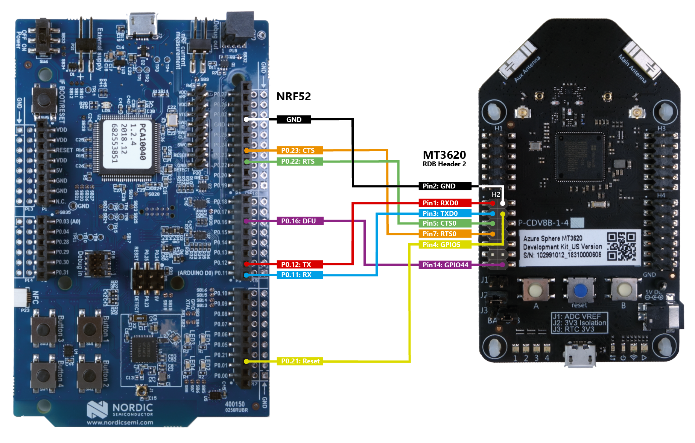

# Sample: External MCU update - reference solution

Your product may incorporate other MCUs with your Azure Sphere device, and [those other MCUs may require updates](https://docs.microsoft.com/en-us/azure-sphere/deployment/external-mcu-update). Assuming the other MCUs permit updates to be loaded over the connection you establish with the Azure Sphere device, for example over UART, you can use the Azure Sphere device to securely deliver those updates.

This reference solution demonstrates how you might deploy an update to an external MCU device using Azure Sphere. This solution deploys firmware to the Nordic nRF52 Development Kit over UART from the Azure Sphere MT3620 board.

## Preparation

This sample solution requires the following hardware:

- Azure Sphere MT3620 board
- Nordic nRF52 BLE development board
- Jumper wires to connect the boards
- Two free USB ports on your computer

## Connect Azure Sphere MT3620 to the Nordic nRF52

Make the following connections between the nRF52 and MT3620 dev boards using the jumper wires:

- nRF52 RX: P0.11 to MT3620 UART0 TX: Header 2 (lower left) Pin 3
- nRF52 TX: P0.12 to MT3620 UART0 RX: Header 2 (lower left) Pin 1
- nRF52 CTS: P0.23 to MT3620 UART0 RTS: Header 2 (lower left) Pin 7
- nRF52 RTS: P0.22 to MT3620 UART0 CTS: Header 2 (lower left) Pin 5
- nRF52 Reset: P0.21 to MT3620 GPIO5: Header 2 (lower left) Pin 4
- nRF52 DFU: P0.16 to MT3620 GPIO44: Header 2 (lower left) Pin 14
- nRF52 Ground: GND to MT3620 GND: Header 2 (lower left) Pin 2

Refer to the following graphic for details.



## Install bootloader on the nRF52

1. If you haven't already done so, clone this repo. 
    ```sh
    git clone https://github.com/Azure/azure-sphere-samples.git
    ```
1. Connect the nRF52 developer board to your computer using USB. Once connected, the nRF52 displays a JLINK removable drive in Windows.
1. Find softdevice_Bootloader.hex in the ExternalMcuUpdateNrf52\Binaries folder, and copy it to the JLINK drive. The nRF52 restarts automatically and runs the bootloader.
1. Observe that LED1 and LED3 are lit on the nRF52 development board, which indicates that the bootloader has started successfully. 

## Run the Azure Sphere app that updates the firmware on the nRF52

1. Open ExternalMcuUpdateNrf52\AzureSphereApp\ExternalMcuUpdateNrf52.sln in Visual Studio.
1. Build and debug (F5) the app.
1. As the app runs, observe the Output window for activity messages. You should see the sample firmware install on the nRF52.
1. Observe that LED2 and LED4 are blinking on the nRF52 development board, which indicates the new firmware is running.
1. Press button A to restart the update process. In the Output window, observe that the app determines the nRF52 firmware is already up to date, and does not reinstall it.

## Edit the Azure Sphere app to deploy different firmware to the nRF52

The nRF52 firmware files are included as resources within the Azure Sphere app. The app can easily be rebuilt to include different firmware.

1. Remove the existing BlinkyV1.dat and BlinkyV1.bin nRF52 firmware files from the solution. In Solution Explorer, find them under **Resource Files**. Right-click on them, and select **Remove**.  
1. Add BlinkyV2.bin and BlinkyV2.dat files as resources to the solution. Right-click on **Resource Files**, select **Add -> Existing Item**, and find these files in the ExternalMcuUpdateNrf52\AzureSphereApp\External Nrf52 Firmware subfolder. 
1. After you add the files, right-click each file and set the **Content** property to **Yes**, to ensure that they are included as resources when the image package is created.
1. Update the filename constants in main.c to point at BlinkyV2 instead of BlinkyV1.
1. Update the accompanying version constant to '2' instead of '1'.
1. Ensure the "SoftDevice" BLE stack firmware files (s132_nrf52_6.1.0_softdevice.bin and s132_nrf52_6.1.0_softdevice.dat) are still included as resources. Do not edit the constants that relate to these files. 
1. Build and debug (F5) the Azure Sphere app.
1. Use the Output window to observe as the BlinkyV2 firmware is installed and run on the nRF52.
1. Observe that LED3 and LED4 are now blinking on the nRF52 development board, which indicates that the BlinkyV2 firmware is running.
1. Notice that the SoftDevice BLE stack was not updated because it is already at the correct version.

## Build and deploy your own app firmware for the nRF52

You can adapt this solution to include your own nRF52 app.

### Create a new 'BlinkyV3' nRF52 app

1. Download and install [SEGGER Embedded Studio](https://www.segger.com/downloads/embedded-studio). [Download the 32-bit version](https://www.segger.com/downloads/embedded-studio/EmbeddedStudio_ARM_Win_x86) not the 64-bit version. Ensure that you are licensed to use it for your purposes. In Oct 2018, we were able to [obtain the license for free because we were developing for NRF52](https://www.segger.com/news/segger-embedded-studio-ide-now-free-for-nordic-sdk-users/).
1. Download and unzip the [Nordic NRF5 SDK V15.2](https://www.nordicsemi.com/eng/Products/Bluetooth-low-energy/nRF5-SDK#Downloads)
1. Edit Nordic's Blinky sample app so you can build it against your SDK:
    - Use a text editor to open <NORDIC_SDK_PATH>\examples\peripheral\blinky\pca10040\s132\ses\blinky_pca10040_s132.emProject.
    - Set the SDK_ROOT variable in this file to point to the root directory your Nordic SDK install. Specifically, replace the words "CHANGE_THIS_TO_YOUR_NORDIC_SDK_PATH" with the correct path, changing any backslashes ("\") to forward slashes ("/") in the path. For example: macros="SDK_ROOT=C:/Users/ExampleUser/source/nRF5_SDK_15.2.0_9412b96;…"
1. Open this .emProject file in the Segger IDE.
1. Build it (Build -> Build Solution) to generate a .hex file. It is placed in this location: **<NORDIC_SDK_PATH>\examples\peripheral\blinky\pca10040\s132\ses\Output\Release\Exe\blinky_pca10040_s132.hex**

### Obtain the BlinkyV3.bin and BlinkyV3.dat app firmware files

1. Install [Python](https://www.python.org/downloads/) 2.7.6 (32-bit) or later. **Note:** Python 3 won't work but it's fine to have this installed side-by-side.
1. Install the Nordic [nrfutil](http://infocenter.nordicsemi.com/index.jsp?topic=%2Fcom.nordic.infocenter.tools%2Fdita%2Ftools%2Fnrfutil%2Fnrfutil_intro.html) CLI.
1. Use this CLI to transform the downloaded app .hex file into an firmware update package .zip file, specifying the app version.
    - Go to the directory that contains the .hex file generated above.
    - Run this command: nrfutil pkg generate --application blinky_pca10040_s132.hex --sd-req "0xA8","0xAF" --application-version 3 --hw-version 52 blinkyV3.zip 
    - Note the version used to pack the application ('3' in this case) must be used below, as the same version must be specified in the Azure Sphere app in a subsequent step.
    - Note the warning about 'not providing a signature key'. This doesn't stop you proceeding, but you should consider if this is acceptable for your production scenario or if, for example, your product is designed such that only the Azure Sphere chip has the ability to update the nRF52 firmware.
    - See the [nrfutil documentation](https://libraries.io/pypi/nrfutil) for more details about its command options. 
1. Open the resulting .zip file and extract the .bin and metadata .dat back out from this .zip package.
1. Rename these files as desired, e.g. to BlinkyV3.bin/.dat.

### Deploy the new firmware

Add BlinkyV3.bin and BlinkyV3.dat as resources in the AzureSphere app by following the steps specified in "Edit the Azure Sphere app to deploy different firmware to the nRF52". Remember to update the filenames and the version to '3' in main.c.

## Build your own bootloader

This sample includes a modified version of the example bootloader (secure_bootloader\pca10040_uart_debug) in the nRF5 SDK. It has been modified to:

- Use a custom board configuration where the UART pins are remapped and have pull-up resistors enabled on the input pins.
- Accept signed or unsigned applications - consider whether this is acceptable for your production scenario.
- Accept signed or unsigned bootloaders - consider whether this is acceptable for your production scenario.
- Accept firmware upgrades or downgrades.
- Enable Device Firmware Update (DFU) mode via pin input, as well as by pressing the Reset button on the nRF52 board.

To further edit and deploy this bootloader:

1. Edit the bootloader sample so you can build it against your SDK:
    - Use a text editor to open ExternalMcuUpdateNrf52\Nrf52Bootloader\pca10040\s132\ses\bootloader_uart_mbr_pca10040_debug.emProject.
    - Set the SDK_ROOT variable in this file to point to the root directory your Nordic SDK install. Specifically, replace the words "CHANGE_THIS_TO_YOUR_NORDIC_SDK_PATH" with the correct path, changing to the backslashes ("\") to forward slashes ("/") in the path. For example: macros="SDK_ROOT=C:/Users/ExampleUser/source/nRF5_SDK_15.2.0_9412b96;…"
1. Open this .emProject file in the Segger IDE.
1. Build it (Build -> Build Solution) to generate a .hex file. It is placed in this location: ExternalMcuUpdateNrf52\Nrf52Bootloader\pca10040\s132\ses\Output\Release\Exe\bootloader_uart_mbr_pca10040_debug.hex
1. Copy this file to the JLINK drive presented by the nRF52. The nRF52 restart automatically and runs the bootloader.

## License
For license details, see LICENSE.txt in each directory.

## Code of Conduct
This project has adopted the [Microsoft Open Source Code of Conduct](https://opensource.microsoft.com/codeofconduct/).
