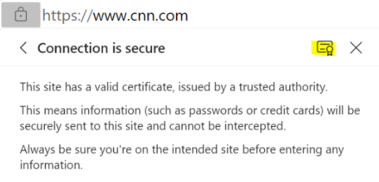

# Sample: HTTPS cURL Easy

This sample demonstrates how to use the cURL Easy interface with Azure Sphere over a secure HTTPS connection. For details about using the libcurl library with Azure Sphere, see [Connect to web services using cURL](https://docs.microsoft.com/azure-sphere/app-development/curl).

The sample periodically downloads the index web page at example.com, by using cURL over a secure HTTPS connection. It uses the cURL Easy interface, which is a synchronous (blocking) API.

The sample logs the downloaded content. If the size of the downloaded content exceeds 2 KiB, the sample pauses the download, prints the content that has been downloaded so far, and then resumes the download. Refer to cURL **curl_easy_pause** API for more information.

The sample uses the following Azure Sphere libraries.

| Library | Purpose |
|---------|---------|
| [curl](https://docs.microsoft.com/azure-sphere/reference/baseapis#curl-library) | Configures the data transfer and downloads the web page over HTTP/HTTPS. |
| [eventloop](https://docs.microsoft.com/azure-sphere/reference/applibs-reference/applibs-eventloop/eventloop-overview) | Invokes handlers for timer events. |
| [log](https://docs.microsoft.com/azure-sphere/reference/applibs-reference/applibs-log/log-overview)     | Displays messages in the Device Output window during debugging. |
| [networking](https://docs.microsoft.com/azure-sphere/reference/applibs-reference/applibs-networking/networking-overview) | Gets and sets network interface configuration. |
| [storage](https://docs.microsoft.com/azure-sphere/reference/applibs-reference/applibs-storage/storage-overview)    | Gets the path to the certificate file that is used to authenticate the server. |

## Contents

| File/folder           | Description |
|-----------------------|-------------|
| `app_manifest.json`   | Application manifest file, which describes the resources. |
| `CMakeLists.txt`      | CMake configuration file, which Contains the project information and is required for all builds. |
| `CMakeSettings.json`  | JSON file for configuring Visual Studio to use CMake with the correct command-line options. |
| `launch.vs.json`      | JSON file that tells Visual Studio how to deploy and debug the application. |
| `LICENSE.txt`         | The license for this sample application. |
| `main.c`              | Main C source code file. |
| `README.md`           | This README file. |
| `.vscode`             | Folder containing the JSON files that configure Visual Studio Code for building, debugging, and deploying the application. |

## Prerequisites

The sample requires the following hardware:

- An [Azure Sphere development board](https://aka.ms/azurespheredevkits)

## Setup

Complete the following steps to set up this sample.

1. Ensure that your Azure Sphere device is connected to your computer, and your computer is connected to the internet.
1. Even if you've performed this setup previously, ensure that you have Azure Sphere SDK version 21.07 or above. At the command prompt, run **azsphere show-version** to check. Upgrade the Azure Sphere SDK for [Windows](https://docs.microsoft.com/azure-sphere/install/install-sdk) or [Linux](https://docs.microsoft.com/azure-sphere/install/install-sdk-linux) as needed.
1. Enable application development, if you have not already done so, by entering the following line at the command prompt:

    `azsphere device enable-development`

1. Clone the [Azure Sphere samples](https://github.com/Azure/azure-sphere-samples) repository and find the *HTTPS_Curl_Easy* sample in the *HTTPS* folder or download the zip file from the [Microsoft samples browser](https://docs.microsoft.com/samples/azure/azure-sphere-samples/https-curl-easy/).

1. Note that the sample can connect only to websites listed in the **AllowedConnections** capability of the [app_manifest.json](https://docs.microsoft.com/azure-sphere/app-development/app-manifest) file. The sample is set up to connect to the website `example.com`:

    ```json
    "Capabilities": {
        "AllowedConnections": [ "example.com" ],
      },
    ```

    You can revise the sample to connect to a different website for downloading, as described in the [Rebuild the sample to download from a different website](#rebuild-the-sample-to-download-from-a-different-website) section of this README.

1. Configure networking on your device. You must either [set up WiFi](https://docs.microsoft.com/azure-sphere/install/configure-wifi#set-up-wi-fi-on-your-azure-sphere-device) or [set up Ethernet](https://docs.microsoft.com/azure-sphere/network/connect-ethernet) on your development board, depending on the type of network connection you are using.

### Configure a static IP address

You can configure a static IP address on an Ethernet or a Wi-Fi interface. If you have configured a device with a static IP and require name resolution, your application must set a static DNS address. For more information, see the sections *Static IP address* and *Static DNS address* in [Use network services](https://docs.microsoft.com/azure-sphere/network/use-network-services).

## Build and run the sample

To build and run this sample, follow the instructions in [Build a sample application](../../../BUILD_INSTRUCTIONS.md).

The sample logs the downloaded content. If the size of the downloaded content exceeds 2 KiB, the sample pauses the download, prints the content that has been downloaded so far, and then resumes the download. Refer to cURL **curl_easy_pause** API for more information.

## Rebuild the sample to download from a different website

To download data from a website other than the default website, you'll need to get the root CA certificate from the website, modify the sample to use the new website and its certificate, and build and run the modified sample.

Complete the steps described in the following sections.

### Download the root CA certificate

If the website uses SSL, you may need to use a different root CA certificate. To download the certificate from the website, complete the following steps:

1. Open the browser and click the **Secure** icon, which is a padlock in the address bar.
1. If you're using Microsoft Edge, select **Connection is secure**; then click the certificate icon (highlighted yellow):

    

1. Select **Certificate**.
1. Open the **Certification Path** tab.
1. Select the top certificate in the hierarchy and then select **View Certificate**.
1. Open the **Details** tab and select **Copy to File**.
1. In the Certificate Export Wizard, click **Next**.
1. Select the Base-64 encoded X.509 (.CER) format and then click **Next**.
1. Type the file name to which to export the certificate and then click **Next**.
1. Click **Finish** to complete the wizard.
1. Rename the downloaded certificate file to have the .pem extension.

### Modify the sample to use the new website

Complete the following steps to modify the sample to use the new website.

1. In the `app_manifest.json` file, add the hostname of the new website to the **AllowedConnections** capability. For example, the following adds `Contoso.com` to the list of allowed websites.

    ```json
    "Capabilities": {
        "AllowedConnections": [ "example.com", "Contoso.com"],
      },
    ```

1. Open `main.c`, go to the following statement, and change `example.com` to the URL of the website you want to connect to.

    ```c
    if ((res = curl_easy_setopt(curlHandle, CURLOPT_URL, "https://example.com")) != CURLE_OK) {
        LogCurlError("curl_easy_setopt CURLOPT_URL", res);
        goto cleanupLabel;
    }
    ```

1. Update the sample to use a different root CA certificate, if necessary:

     1. Put the trusted root CA certificate in the `certs/` folder (and optionally remove the existing DigiCert Global Root CA certificate).
     1. Update line 14 of `CMakeLists.txt` to include the new trusted root CA certificate in the image package, instead of the DigiCert Global Root CA certificate.
     1. Update line 185 of `main.c` to point to the new trusted root CA certificate.

### Build and run the sample modified to use the new website

To build and run the modified sample, follow the instructions in the [Build and run the sample](#build-and-run-the-sample) section of this README.

## Rebuild the sample to use mutual authentication

You can modify the sample to use mutual authentication if your website is configured to do so. The instructions in this section require that you already have a website and certificates configured for mutual authentication. See [Connect to web services - mutual authentication](https://docs.microsoft.com/azure-sphere/app-development/curl#mutual-authentication) for information about configuring mutual authentication on Azure Sphere. For information about configuring a website with mutual authentication for testing purposes, you can use [Configure certificate authentication in ASP.NET Core](https://docs.microsoft.com/aspnet/core/security/authentication/certauth?view=aspnetcore-3.0).

**Note:** These instructions are for testing purposes only and should not be used in a production environment.

Complete the steps described in the following sections to rebuild the sample to use mutual authentication on a website that is configured for mutual authentication.

### Update the application manifest

Add the following to the `app_manifest.json` file.

1. Add the **DeviceAuthentication** capability, and use it to specify your tenant ID.

1. In the **AllowedConnections** capability, add the HTTPS endpoint of the website that has mutual authentication configured.

The following code snippet is an example entry.

```json
"Capabilities": {
    "AllowedConnections" : [ "example.com" ],
    "DeviceAuthentication": "77304f1f-9530-4157-8598-30bc1f3d66f0"
  },
```

### Add the TLS utilities library

1. Add `tlsutils` to `target_link_libraries` in the `CMakeLists.txt` file, as shown in the following line of code. For information about this library, see [TLS utilities library](https://docs.microsoft.com/azure-sphere/app-development/tlsutils-library) in the Azure Sphere documentation.

    `target_link_libraries(${PROJECT_NAME} applibs gcc_s c curl tlsutils)`

2. Open `main.c` and add the `deviceauth_curl.h` header file after `curl.h`:

    ```c
    #include <curl/curl.h>
    #include <tlsutils/deviceauth_curl.h>
    ```

### Add TLS utilities functions

Use the [**DeviceAuth_CurlSslFunc**](https://docs.microsoft.com/azure-sphere/reference/applibs-reference/tlsutils/function-deviceauth-curlsslfunc) function or create a custom authentication function that calls [**DeviceAuth_SslCtxFunc**](https://docs.microsoft.com/azure-sphere/reference/applibs-reference/tlsutils/function-deviceauth-sslctxfunc) to perform the authentication. See [Connect to web services - mutual authentication](https://docs.microsoft.com/azure-sphere/app-development/curl#mutual-authentication) for more information about these functions.

- To use **DeviceAuth_CurlSslFunc**, revise `main.c` by adding the following code to the **PerformWebPageDownload** function after the **if** statement that sets **CURLOPT_VERBOSE**.

    ```c
        // Configure SSL to use device authentication-provided client certificates
        if ((res = curl_easy_setopt(curlHandle, CURLOPT_SSL_CTX_FUNCTION, DeviceAuth_CurlSslFunc)) !=
            CURLE_OK) {
            LogCurlError("curl_easy_setopt CURLOPT_SSL_CTX_FUNCTION", res);
            goto cleanupLabel;
        }
    ```

- To create a custom authentication function that calls **DeviceAuth_SslCtxFunc**, complete the following steps.

   1. Create your custom callback function. The following code is an example:

       ```c
           static CURLcode UserSslCtxFunction(CURL* curlHandle, void* sslCtx, void* userCtx)
           {
               DeviceAuthSslResult result = DeviceAuth_SslCtxFunc(sslCtx);
       
               if (result != DeviceAuthSslResult_Success) {
                   Log_Debug("Failed to set up device auth client certificates: %d\n", result);
                   return CURLE_SSL_CERTPROBLEM;
               }
       
               return CURLE_OK;
           }
       ```

   2. In `main.c`, add your custom function above the **PerformWebPageDownload** function.

   3. Add the following code to the **PerformWebPageDownload** function after the **if** statement that sets **CURLOPT_VERBOSE**.

       ```c
           // Configure SSL to use device authentication-provided client certificates
           if ((res = curl_easy_setopt(curlHandle, CURLOPT_SSL_CTX_FUNCTION, UserSslCtxFunction)) !=
               CURLE_OK) {
               LogCurlError("curl_easy_setopt CURLOPT_SSL_CTX_FUNCTION", res);
               goto cleanupLabel;
           }
       ```

### Build and run the sample modified to use mutual authentication

To build and run the modified sample, follow the instructions in the [Build and run the sample](#build-and-run-the-sample) section of this README.

## Troubleshooting

The following message in device output may indicate an out of memory issue:

`Child terminated with signal = 0x9 (SIGKILL)`

Currently, the Azure Sphere OS has a bug that causes a slow memory leak when using cURL and HTTPS. This slow memory leak can result in your application running out of memory. We plan to fix this bug in an upcoming quality release, and will announce it in the [IoT blog](https://techcommunity.microsoft.com/t5/internet-of-things/bg-p/IoTBlog) when it is available.

Until the updated OS is released, you can mitigate this problem. However, the mitigation might degrade performance, so you should remove it as soon as the updated OS is available. To mitigate the problem, disable the CURLOPT_SSL_SESSIONID_CACHE option when you create cURL handles, as shown in the following example:

`curl_easy_setopt(curlHandle, CURLOPT_SSL_SESSIONID_CACHE, 0);`

For details about how to set this option, see [CURLOPT_SSL_SESSIONID_CACHE explained](https://curl.haxx.se/libcurl/c/CURLOPT_SSL_SESSIONID_CACHE.html) in the cURL documentation.

## Next steps

- For an overview of Azure Sphere, see [What is Azure Sphere](https://docs.microsoft.com/azure-sphere/product-overview/what-is-azure-sphere).
- To learn more about Azure Sphere application development, see [Overview of Azure Sphere applications](https://docs.microsoft.com/azure-sphere/app-development/applications-overview).
- For network troubleshooting, see [Troubleshoot network problems](https://docs.microsoft.com/azure-sphere/network/troubleshoot-network-problems).
