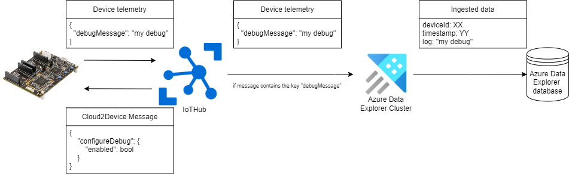
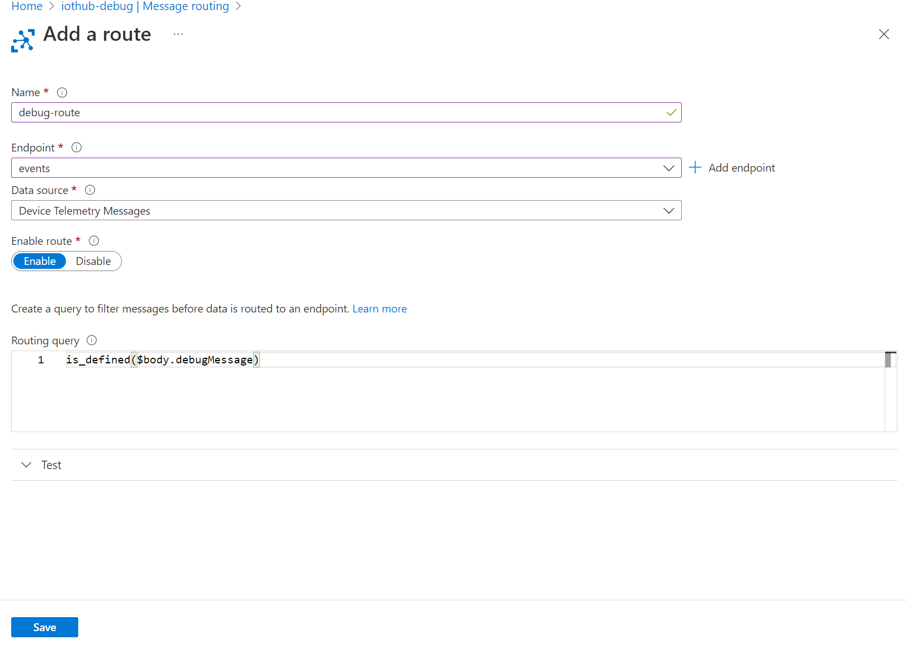
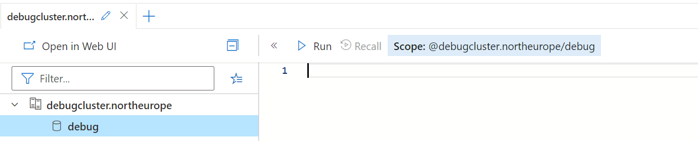
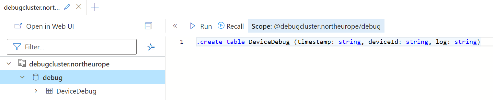
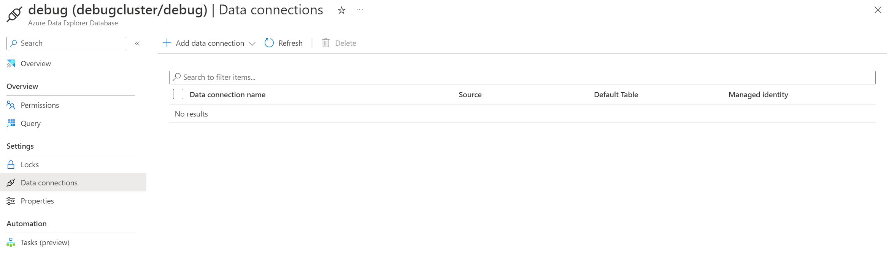
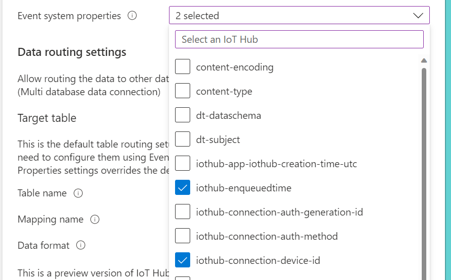
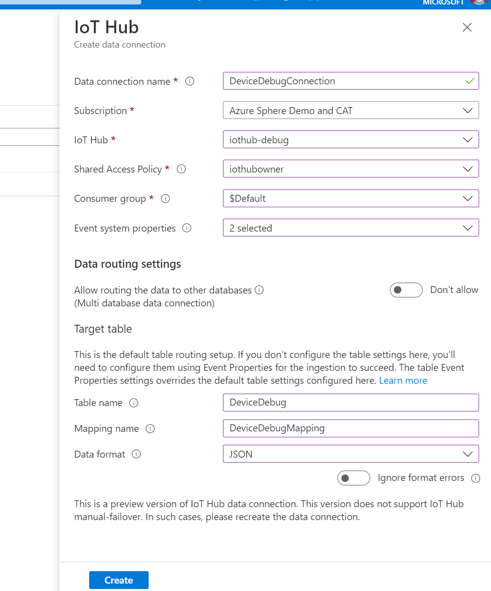

# Sample: Logging Debug Messages to Azure

This sample shows how to log diagnostic and debug information to Azure. Logging this information to Azure provides the ability to remotely diagnose and analyze issues with deployed applications.

The architecture of the application is shown below. Azure Sphere devices send JSON [telemetry messages](https://learn.microsoft.com/azure/iot-hub/iot-concepts-and-iot-hub#device-telemetry) to IoT Hub. IoT Hub then processes the messages and checks to see if the key `debugMessage` is present in the JSON. If `debugMessage` is present, the message is forwarded on to an Azure Data Explorer database. Upon receiving the telemetry message, Azure Data Explorer maps the received message to database format for later analysis. Queries can be executed on the database to hone in on a particular device.

Out of band, a cloud-to-device telemetry message can be sent to a particular device to enable or disable logging to Azure from IoT Hub.



After completing the configuration steps, you will be able to use Azure Data Explorer to analyze debug messages sent by Azure Sphere devices. The `Log_Azure` function defined in `log_azure.h`, makes it easy to send arbitrary debug messages anywhere in your application. Logging can be enabled and disabled remotely for individual devices, giving you precise debug control over your fleet.

## Prerequisites

- An [Azure Sphere development board](https://aka.ms/azurespheredevkits).
- An Azure subscription. If your organization does not already have a subscription, you can set up a [free trial subscription](https://azure.microsoft.com/free/?v=17.15).

## Setup

### Configure your Azure Sphere Device

1. Ensure that your Azure Sphere device is connected to your computer and your computer is connected to the internet.
1. Even if you've performed this setup previously, ensure that you have Azure Sphere SDK version 22.11 or later. At the command prompt, run **azsphere show-version** to check. Upgrade the Azure Sphere SDK for [Windows](https://learn.microsoft.com/azure-sphere/install/install-sdk) or [Linux](https://learn.microsoft.com/azure-sphere/install/install-sdk-linux) as needed.
1. Enable application development, if you have not already done so, by entering the **azsphere device enable-development** command at the command prompt.
1. Clone the [Azure Sphere samples](https://github.com/Azure/azure-sphere-samples) repository and navigate to `/Samples/LoggingToAzure`.
1. Configure networking on your device. You must either [set up WiFi](https://learn.microsoft.com/azure-sphere/install/configure-wifi#set-up-wi-fi-on-your-azure-sphere-device) or [set up Ethernet](https://learn.microsoft.com/azure-sphere/network/connect-ethernet) on your development board, depending on the type of network connection you are using.

### Create and configure an IoT Hub

This sequence of steps creates rules to forward [telemetry messages](https://learn.microsoft.com/azure/iot-hub/iot-concepts-and-iot-hub#device-telemetry) containing "debugMessage" to the events endpoint. Ultimately, Azure Data Explorer will consume data from this endpoint. Note that although we use the built-in events endpoint, routes can be applied to other event endpoints too.

1. [Create an IoT Hub and configure it for use with Azure Sphere](https://learn.microsoft.com/azure-sphere/app-development/setup-iot-hub).
1. Navigate to the newly created IoT Hub page.
1. Select **Message routing** under **Hub settings**.
1. Click **+ Add**. Enter a name for your endpoint (for example: "debug-route"). Click the **Endpoint** drop-down and select **events** which should appear as a built-in endpoint. Ensure Data source is set to **Device Telemetry Messages**.
1. In the **Routing query** text box enter the following query: `is_defined($body.debugMessage)`. This will select any telemetry messages with a json body containing **debugMessage** as a key.
1. Finally, click **Save**.



### Create and configure an Azure Data Explorer Cluster
1. [Create an Azure Data Explorer Cluster and database](https://learn.microsoft.com/azure/data-explorer/create-cluster-database-portal).
1. Navigate to the database you created in step 1 and click **Query** on the left hand side of the page. You should see two views, a text box where queries can be entered and a table view of the database you created:



3. Create a table to store the received debug messages. In the query text box, enter the following: `.create table DeviceDebug (timestamp: string, deviceId: string, log: string)` and click **Run**. This creates a table with three columns called **timestamp**, **deviceId**, and **log**. All columns have the type string.
1. After running the query, a new table called **DeviceDebug** should have appeared in the database:



Data Explorer uses "ingestion mappings" to automatically map received data into a database. The following sequence of steps creates an ingestion mapping called `DeviceDebugMapping` for debug messages generated by the application.

1. In the query window, enter the following:
```json
.create table DeviceDebug ingestion json mapping 'DeviceDebugMapping' '[{"column":"timestamp","path":"$.iothub-enqueuedtime","datatype":"string"}, {"column":"deviceId","path":"$.iothub-connection-device-id","datatype":"string"}, {"column":"log","path":"$.debugMessage","datatype":"string"}]'
```
2. Select **Run** and check that the query completed successfully.

If you make a mistake, an ingestion mapping can be removed with the following query:

```
.drop table DeviceDebug ingestion json mapping 'DeviceDebugMapping'
```

**Note:** Azure Data Explorer is a production solution designed to ingest data from many thousands of devices. As such, it may not be cost-effective to leave idle after testing. After exploring this sample, remember to navigate to the created Azure Data Explorer instance in the [Azure Portal](https://portal.azure.com) and select **Delete**.

### Create a data connection between Azure Data Explorer and IoT Hub

This final step connects Azure Data Explorer and IoT Hub. A data connection allows Azure Data Explorer to consume telemetry events from IoT Hub.

1. Navigate to the newly created database from the previous step.
1. On the left side of the page, select **Data connections**



3. Click **+ Add data connection** and select IoT Hub.
1. In the pane that appears enter a name for the data connection. Select a subscription, and the IoT Hub we created earlier. **Shared access policy** should be set to "IoT Hubowner" and **Consumer group** should be set to **$Default**.
1. From **Event system properties** select **iothub-enqueuedtime** and **iothub-connection-device-id**. These properties will map to the timestamp and deviceId columns on the database.



6. Under **Target table**, enter **DeviceDebug** as **Table Name**, **DeviceDebugMapping** as **Mapping Name**, and select **JSON** as **Data Format**:



7. Click **Create**.

## Application configuration

We have now set up the required infrastructure to store debug messages in Azure. We now need to sideload an application to an AzureSphere device that sends debug telemetry messages.

Using the same device configured in the "Create an IoT Hub" section, complete the following steps:

1. Open the `app_manifest.json` file in this directory.

1. Update the *CmdArgs* field of the `app_manifest.json` file:
   - In the Azure portal, at the top right of your Hub's Overview screen, copy the Hostname and paste it into the *CmdArgs* field of the app_manifest.json file as an argument to the Hostname option. Your *CmdArgs* field should now look like:

        `"CmdArgs": [ "--Hostname", "<azure_iot_hub_name.azure-devices.net>" ],`

1. Update the *AllowedConnections* field of the `app_manifest.json` file.

   - Copy the hostname used in the *CmdArgs* section and append it to the *AllowedConnections* field of the `app_manifest.json` file. The field should now look like:

     `"AllowedConnections": [ "<azure_iot_hub_name.azure-devices.net>" ]`

1. Update the *DeviceAuthentication* field of the `app_manifest.json` file.

   - At the command prompt, run the following command to get the Tenant ID. Use the GUID, not the friendly name, and paste it into the *DeviceAuthentication* field of the `app_manifest.json` file:

      `azsphere tenant show-selected`

   - Your *DeviceAuthentication* field should now look like:

     `"DeviceAuthentication": "<GUID>"`

1. Save the modified `app_manifest.json` file.

Then using your editor of choice, build and deploy the application.

## Using the sample

The sample contains `log_azure.c` and `log_azure.h` files which introduce a new log call `Log_Azure`. `Log_Azure` accepts a format string with parameters and packs the resulting output into a JSON device telemetry message. `log_azure.c` and `log_azure.h` are designed to be portable and can be copied to existing applications (provided the core Azure IoT files are also up to date).

On initialization, the sample waits to establish a connection to Azure before logging key device information. Included in first telemetry message is any information stored in MutableStorage from the previous application run:

```
OS Version: 22.09
Application version: v0.0.7
Network interface status:
	wlan0 UP 192.168.1.195 2c:f7:f1:08:93:e6
Local time: 2022-10-12T08:55:32Z
Crash info: App exited -1
```

After the initial message is sent, the sample periodically sends telemetry messages to IoT Hub. These telemetry messages contain the current memory usage.


### Enabling/disabling Azure logging remotely

The application starts with Azure logging on by default. However, Azure logging can be remotely enabled or disabled using cloud-to-device messages. There are many ways to send cloud-to-device messages. One option is to install and use [IoT Explorer](https://learn.microsoft.com/azure/iot-fundamentals/howto-use-iot-explorer), another option is to use the Azure IoT toolkit from within [Visual Studio Code](https://learn.microsoft.com/azure/iot-hub/iot-hub-device-management-iot-toolkit). Messages can also be sent from the IoT Hub interface available in the Azure portal.

Once you have selected a mechanism to send cloud-to-device messages, the following messages enable or disable logging to Azure:

* Disable logging to Azure:

```json
{
  "configureDebug": {
    "enabled": false
  }
}
```

* Enable logging to Azure:
```json
{
  "configureDebug": {
    "enabled": true
  }
}
```

## Analyzing data from your fleet

After receiving messages from devices in your fleet, IoT Hub stores received messages in an Azure Data Explorer instance. When debugging, it is useful to query the received log messages for further analysis. Kusto, the technology underpinning Azure Data Explorer provides a powerful query language that can be used to extract and analyse key data. [Full documentation about the Kusto query language is available](https://learn.microsoft.com/azure/data-explorer/kusto/query/).

This example will extract the operating system version sent at power on to check if a particular device has received the latest operating system update. A power-on message stored in the "log" column of our database looks like this:

```
OS Version: 22.09
Application version: v0.0.7
Network interface status:
	wlan0 UP 192.168.1.195 2c:f7:f1:08:93:e6
Local time: 2022-10-12T08:55:32Z
Crash info:
```

In the same query window as was used in [Create and configure an Azure Data Explorer Cluster](#create-and-configure-an-azure-data-explorer-cluster), run the following query:

```kusto
DeviceDebug
```
This will show all rows stored in the DeviceDebug table.

Next, retrieve log messages for a specific device using its a device ID. The device ID can be retrieved using [azsphere device list-attached](https://learn.microsoft.com/azure-sphere/reference/azsphere-device#list-attached). Enter the following query:

```kusto
DeviceDebug
| where deviceId == "<your device id>"
```

We can refine the query further. Retrieve all power-on messages:

```kusto
DeviceDebug
| where deviceId == "<your device id>"
| where log has "OS Version"
```

This query filters the log column, returning only the rows that contain the string "OS Version".

Using regular expressions, we can extract the operating system version:

```kusto
DeviceDebug
| where deviceId == "<your device id>"
| where log has "OS Version"
| extend OSVersion = extract("OS Version: ([0-9.]+)", 1, log)
```

This query creates a new intermediary column "OSVersion" that is populated with data resulting from executing the regular expression on each row in the log column.

We can then perform a further query on this intermediary column to determine whether a device has upgraded to a specific OS version:

```kusto
DeviceDebug
| where deviceId == "<your device id>"
| where log has "OS Version"
| extend OSVersion = extract("OS Version: ([0-9.]+)", 1, log)
| where OSVersion == "<os version>"
```

The OS version for your device can be retrieved using [azsphere device show-os-version](https://learn.microsoft.com/azure-sphere/reference/azsphere-device#show-os-version)
