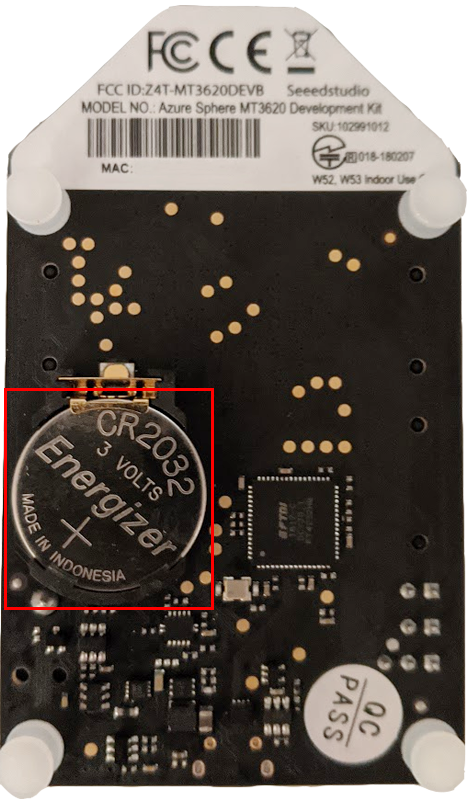
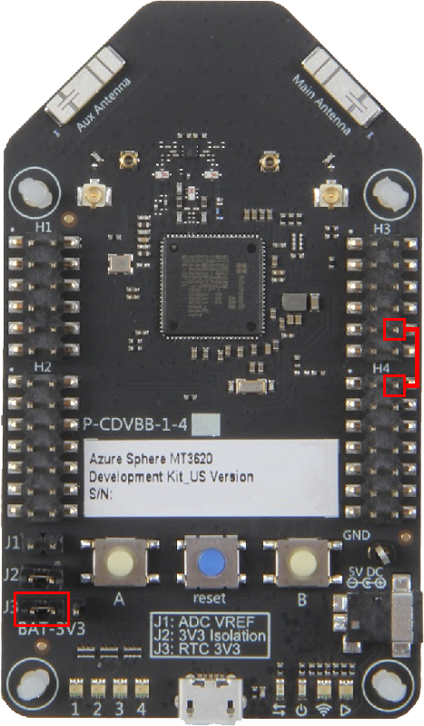
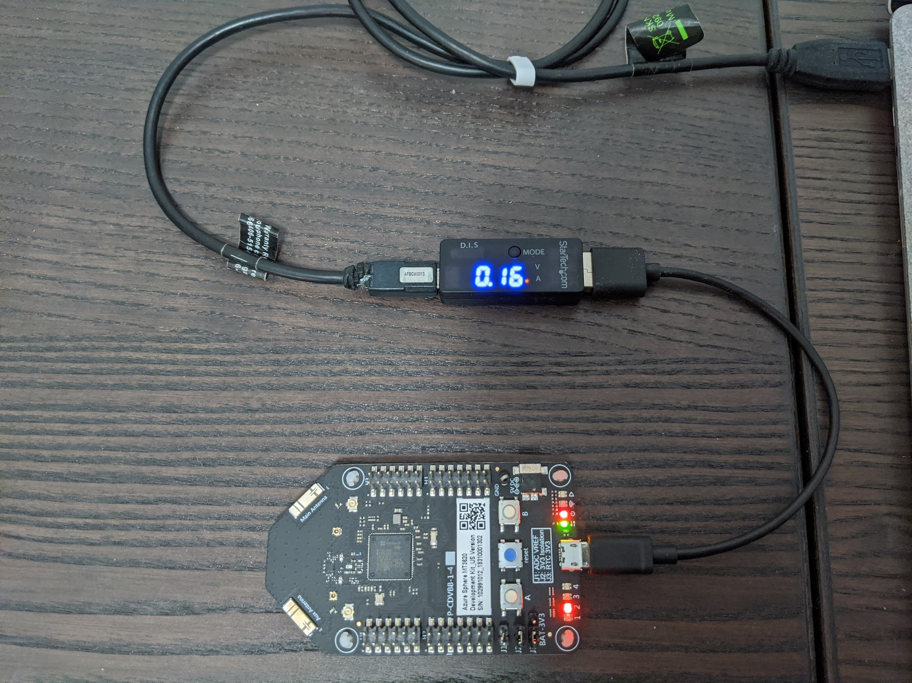

# Sample: Power Down high-level app

This sample application demonstrates how to force an Azure Sphere device into the [Power Down](https://docs.microsoft.com/azure-sphere/app-development/power-down) state and wake up the device to check for [OS and app updates](https://docs.microsoft.com/azure-sphere/app-development/power-down#force-power-down-and-updates).

This application performs the following cycle of operations:

1. Blinks a red LED to indicate the device is awake.
1. Blinks a green LED to indicate the device is checking for updates or downloading an update. A non-blinking green LED indicates updates are ready to install.
1. Puts the device in the Power Down state.
1. Wakes the device from the Power Down state after a specified time.
1. Periodically delays putting the device in the Power Down state to enable the OS to check for updates.
1. Restarts the cycle from the beginning after updates (if any) are processed.

**Note:** To ensure that updates have completed before the Power Down state is requested, the sample app makes use of three [system event notifications](https://docs.microsoft.com/azure-sphere/reference/applibs-reference/applibs-sysevent/enum-sysevent-events): **SysEvent_Events_NoUpdateAvailable,** **SysEvent_Events_UpdateStarted,** and **SysEvent_Events_UpdateReadyForInstall.** The app uses these notifications to find out about the status of downloads and updates.

The sample uses the following Azure Sphere libraries.

|Library   |Purpose  |
|---------|---------|
|[log](https://docs.microsoft.com/azure-sphere/reference/applibs-reference/applibs-log/log-overview)     |  Displays messages in the Device Output window during debugging  |
|[gpio](https://docs.microsoft.com/azure-sphere/reference/applibs-reference/applibs-gpio/gpio-overview)    | Used for GPIO (general-purpose input/output) pin communication      |
|[eventloop](https://docs.microsoft.com/azure-sphere/reference/applibs-reference/applibs-eventloop/eventloop-overview) | Used for LED blink, Power Down, and other timers |
|[sysevent](https://docs.microsoft.com/azure-sphere/reference/applibs-reference/applibs-sysevent/sysevent-overview) | Used to register for system event notifications about updates so that the app can make sure update checks have completed before the Power Down state is requested |
|[powermanagement](https://docs.microsoft.com/azure-sphere/reference/applibs-reference/applibs-power/power-overview) | Used to manage the power state of the device |
|[storage](https://docs.microsoft.com/azure-sphere/reference/applibs-reference/applibs-storage/storage-overview) | Used to keep track of when an update check happened |
|[networking](https://docs.microsoft.com/azure-sphere/reference/applibs-reference/applibs-storage/storage-overview) | Used to check if the device is connected to a network and if the time is synchronized|

By default, this sample runs over a Wi-Fi connection to the internet. To use Ethernet instead, make the following changes:

1. Configure Azure Sphere as described in [Connect Azure Sphere to Ethernet](https://docs.microsoft.com/azure-sphere/network/connect-ethernet).
1. Add an Ethernet adapter to your hardware. If you are using an MT3620 RDB, see the [wiring instructions](../../../HardwareDefinitions/mt3620_rdb/EthernetWiring.md).
1. Add the following line to the Capabilities section of the app_manifest.json file:

   `"NetworkConfig" : true`
1. In Powerdown/Powerdown_HighLevelApp/main.c, ensure that the global constant `networkInterface` is set to "eth0". In source file Powerdown/Powerdown_HighLevelApp/main.c, search for the following line:

    `static const char networkInterface[] = "wlan0";`

    Change this line to:

    `static const char networkInterface[] = "eth0";`
1. In Powerdown/Powerdown_HighLevelApp/main.c, add a call to `Networking_SetInterfaceState` before any other networking calls:

   ```c
    int err = Networking_SetInterfaceState(networkInterface, true);
    if (err == -1) {
        Log_Debug("Error setting interface state %d\n",errno);
        return -1;
    }
   ```


## Contents

| File/folder | Description |
|-------------|-------------|
| Powerdown_HighLevelApp       | Sample source code and project files |
| README.md     | This readme file |

## Prerequisites

- Azure Sphere device

    **NOTE:** By default, this sample targets [MT3620 reference development board (RDB)](https://docs.microsoft.com/azure-sphere/hardware/mt3620-reference-board-design) hardware, such as the MT3620 development kit from Seeed Studios. To build the sample for different Azure Sphere hardware, change the Target Hardware Definition Directory in the CMakeLists.txt file. For detailed instructions, see the [README file in the HardwareDefinitions folder](../../../HardwareDefinitions/README.md). You might also need to wire the boards differently; check with your hardware manufacturer for details.

- CR2032 coin cell battery to power the real-time clock (RTC) (Optional): Insert the battery into the battery holder on the bottom of the RDB as shown in the following image:



- Jumper block to set the power source for the RTC: 

    - To power the RTC from the main 3.3V power supply, use the jumper block to connect pins 2 and 3 of jumper J3 (J3.2, J3.3).
     - To power the RTC from a coin cell battery, use the jumper block to connect pins 1 and 2 of Jumper J3 (J3.1, J3.2) as shown in the bottom left corner of the RDB in the following image.

     **Note:** For versions v1.6 and later of the RDB, when pins J3.1 and J3.2 are connected, the RTC will be powered from the main 3.3V power supply when present or from the coin cell battery when the main supply is not present.  

- Female-female header (if using RDB v1.0): To determine which version of the RDB you have, see the [MT3620 User Guide](https://docs.microsoft.com/azure-sphere/hardware/mt3620-user-guide#power-down-mode). If you have RDB v1.0, you will need to tie the PMU_EN pin low to enable the MT3620 to Power Down. Connect the female header from pin 10 on H3 (PMU_EN) to pin 2 on H4 (GND), as shown on the right side of the following  image:

  

- In-line USB current meter (optional): You can connect an in-line USB current meter between your RDB and your PC to measure the current consumption of the RDB. This is helpful for validating that the RDB has entered Power Down by observing the decrease in current consumption displayed on the meter.

    **Note:** Although most USB current meters will work, get one with a data passthrough feature so that you can deploy apps and debug while it's connected. One such USB current meter is the [StarTech USB Voltage and Current Tester Kit](https://www.startech.com/Cables/USB-2.0/USB-Adapters/usb-voltage-current-tester-kit~USBAUBSCHM) (pictured below).

  

    **Note:** Additional on-board circuitry (the FTDI interface and so forth) is also powered from the main power supply. When the chip is placed in Power Down mode, the overall current consumption of the board will not drop to the expected MT3620 Power Down levels because the FTDI consumes between 10-80mA, depending on its connection activity with the USB Host device. As such, the RDB is helpful for validating that software is correctly placing the chip in Power Down mode, but is less useful for validating overall power consumption of the hardware design.

## Prepare the sample

1. Set up your Azure Sphere device and development environment as described in the [Azure Sphere documentation](https://docs.microsoft.com/azure-sphere/install/overview).
1. Even if you've performed this set up previously, ensure you have Azure Sphere SDK version 20.10 or above. In an Azure Sphere Developer Command Prompt, run **azsphere show-version** to check. Install [the Azure Sphere SDK for Windows](https://docs.microsoft.com/azure-sphere/install/install-sdk) or [the Azure Sphere SDK for Linux](https://docs.microsoft.com/azure-sphere/install/install-sdk-linux).
1. Connect your Azure Sphere device to your PC by USB.
1. Enable application development, if you have not already done so, using this command:

   `azsphere device enable-development`

1. Clone the [Azure Sphere samples](https://github.com/Azure/azure-sphere-samples) repo and find the PowerDown_HighLevelApp sample in the Powerdown folder.

## Build and run the sample

To build and run this sample, follow the instructions in [Build a sample application](../../../BUILD_INSTRUCTIONS.md).

**Note:** After a Power Down/wake cycle, the debugger will no longer be attached to the Azure Sphere device. This means you will also no longer see debug console output after the device wakes up. As a workaround, redeploy the sample app after the device wakes up to restore debugging functionality and debug console output.

## Test Power Down

The device repeatedly cycles through 3 states: Start-up, Update, and Power Down.  

1. Start-up

    When you start the application or the device wakes up from the Power Down state LED #2 will begin to blink red and continue to blink for 60 seconds. If you are using a USB current meter, it should show approximately 0.15A during this time.

    When you first run the application, the last update time is set to 1970. If the device is not connected to a network, it might check for updates at every power-down cycle, depending on the local time of your device.

1. Update
  
   When the device enters Update LED #2 continues to blink but changes color from red to green. In this state the blink rate of LED #2 indicates the following conditions:
  
   - Rapid - The app is waiting for notification of an update. If a notification is not received within 60 seconds the device goes into Power Down state.
   - Slow - An update is available and has begun downloading
   - Steady (on but not blinking) - The download has completed and the device will reboot to apply the download.
   
   See [Test Update Checks](#test-update-checks) for details.

1. Power Down
   
   When the device enters Power Down, LED #2 will stop blinking and turn off.

   If you are using the USB current meter, you should see the current reading drop to approximately 0.05A.
   
   **Note:** The RDB has additional components that will cause it to consume much more current than a production device would when in the Power Down state. This test is only intended for observing the relative current drop to validate that your application is entering Power Down.

   The device will stay in Power Down for `powerdownResidencyTime` seconds (the default is 10 seconds). Change this constant value in the app to configure how long the device stays in Power Down.

   After `powerdownResidencyTime` seconds, the device will wake up. You should see the reading on the current meter rise back up to approximately 0.15A.

## Test Update Checks

 When checking for updates, the app will wait until one of three events occurs:

  1. The app receives a `SysEvent_Events_NoUpdateAvailable` event notification, indicating the update check has completed and no updates are available. In this case, the device will wait until the end of the 60 second interval and enter Power Down.

  1. It receives a `SysEvent_Events_UpdateStarted` event. This means an update is available and has begun downloading. The green LED will begin to blink more slowly to indicate an update is downloading. The device will stay awake while the update downloads until one of two things occurs:

      * The update finishes downloading, indicated by the reception of a `SysEvent_Events_UpdateReadyForInstall` event notification. The LED stops blinking but remains on to indicate the download has completed. After approximately 2 seconds, the device will reboot to apply the update.

      * The update has not finished downloading after `waitForUpdateDownloadTimeout` seconds have elapsed. In this case, the app will Power Down to conserve energy. For example, this might happen if an unreliable network connection is causing the download to take an excessive amount of time. The app will try to resume the download again the next time it wakes up.

  1. An update check has not completed. This means that neither of the update event notifications (`SysEvent_Events_NoUpdateAvailable` nor `SysEvent_Events_UpdateStarted`) were received after `waitForUpdateCheckTimeout` seconds. In this case, the app will Power Down to conserve energy and try to check for updates again the next time it wakes up.

## Next steps

- To learn more about power management and the Power Down state on Azure Sphere, see [Manage Power Down state for Azure Sphere devices](https://docs.microsoft.com/azure-sphere/app-development/power-down).
- For more details about Power Down that are specific to the RDB, see the [Power Down section of the MT3620 RDB User Guide](https://docs.microsoft.com/azure-sphere/hardware/mt3620-user-guide#power-down-mode).
- To learn about hardware considerations to ensure your design can take advantage of Power Down, see [the Power Down considerations section of the MT3620 hardware notes documentation](https://docs.microsoft.com/azure-sphere/hardware/mt3620-hardware-notes#power-down-considerations).

## License
For details on license, see LICENSE.txt in this directory.

## Code of Conduct
This project has adopted the [Microsoft Open Source Code of Conduct](https://opensource.microsoft.com/codeofconduct/).
