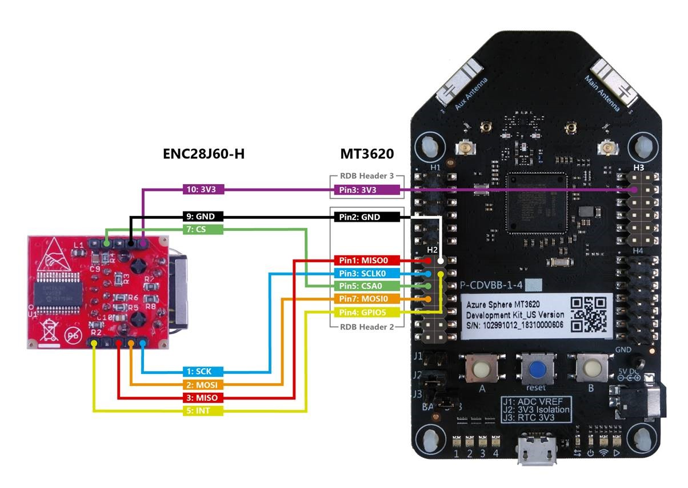

# Sample: Private Ethernet

This sample C application demonstrates how you can [connect an Azure Sphere device to a private Ethernet network](https://docs.microsoft.com/azure-sphere/network/connect-private-network). It configures the Azure Sphere device to run a DHCP server and an SNTP server, and implements a basic TCP server. The steps below show how to verify this functionality by connecting your computer to this private network.

The DHCP and SNTP servers are managed by the Azure Sphere OS and configured by the application. The servers start only upon request from the application but continue to run even after the application stops.

The TCP server runs in the application process and stops when the application stops. Note that this sample TCP server implementation is basic, for illustration only, and that it does not authenticate or encrypt connections; you should replace it with your own production logic.

The sample uses the following Azure Sphere libraries and includes [beta APIs](https://docs.microsoft.com/azure-sphere/app-development/use-beta).

|Library   |Purpose  |
|---------|---------|
|log     |  Displays messages in the Visual Studio Device Output window during debugging  |
|networking    | Gets and sets network interface configuration |

## Prerequisites

 This sample requires the following hardware:

- Azure Sphere MT3620 board
- [Olimex ENC28J60-H development board](https://www.olimex.com/Products/Modules/Ethernet/ENC28J60-H/)
- Jumper wires to connect the boards to each other
- Ethernet support on your computer, either through an internal adapter or external adapter, such as a USB to Ethernet adapter

Make the following connections between the ENC28J60-H and MT3620 development boards using these jumper wires:

- ENC28J60-H 3V3: 10 to MT3620 3V3: Header 3 (upper right) Pin 3
- ENC28J60-H GND: 9 to MT3620 GND: Header 2 (lower left) Pin 2
- ENC28J60-H CS: 7 to MT3620 CSA0: Header 2 (lower left) Pin 1
- ENC28J60-H SCK: 1 to MT3620 SCLK0: Header 2 (lower left) Pin 3
- ENC28J60-H MOSI: 2 to MT3620 MOSI0: Header 2 (lower left) Pin 5
- ENC28J60-H MISO: 3 to MT3620 MISO0 RTS: Header 2 (lower left) Pin 7
- ENC28J60-H INT: 5 to MT3620 GPIO5: Header 2 (lower left) Pin 4

Refer to the following graphic for details.



## To build and run the sample

1. Set up your Azure Sphere device and development environment as described in the [Azure Sphere documentation](https://docs.microsoft.com/azure-sphere/install/install).
1. Even if you've performed this set up previously, ensure that you have Azure Sphere SDK version 19.02 or above. In an Azure Sphere Developer Command Prompt, run **azsphere show-version** to check. Download and install the [latest SDK](https://aka.ms/AzureSphereSDKDownload) as needed.
1. Connect your Azure Sphere device to your PC by USB.
1. Enable [application development](https://docs.microsoft.com/azure-sphere/quickstarts/qs-blink-application#prepare-your-device-for-development-and-debugging), if you have not already done so:

   `azsphere device prep-debug`
1. Package and deploy the [board configuration image](https://docs.microsoft.com/azure-sphere/network/connect-private-network) for the Microchip ENC286J60 Ethernet chip:

   `azsphere image package-board-config --preset lan-enc28j60-isu0-int5 --output enc28j60-isu0-int5.imagepackage`
   
   `azsphere device sideload deploy --imagepackage enc28j60-isu0-int5.imagepackage`
1. Clone the [Azure Sphere samples](https://github.com/Azure/azure-sphere-samples) repo and find the PrivateEthernet sample.
1. In Visual Studio, open PrivateEthernet.sln and press F5 to compile and build the solution and load it onto the device for debugging.
1. Leave the app running while you complete the remaining instructions.

### Troubleshooting the Azure Sphere app

If an error similar to the following appears in the Visual Studio Build output when you build the Azure Sphere app, you probably have an outdated version of the Azure Sphere SDK:

   `mt3620_rdb.h:9:10: fatal error: soc/mt3620_i2cs.h: No such file or directory`

You can check which version of the Azure Sphere SDK you have installed by using the **azsphere.exe show-version** command.

## Configure the Ethernet connection on your computer

1. Open Settings, click **Network and Internet**, and then click **Change adapter options**.  
1. Right-click on your Ethernet adapter and then select **Properties**.
1. In the **Ethernet Properties** window, disable all items except for **Internet Protocol Version 4 (TCP/IPv4)**.
1. Select **Internet Protocol Version 4 (TCP/IPv4)**, and then click **Properties**. 
1. In the **Internet Protocol Version 4 (TCP/IPv4) Properties** window, check that "Obtain IP address automatically" is selected. (Previous versions of this sample required configuration of a static IP address at this point. A static address is no longer necessary because the application now provides a DHCP server.)
1. Click **OK** to close the **IPv4 Properties**, and then close the **Ethernet Properties** window.
1. Attach an Ethernet cable from the ENC286J60-H to the Ethernet connection on your computer.

**Note:** If your computer is managed by policies that prevent it from being connected to multiple network interfaces at once, you may need to disable other network interfaces while using this sample.

**Note:** The samples uses the IP address range 192.168.100.xxx. If you have another network adapter that uses the same range, then you will need to either modify the sample or disable the other network adapter temporarily.

## Test the device's DHCP server

Open a command prompt on your computer and type **ipconfig**. You should see that the DHCP server has issued an IP address in the 192.168.100.xxx range to your PC for its Ethernet connection:

```sh
Ethernet adapter <name>:

   Connection-specific DNS Suffix  . :
   Link-local IPv6 Address . . . . . : fe80::8c67:be24:4d9a:d4bb%9
   IPv4 Address. . . . . . . . . . . : 192.168.100.11
   Subnet Mask . . . . . . . . . . . : 255.255.255.0
   Default Gateway . . . . . . . . . :
```

You could also find, download, and use a DHCP client test tool (not provided) on your PC to inspect the DHCP server response in more detail &mdash; such as to look at the NTP server address(es) returned.

## Test the device's SNTP server

1. Ensure the Azure Sphere device is [connected to Wi-Fi](https://docs.microsoft.com/azure-sphere/install/configure-wifi), so that it can obtain time settings from a public NTP server. The SNTP server won't respond until it knows the current time.
1. Open a command prompt on your computer and type **w32tm /stripchart /computer:192.168.100.10 /dataonly /samples:1**. This invokes the [Windows Time tool](https://docs.microsoft.com/windows-server/networking/windows-time-service/windows-time-service-tools-and-settings) to query the device's SNTP server and to display the calculated difference between your computer's time and the device's time:
   ```sh
   Tracking 192.168.100.10 [192.168.100.10:123].
   Collecting 1 samples.
   The current time is 06/02/2019 14:18:09.
   14:18:09, +00.0349344s
   ```

1. If the SNTP server doesn't respond, then you may see the following output. Check that the app is running and that Wi-Fi is configured on the Azure Sphere device.
   ```sh
   Tracking 192.168.100.10 [192.168.100.10:123].
   Collecting 1 samples.
   The current time is 06/02/2019 14:16:50.
   14:16:50, error: 0x800705B4
   ```

## Test the application's TCP server

Ensure that the sample app is still running on your Azure Sphere device. Then, on your computer, use a terminal application to open a raw TCP connection to the Azure Sphere application's TCP server at 192.168.100.10 port 11000. You can open this connection with a third-party terminal application such as PuTTY (using a "raw" connection type), or with the built-in Telnet client for Windows.

To use the built-in Telnet client for Windows:

1. Open Control Panel and click **Programs and Features** > **Turn Windows features on or off** to launch the **Windows Features** window.
1. Ensure **Telnet Client** is selected and click **OK**.
1. Open a command prompt and type **telnet 192.168.100.10 11000**.

The characters that you type will appear in the debug console in Visual Studio–either immediately or when you enter a newline&mdash;showing that they have been received by the example TCP server on the MT3620. When you enter a newline, the MT3620 sends the following string back to the terminal:

   ```sh
   Received "<last-received-line>"
   ```

Note that this sample server has a simple 16-character input buffer. If you send more than this, then the Output window in Visual Studio may show: "Input data overflow. Discarding 16 characters." 

## Troubleshooting

- If you run the sample without the ENC28J60 attached (or improperly attached), then the sample app will exit immediately. The debug output will show an error such as "ERROR: Networking_SetStaticIp: 5 (I/O error)" just before it exits. If you subsequently attach or fix the connection to the ENC28J60, then you must also reset the Azure Sphere device.
- If you run the sample without the board configuration being loaded onto the device, then the sample app will exit immediately. The debug output will show an error such as "ERROR: Networking_SetStaticIp: 2 (No such file or directory)" just before it exits.

## Removing the Ethernet board configuration

If you no longer require Ethernet&mdash;for example because you wish to use your board for a different project&mdash;you must manually remove the Ethernet board configuration image using these steps:

1. Find the installed image with type 'Board config', and note its component ID:

   `azsphere device image list-installed`
1. Delete this image: 

   `azsphere device sideload delete --componentid <component ID>`
1. Press the reset button on the MT3620 dev board.

**Note:** This sample uses ISU0 (I2C/SPI/UART port 0) on the MT3620, which is also used by other samples. Other samples can be adapted to use a different ISU port. For now, it’s not possible to adapt this Private Ethernet sample to use another ISU port.

## Over-the-air deployment
If you want to deploy this sample over the air, ensure to [deploy both the board configuartion and the application.](https://docs.microsoft.com/azure-sphere/network/connect-private-network)

## License
For details on license, see LICENSE.txt in this directory.

## Code of Conduct
This project has adopted the [Microsoft Open Source Code of Conduct](https://opensource.microsoft.com/codeofconduct/).