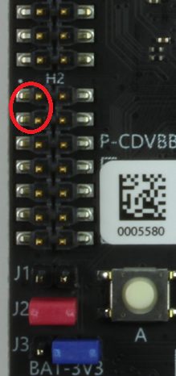

# Sample: UART

This sample demonstrates how to communicate over UART on an MT3620 development board.

This sample does the following:

- Opens a UART serial port with a baud rate of 115200.
- Sends characters from the device over the UART when button A is pressed.
- Displays the data received from the UART in the Visual Studio Output Window.
- Causes an LED to blink when data is received from the UART.

This sample uses these Applibs APIs:

| Library | Purpose |
|---------|---------|
| [UART](https://docs.microsoft.com/azure-sphere/reference/applibs-reference/applibs-uart/uart-overview) | Manages UART connectivity on the device |
| [GPIO](https://docs.microsoft.com/azure-sphere/reference/applibs-reference/applibs-gpio/gpio-overview) | Manages button A on the device |
| [log](https://docs.microsoft.com/azure-sphere/reference/applibs-reference/applibs-log/log-overview) | Displays messages in the Visual Studio Device Output window during debugging |

## Prerequisites

This sample requires the following hardware:

- Azure Sphere MT3620 board

On header 2 (marked H2) on the lower left side of the board:

- Connect pins 1 and 3 (ISU0 RXD and ISU0 TXD) of H2 with a jumper header. These are the first two pins on the left side of the header, circled in red in the figure.

    

## To build and run the sample

1. Even if you've performed this setup previously, ensure you have Azure Sphere SDK version 19.02 or above. In an Azure Sphere Developer Command Prompt, run **azsphere show-version** to check. Download and install the [latest SDK](https://aka.ms/AzureSphereSDKDownload) as needed.
1. Connect your Azure Sphere device to your PC by USB.
1. Enable [application development](https://docs.microsoft.com/azure-sphere/quickstarts/qs-blink-application#prepare-your-device-for-development-and-debugging), if you have not already done so:

   `azsphere device prep-debug`
1. Clone the [Azure Sphere samples](https://github.com/Azure/azure-sphere-samples/) repo and find the UART sample.
1. In Visual Studio, open UART.sln and press F5 to compile, build, and load the solution onto the device for debugging.
1. Press button A on the board. This sends 13 bytes over the UART connection and displays the sent and received text in the Visual Studio Device Output window:

   `Sent 13 bytes over UART in 1 calls`  
   `UART received 12 bytes: 'Hello world!'`  
   `UART received 1 bytes: '`  
   `'`

   All the received text might not appear at once, and it might not appear immediately. 

   The message may contain more bytes than read() can return, depending on the Azure Sphere device (on the MT3620 this is often 12 bytes). The message may need to be assmbled asynchronously over a sequence of read() calls as a result, as illustrated at [this point](https://github.com/Azure/azure-sphere-samples/blob/7232fcb52a493b7def65c50ea93ab9bb73e283c2/Samples/WifiSetupAndDeviceControlViaBle/AzureSphereApp/WifiSetupAndDeviceControlViaBle/message_protocol.c#L214) in the WifiSetupAndDeviceControlViaBle sample.

   If it is temporarily not possible to send further bytes, such as when transmitting larger buffers, write() may fail with errno of EAGAIN. You can handle this by registering an EPOLLOUT event handler, as illustrated at [this point](https://github.com/Azure/azure-sphere-samples/blob/7232fcb52a493b7def65c50ea93ab9bb73e283c2/Samples/WifiSetupAndDeviceControlViaBle/AzureSphereApp/WifiSetupAndDeviceControlViaBle/message_protocol.c#L276) in the WifiSetupAndDeviceControlViaBle sample.

As an alternative to using the loopback connection, you can connect the UART to an external serial-USB interface board, and transmit and receive bytes using a client such as 'telnet' or 'putty'.

### Troubleshooting the Azure Sphere app

If an error similar to the following appears in the Visual Studio Build output when you build the Azure Sphere app, you probably have an outdated version of the Azure Sphere SDK:

   `mt3620_rdb.h:9:10: fatal error: soc/mt3620_i2cs.h: No such file or directory`
