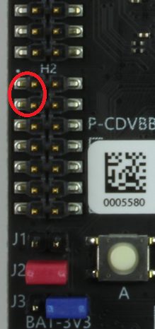
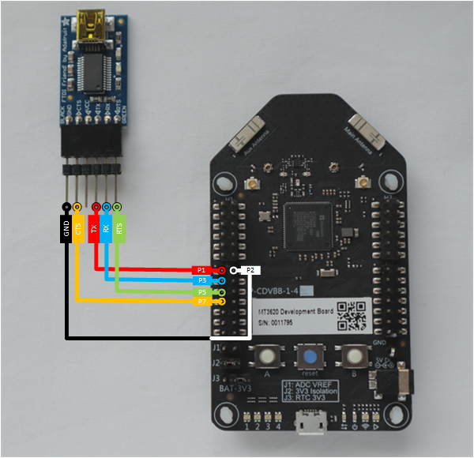

# Sample: UART (high-level app)

This sample demonstrates how to communicate over UART on an MT3620 development board.

This sample does the following:

- Opens a UART serial port with a baud rate of 115200.
- Sends characters from the device over the UART when button A is pressed.
- Displays the data received from the UART in the Visual Studio Output Window.
- Causes an LED to blink when data is received from the UART.

This sample uses these Applibs APIs:

| Library | Purpose |
|---------|---------|
| [UART](https://docs.microsoft.com/azure-sphere/reference/applibs-reference/applibs-uart/uart-overview) | Manages UART connectivity on the device |
| [GPIO](https://docs.microsoft.com/azure-sphere/reference/applibs-reference/applibs-gpio/gpio-overview) | Manages button A on the device |
| [log](https://docs.microsoft.com/azure-sphere/reference/applibs-reference/applibs-log/log-overview) | Displays messages in the Visual Studio Device Output window during debugging |
| [EventLoop](https://docs.microsoft.com/en-gb/azure-sphere/reference/applibs-reference/applibs-eventloop/eventloop-overview) | Invoke handlers for IO and timer events |

## Contents
| File/folder | Description |
|-------------|-------------|
|   main.c    | Sample source file. |
| app_manifest.json |Sample manifest file. |
| CMakeLists.txt | Contains the project information and produces the build. |
| CMakeSettings.json| Configures Visual Studio to use CMake with the correct command-line options. |
|launch.vs.json |Tells Visual Studio how to deploy and debug the application.|
| README.md | This readme file. |
|.vscode |Contains settings.json that configures Visual Studio Code to use CMake with the correct options, and tells it how to deploy and debug the application. |

## Prerequisites

**Note:** By default, this sample targets [MT3620 reference development board (RDB)](https://docs.microsoft.com/azure-sphere/hardware/mt3620-reference-board-design) hardware, such as the MT3620 development kit from Seeed Studios. To build the sample for different Azure Sphere hardware, change the Target Hardware Definition Directory in the project properties. For detailed instructions, see the [README file in the Hardware folder](../../../Hardware/README.md). You may also have to set the hardware differently.

This sample requires the following hardware:

- Azure Sphere MT3620 board

On header 2 (marked H2) on the lower left side of the board:

- Connect pins 1 and 3 (ISU0 RXD and ISU0 TXD) of H2 with a jumper header. These are the first two pins on the left side of the header, circled in red in the figure.

    

## Prepare the sample

1. Even if you've performed this setup previously, ensure you have Azure Sphere SDK version 20.01 or above. At the command prompt, run **azsphere show-version** to check. Install [the Azure Sphere SDK](https://docs.microsoft.com/azure-sphere/install/install-sdk) as needed.
1. Connect your Azure Sphere device to your computer by USB.
1. Enable application development, if you have not already done so, by entering the following line at the command prompt:

   `azsphere device enable-development`
1. Clone the [Azure Sphere samples](https://github.com/Azure/azure-sphere-samples/) repo and find the UART_HighLevelApp sample in the UART folder.

## Set up hardware to display output

To prepare your hardware to display output from the sample, see "Set up hardware to display output" for [Windows](https://docs.microsoft.com/azure-sphere/install/development-environment-windows#set-up-hardware-to-display-output) or [Linux](https://docs.microsoft.com/azure-sphere/install/development-environment-linux#set-up-hardware-to-display-output).

## Build and run the sample

See the following Azure Sphere Quickstarts to learn how to build and deploy this sample:

   -  [with Visual Studio](https://docs.microsoft.com/azure-sphere/install/qs-blink-application)
   -  [with VS Code](https://docs.microsoft.com/azure-sphere/install/qs-blink-vscode)
   -  [on the Windows command line](https://docs.microsoft.com/azure-sphere/install/qs-blink-cli)
   -  [on the Linux command line](https://docs.microsoft.com/azure-sphere/install/qs-blink-linux-cli)

### Test the sample

1. Press button A on the board. This sends 13 bytes over the UART connection and displays the sent and received text in the Visual Studio Device Output window:

   `Sent 13 bytes over UART in 1 calls`  
   `UART received 12 bytes: 'Hello world!'`  
   `UART received 1 bytes: '`  
   `'`

   All the received text might not appear at once, and it might not appear immediately. 

   The message may contain more bytes than read() can return, depending on the Azure Sphere device (on the MT3620 this is often 12 bytes). The message may need to be assmbled asynchronously over a sequence of read() calls as a result, as illustrated at [this point](https://github.com/Azure/azure-sphere-samples/blob/7232fcb52a493b7def65c50ea93ab9bb73e283c2/Samples/WifiSetupAndDeviceControlViaBle/AzureSphereApp/WifiSetupAndDeviceControlViaBle/message_protocol.c#L214) in the WifiSetupAndDeviceControlViaBle sample.

   If it is temporarily not possible to send further bytes, such as when transmitting larger buffers, write() may fail with errno of EAGAIN. You can handle this by registering an EPOLLOUT event handler, as illustrated at [this point](https://github.com/Azure/azure-sphere-samples/blob/7232fcb52a493b7def65c50ea93ab9bb73e283c2/Samples/WifiSetupAndDeviceControlViaBle/AzureSphereApp/WifiSetupAndDeviceControlViaBle/message_protocol.c#L276) in the WifiSetupAndDeviceControlViaBle sample.

As an alternative to using the loopback connection, you can connect the UART to an external serial-USB interface board, and transmit and receive bytes using a client such as Telnet or Putty. We tested this solution using the Adafruit FTDI Friend serial to USB adapter, with the wiring connections listed below.

 

<table>
<tr>
<th>FTDI Friend</th>
<th>Azure Sphere MT3620</th>
</tr>
<tr>
<td>GND</td>
<td>H2 Pin 2</td>
</tr>
<tr>
<td>TX</td>
<td>H2 Pin 1</td>
</tr>
<tr>
<td>RX</td>
<td>H2 Pin 3</td>
</tr>
<tr>
<td>RTS</td>
<td>H2 Pin 5</td>
</tr>
<tr>
<td>CTS</td>
<td>H2 Pin 7</td>
</tr>
</table>

Putty settings:

- Local echo = force on
- Local line editing = force on
