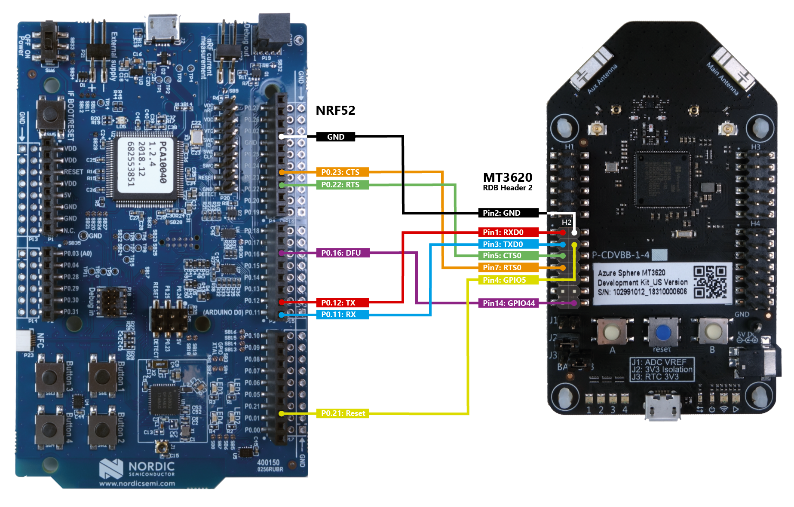
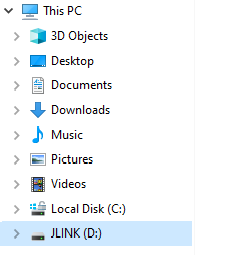
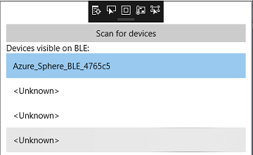
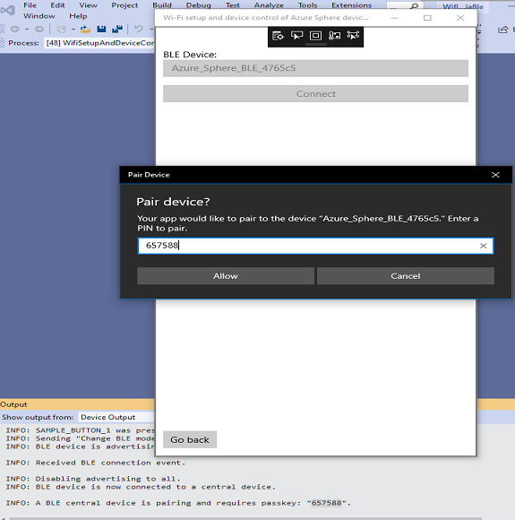
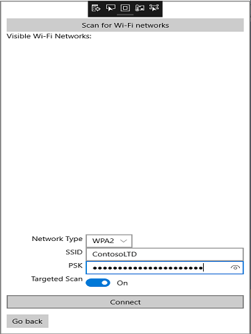
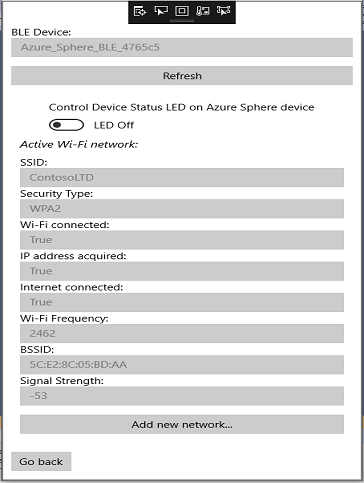
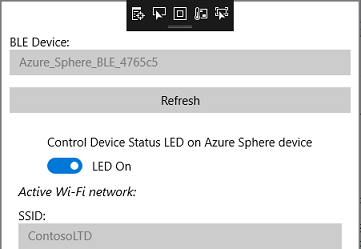

# Sample: Wi-Fi setup and device control via BLE

This reference solution demonstrates how you might [complete Wi-Fi setup and device control](https://docs.microsoft.com/azure-sphere/network/wifi-including-ble) of an Azure Sphere-based device through Bluetooth Low Energy (BLE) using a companion app on a mobile device. This solution utilizes a Nordic nRF52 Development Kit to provide BLE connectivity over UART to the Azure Sphere MT3620 board, and a Windows 10 app to illustrate the companion user experience.

The solution consists of three applications:

- An Azure Sphere application
- An example user companion (Windows 10) application
- An nRF52 application

The nRF52 application forwards messages between the Windows 10 application (communicating via BLE) and the Azure Sphere application (communicating via UART).
If using a different BLE part, you should be able to run both the Azure Sphere and Windows applications unchanged. However, you would need to modify or rewrite the nRF52 application for your BLE platform.

For more information on the design of this sample solution see the [Design overview](./design-overview.md) article.

The sample uses the following Azure Sphere libraries.

| Library | Purpose |
|---------|---------|
| [gpio](https://docs.microsoft.com/azure-sphere/reference/applibs-reference/applibs-gpio/gpio-overview) | Manages the LED 2 on the device. |
| [log](https://docs.microsoft.com/azure-sphere/reference/applibs-reference/applibs-log/log-overview) | Displays messages in the Device Output window during debugging. |
| [networking](https://docs.microsoft.com/azure-sphere/reference/applibs-reference/applibs-networking/networking-overview) | Manages the network configuration of the device. |
| [uart](https://docs.microsoft.com/azure-sphere/reference/applibs-reference/applibs-uart/uart-overview) | Manages communication with the Nordic nRF52 Development Kit. |
| [wificonfig](https://docs.microsoft.com/azure-sphere/reference/applibs-reference/applibs-wificonfig/wificonfig-overview) | Manages Wi-Fi configuration on the device. |

## Contents

| File/folder                | Description |
|----------------------------|-------------|
| `design-overview.md`       | Overview of the design of this sample application. |
| `README.md`                | This README file. |
| `AzureSphere_HighLevelApp` | Folder containing the configuration files, source code files, hardware defintions, and other files needed for the high-level application. |
| `common`                   | Folder containing common header files and source code files. |
| `Nrf52App`                 | Folder containing the configuration files, source code files, and other files needed for the nRF52 application. |
| `WindowsApp`               | Folder containing the configuration files, source code files, and other files needed for the Windows 10 application. |

## Prerequisites

This sample requires the following items:

- Azure Sphere SDK version 22.02 or above. At the command prompt, run **azsphere show-version** to check. Install [the Azure Sphere SDK](https://docs.microsoft.com/azure-sphere/install/install-sdk) if needed.
- An [Azure Sphere development board](https://aka.ms/azurespheredevkits) that supports the [Sample Appliance](../../HardwareDefinitions) hardware requirements.

   **Note:** By default, the sample targets the [Reference Development Board](https://docs.microsoft.com/azure-sphere/hardware/mt3620-reference-board-design) design, which is implemented by the Seeed Studios MT3620 Development Board. To build the sample for different Azure Sphere hardware, change the value of the TARGET_HARDWARE variable in the `CMakeLists.txt` file. For detailed instructions, see the [Hardware Definitions README](../../HardwareDefinitions/README.md) file.

- Nordic nRF52 BLE development board

   **Note:** The nRF52 board is not required. You can adapt this solution to run on a board based on another BLE part. Software changes will be required and the BLE part you choose must support communication over UART.

- Jumper wires to connect the boards to each other
- Two free USB ports to connect both boards to your computer
- BLE support on your computer, either through internal hardware or external hardware such as a USB BLE dongle
- Windows 10 Fall Creators edition (1709) or newer, which is required for its updated BLE support
- Developer Mode on Windows, which enables installation of the sample Windows 10 companion app

## Setup

First, obtain the sample. Next, set Windows to use Developer Mode, connect the Azure Sphere MT3620 to the Nordic nRF52, and install the nRF52 application on the nRF52 Development Kit.

### Obtain the sample

1. Clone the [Azure Sphere samples](https://github.com/Azure/azure-sphere-samples) repository and find the *WifiSetupAndDeviceControlViaBle* sample in the *WifiSetupAndDeviceControlViaBle* folder or download the zip file from the [Microsoft samples browser](https://docs.microsoft.com/samples/azure/azure-sphere-samples/wifi-setup-via-ble/).

### Set Windows to use Developer Mode

1. In Settings, click **Update & Security**, and then click **For Developers**.
1. Under **Use developer features** select **Developer mode**.

### Connect the Azure Sphere MT3620 to the Nordic nRF52

Make the following connections between the nRF52 and MT3620 dev boards using the jumper wires:

- nRF52 RX: P0.11 to MT3620 UART0 TX: Header 2 (lower left) Pin 3
- nRF52 TX: P0.12 to MT3620 UART0 RX: Header 2 (lower left) Pin 1
- nRF52 CTS: P0.23 to MT3620 UART0 RTS: Header 2 (lower left) Pin 7
- nRF52 RTS: P0.22 to MT3620 UART0 CTS: Header 2 (lower left) Pin 5
- nRF52 Reset: P0.21 to MT3620 GPIO5: Header 2 (lower left) Pin 4
- nRF52 DFU: P0.16 to MT3620 GPIO44: Header 2 (lower left) Pin 14
- nRF52 Ground: GND to MT3620 GND: Header 2 (lower left) Pin 2

   Refer to the following graphic for details.

   

### Install the nRF52 application on the nRF52 Development Kit

1. Connect the nRF52 developer board to your computer using USB. After connection, the nRF52 displays a JLINK removable drive in Windows.

     

1. Find the nRF52 binary at `WifiSetupAndDeviceControlViaBle/Binaries/pca10040_Softdevice_WifiSetupAndDeviceControlViaBleApp.hex`.
1. Copy this file to the root of the JLINK removable drive. After the file is copied, the nRF52 restarts automatically and runs the sample application.

## Build and run the sample

To build and run the Azure Sphere app, follow the instructions in [Build a sample application](../../BUILD_INSTRUCTIONS.md).

### Observe the output

1. Wait for notification that the nRF52 app is active and advertising its availability to connect to known ("bonded") BLE devices. LED 2 on the MT3620 will light up blue when this is complete.
1. Note the randomly generated device name in the Output window in Visual Studio. You will use this name to identify the BLE connection in a subsequent step. The name is similar to *Azure_Sphere_BLE_123456*.

    ```
              .
              .
    Opening SAMPLE_BUTTON_1 as input
    Opening SAMPLE_BUTTON_2 as input.
    Opening SAMPLE_RGBLED_BLUE
    Opening SAMPLE_RGBLED_RED
    Opening SAMPLE_RGBLED_GREEN
    Opening SAMPLE_DEVICE_STATUS_LED
    INFO: Sending "Initialize BLE device" request with device name set to: Azure_Sphere_BLE_4765c5.
              .
              .
    ```

### Run the Windows 10 companion app on your PC

This Windows app allows you to use your development computer to simulate a mobile app that uses the BLE connection to the nRF52 to configure Wi-Fi setup and device control on the Azure Sphere device. It provides reference code that can be ported to other platforms.

1. Start a separate instance of Visual Studio.
1. Open `WifiSetupAndDeviceControlViaBle/WindowsApp/WifiSetupAndDeviceControlViaBle.sln`.
1. Build and debug the application (F5). If this is your first time developing Universal Windows Platform (UWP) applications on this computer, you may be required to download the Universal Windows Platform Development workload.

### Configure the Wi-Fi settings

**Note:** If the nRF52 was previously paired with your Windows device and that pairing was removed from the Windows device,
press and hold button A on the MT3620 board for 3 seconds before trying to pair the nRF52 with your Windows device again. This will remove the existing pairing from the nRF52 device.

1. Press button A on the MT3620 board. The Azure Sphere app requests that the nRF52 app advertise its availability to connect to a new BLE device for the next 60 seconds. LED 2 on the MT3620 should light up red.
1. In the Windows 10 companion app, click the **Scan for devices** button at the top to scan for BLE devices.
1. Select your device from the list. It has the name you noted earlier in the [Observe the output:](#observe-the-output) step.

   

1. Click **Connect**. LED 2 on the MT3620 lights up green to indicate a BLE device (the Windows 10 computer) is connected to the nRF52, and a passkey appears in the Output window in the Visual Studio instance for the Azure Sphere app. The nRF52 doesn't yet trust this BLE device.
1. When prompted, type the passkey you noted earlier. When the connection is confirmed, the nRF52 app will remember the Windows 10 computer as a known and trusted BLE device and allow it to read and write values over BLE. The Windows 10 companion app will now be able to read and display the current Wi-Fi status on the MT3620.

    

1. If there is no active Wi-Fi network, click **Add new network...**. If an active network is present, press and hold button B on the MT3620 dev board for at least three seconds to delete it.
1. Click **Scan for Wi-Fi networks**. It may take a few seconds to display a complete list of networks that the Azure Sphere device can see. Only open and WPA2 networks are supported.
1. If you are connecting to an open network, simply click **Connect**. If the network is secured, a prompt appears for a network password. Enter the password and then click **Connect**.
If you are connecting to a hidden network, ensure that the **Target Scan** toggle switch is set to on. Enter the SSID and the PSK (if a WPA2 network) and then click **Connect**.

   

1. Observe that the current Wi-Fi status is displayed again and refreshed every 5 seconds. You should see the Azure Sphere device connect to the new Wi-Fi network successfully.
If you are running the Azure Sphere and Windows apps in debug mode in Visual Studio, the Output window should show the protocol communications they are sending and receiving. If you do not see the messages, check that the wiring between the boards is correct, or reset the boards and restart the debugging session.

   

### Monitor and control device behavior

1. Press button B on the MT3620 dev board. Observe that the Device Status LED on the board (LED1 on the MT3620 RDB) lights up red, and the LED status indicator on the device status screen of the companion app changes from **LED off** to **LED on**.

    

1. Press the Device Status LED control switch on the device status screen. Observe that the LED status indicator changes from **LED On** to **LED Off** and the device status LED on the board turns off.

**Note:** The connection between the Windows device and the nRF52 device can be lost if the MT3620 dev board is restarted while the Windows application is running. If this occurs restart the Windows application and reconnect to the nRF52 device.

### Manage known companion devices

1. Close the Windows 10 companion app. The LED 2 on the MT3620 lights up blue to indicate the nRF52 has no connected device and is advertising only to known ("bonded") BLE devices.
1. Restart the Windows 10 companion app and connect to the nRF52 BLE device again. Observe the LED 2 on the MT3620 board lights up green again. This time there is no need to press the button or enter the passkey.
1. Press button A on the MT3620 board and hold it down for 3 seconds. The Azure Sphere app requests that the nRF52 forget all known devices. The LED turns blue (advertising only to known devices), although in practice this means that no device can currently connect because all known devices have just been deleted.
1. Delete the pairing for the nRF52 in your Windows Bluetooth settings so that you can create a new bond.
1. Repeat the steps in **Configure the Wi-Fi Settings** section above, beginning with a short press of button A, to enable the companion app to connect again.
1. Repeat these steps again on another computer to add a second companion app. However, when you press button A to add the second companion, the first app is disconnected; while the nRF52 can trust ("bond") multiple BLE devices, only one device can be connected at a time.
1. Note that if the nRF52 app is redeployed directly from the computer (see **Build your own solution** below for instructions) then all known companion devices are forgotten. If the nRF52 app is redeployed via the [External MCU update sample](../ExternalMcuUpdate/README.md), then all companion devices are remembered.

## Build your own solution

To edit and re-deploy the Azure Sphere and Windows apps, use Visual Studio as in the steps above.

To edit and re-deploy the nRF52 app:

1. Download and install [SEGGER Embedded Studio](https://www.segger.com/downloads/embedded-studio). [Download the 32-bit version](https://www.segger.com/downloads/embedded-studio/EmbeddedStudio_ARM_Win_x86), not the 64-bit version. Ensure that you are licensed to use it for your purposes. In Oct. 2018, we were able to [obtain the license for free because we were developing for NRF52](https://www.segger.com/news/segger-embedded-studio-ide-now-free-for-nordic-sdk-users/).
1. Install (download and extract) the [Nordic NRF5 SDK V15.2](https://www.nordicsemi.com/eng/Products/Bluetooth-low-energy/nRF5-SDK#Downloads)
1. Edit the nRF52 sample app so you can build it against your SDK:
    - Use a text editor to open `WifiSetupAndDeviceControlViaBle\Nrf52App\pca10040\s132\ses\ble_app_uart_pca10040_s132.emProject`.
    - Set the SDK_ROOT variable in this file to point to the root directory of your Nordic SDK install. Specifically, replace the words "CHANGE_THIS_TO_YOUR_NORDIC_SDK_PATH" with the correct path, changing any backslashes ("\") to forward slashes ("/") in the path. For example: `macros="SDK_ROOT=C:/Users/ExampleUser/source/nRF5_SDK_15.2.0_9412b96;…"`.
1. Open this .emProject file in the Segger IDE.
1. Build and debug the application (F5).

In production solutions, it is highly recommended to enable remote update of this firmware. Please see the [reference solution for external MCU update](https://github.com/Azure/azure-sphere-samples/tree/main/Samples/ExternalMcuUpdate) for more details.

## Troubleshooting the nRF52

If you encounter a situation where the nRF52 BLE board seems to be unresponsive, try the following.

First, check that the JLINK drive is displayed in Windows Explorer. If the JLINK drive does appear, reset the nRF52 board.

If the JLINK drive does not appear in Windows Explorer, try the following:

1. On the nRF52 board, hold the reset button while switching the power off and then back on. This should load the Jlink bootloader and a BOOTLOADER drive should be displayed in Windows Explorer. LED 5 should blink.
1. Download the [Jlink bootloader](https://www.nordicsemi.com/Software-and-Tools/Development-Kits/nRF52-DK/Download#infotabs) (on the Downloads tab, file J-Link OB-SAM3U128-V2-NordicSemi 170724.bin) from NordicSemi.com.
1. Copy the Jlink OB-SAM3U128-V2-NordicSemi 170724.bin file to the BOOTLOADER drive.
1. Turn off the power on the nRF52 board and then turn the power on. Check that the JLINK drive appears in Windows Explorer. LED 5 should be lit (no longer blinking).

If these steps don't resolve the problem, contact Nordic for more help.

## Next steps

- For an overview of Azure Sphere, see [What is Azure Sphere](https://docs.microsoft.com/azure-sphere/product-overview/what-is-azure-sphere).
- To learn more about Azure Sphere application development, see [Overview of Azure Sphere applications](https://docs.microsoft.com/azure-sphere/app-development/applications-overview).
- For network troubleshooting, see [Troubleshoot network problems](https://docs.microsoft.com/azure-sphere/network/troubleshoot-network-problems).
