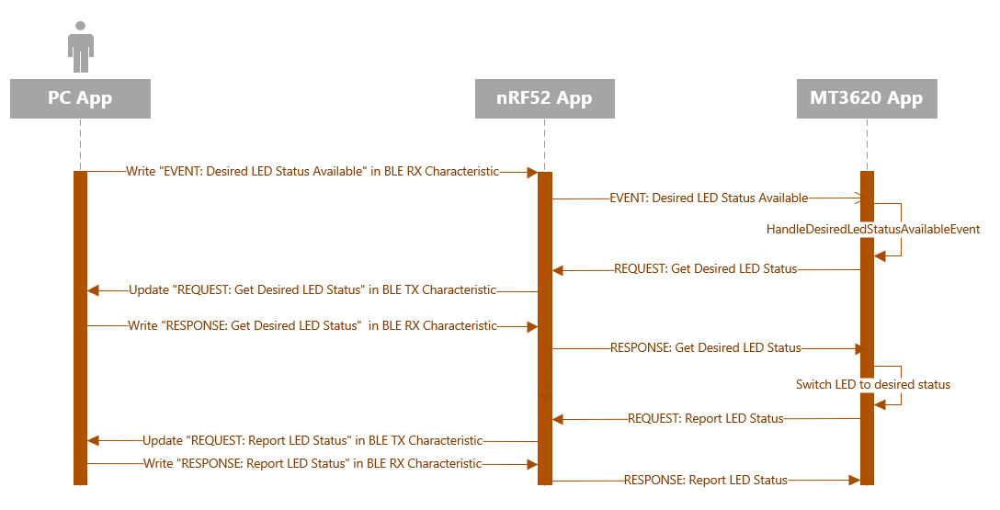

# Sample: Wi-Fi setup and device control via BLE - Design overview

The Azure Sphere application:

- Uses a custom, extensible message-passing protocol to communicate with both the nRF52 Application (via UART) and the Windows Application (via UART and then Bluetooth LE (BLE))
- Instructs the nRF52 application whether to allow new connections from unknown devices, what device name to use, whether to delete all BLE bonds, and what passkey to require. Note: whenever the Azure Sphere app restarts, it may be desirable for it to provide the same device name to the nRF52. This can be done by storing the name, when it is first generated, in [Mutable storage](https://docs.microsoft.com/azure-sphere/app-development/storage#using-mutable-storage). 
- Communicates with the Windows companion app to send and receive messages — see Protocol Specification below
- Manages the state of LED 2:
    - Off: nRF52 is not advertising (only seen briefly on app startup, unless nRF device is not connected properly)
    - Red: nRF52 is advertising and open to bonding for all devices
    - Blue: nRF52 is advertising only for existing bonded devices
    - Green: nRF52 is connected to a remote device and is not currently advertising
    - Yellow: nRF52 is uninitialized
    - Magenta: nRF52 is in an error state
- Manages the functionality of the MT3620 buttons:
    - Short press of button A: MT3620 instructs nRF52 that a new BLE bond to be formed (assuming the bonding device can provide the passkey). This has the side-effect of disconnecting any BLE device currently connected.
    - Long press of button A: MT3620 instructs nRF52 to delete all bonds. This disconnects any BLE device that is connected.
    - Short press of button B: MT3620 toggles the LED 3 status. If a BLE device is connected through the nRF52, then it is notified of the LED 3 status being changed.
    - Long press of button B: MT3620 deletes all of its stored Wi-Fi network information and disconnects from any currently connected Wi-Fi networks.

The Nordic nRF52 application:

- Sets up BLE under the control of the Azure Sphere application
- Forwards messages between the Windows application (communicating via BLE) and the Azure Sphere application (communicating via UART)

The Windows application:

- Uses the Universal Windows Platform (UWP)
- Uses a portable class library (PCL)-based DLL to enable connection to an MT3620 device via BLE

## Extensible Protocol

This reference solution includes a custom, extensible message-passing protocol between the MT3620, the nRF52, and the user's BLE device. The protocol is transported via UART from the MT3620 to the nRF52. The nRF52 application looks for messages using the *BLE Control* category, and responds to those directly. For all other messages, the nRF52 forwards those messages over BLE to a connected and bonded BLE device, if present. Similarly, the nRF52 forwards any incoming message from a remote BLE device to the nRF52. The communication over BLE uses a pair of BLE characteristics "TX" and "RX" - this places a size limit on the messages. Those characteristics are only readable and writable by a bonded BLE device, which is important for secured communication.

The protocol is designed to be extensible, by adding or modifying message types in an existing category, or by introducing new categories of message.

The protocol definitions and key sequences of messages are detailed further below.

### Requests, responses and events

The protocol is based around a simple request/response/event pattern. The Azure Sphere application issues requests, the nRF52 (or the remote BLE device, communicating via the nRF52) responds. These requests and responses have a custom set of parameters for each message type. The Azure Sphere application guarantees to only issue one request at a time, unless there is a timeout; this simplifies the logic required on the nRF52 and the remote device. The nRF52 and remote device can signal asynchronous events with an "event" message at any time, these events do not have parameters, but once the protocol is "idle" (i.e. after any outstanding request has had its response), the Azure Sphere application issues further requests/responses as necessary to handle the event.

**Request format**

**Response format**

**Event format**

**Note:** The protocol defined for this solution uses little endian serialization (also known as LSB).

### Definitions

- **Preamble:** 0x22,0xB5,0x58,0xB9
- **Length:** uint16 - The message length excluding the preamble and length fields
- **Sequence number:** uint16 - The response uses the corresponding request's sequence number
- **Response result:** uint8 - 0 indicates success, >0 indicates error code 
- **Message type:**

    <table>
    <tr>
    <td>Request</td>
    <td>0x01</td>
    </tr>
    <tr>
    <td>Response</td>
    <td>0x02</td>
    </tr>
    <tr>
    <td>Event</td>
    <td>0x03</td>
    </tr>
    </table>

- **Category IDs:**

The requests/responses/events are divided into categories each handled by a different source file. This enables different functionalities to be implemented in a modular way on top of the protocol, for example Wi-Fi setup and device control.

    <table>
    <tr>
    <td>BLE Control</td>
    <td>0x0001</td>
    </tr>
    <tr>
    <td>Wi-Fi Control</td>
    <td>0x0002</td>
    </tr>
    <tr>
    <td>Local Control</td>
    <td>0x0003</td>
    </tr>
    </table>

#### BLE Control

- **BLE Control Request and Response IDs:**

    <table>
    <tr>
    <td>Initialize BLE device</td>
    <td>0x0001</td>
    </tr>
    <tr>
    <td>Set Passkey</td>
    <td>0x0002</td>
    </tr>
    <tr>
    <td>Change BLE Advertising mode</td>
    <td>0x0003</td>
    </tr>
    <tr>
    <td>Delete all BLE bonds</td>
    <td>0x0004</td>
    </tr>
    </table>

#### Wi-Fi Control

- **Wi-Fi Control Request and Response IDs:**

    <table>
    <tr>
    <td>Get New Wi-Fi Details</td>
    <td>0x0001</td>
    </tr>
    <tr>
    <td>Set Wi-Fi Scan Results Summary</td>
    <td>0x0002</td>
    </tr>
    <tr>
    <td>Change BLE Advertising Mode</td>
    <td>0x0003</td>
    </tr>
    <tr>
    <td>Set Wi-Fi Operation Result</td>
    <td>0x0004</td>
    </tr>
    <tr>
    <td>Set Next Wi-Fi Scan Result</td>
    <td>0x0005</td>
    </tr>
    </table>

- **Wi-Fi Control Event IDs:**

    <table>
    <tr>
    <td>New Wi-Fi Details Available</td>
    <td>0x0001</td>
    </tr>
    <tr>
    <td>Wi-Fi Status Needed</td>
    <td>0x0002</td>
    </tr>
    <tr>
    <td>Wi-Fi Scan Needed</td>
    <td>0x0003</td>
    </tr>
    </table>

- **Wi-Fi Security Type:**

    <table>
    <tr>
    <td>Unknown</td>
    <td>0x00</td>
    </tr>
    <tr>
    <td>Open</td>
    <td>0x01</td>
    </tr>
    <tr>
    <td>WPA2</td>
    <td>0x02</td>
    </tr>
    </table>

#### Local Control

- **Local Control Request and Response IDs:**

    <table>
    <tr>
    <td>Get Desired LED Status</td>
    <td>0x0001</td>
    </tr>
    <tr>
    <td>Report LED Status</td>
    <td>0x0002</td>
    </tr>
    </table>

- **Local Control Event IDs:**

    <table>
    <tr>
    <td>Desired LED Status Available</td>
    <td>0x0001</td>
    </tr>
    <tr>
    <td>LED Status Needed</td>
    <td>0x0002</td>
    </tr>
    </table>

### BLE Control scenarios

The following shows the sequences of BLE control operations implemented by the reference solution.

#### Initialize BLE device when BLE device comes up

- Request parameter data format:

    <table>
    <tr>
    <td>Device Name Length  (1 byte)</td>
    <td>Reserved  (3 bytes)</td>
    <td>Device Name  (31 bytes)</td>
    <td>Reserved  (1 byte)</td>
    </tr>
    </table>

- Response data format:

    \<\<empty\>\>, the result is in the *Response Result* field of the Response header

- Sequence diagram:

    

#### Change BLE Advertising Mode

- Request Parameter Data Format:

    <table>
    <tr>
    <td>BLE Advertising Mode  (1 byte)</td>
    <td>Reserved  (3 bytes)</td>
    </tr>
    </table>

    - Not accepting connections: 0x00
    - Accept connections from bonded devices only: 0x01
    - Accept connections from any device: 0x02

- Response Data Format:

    \<\<empty\>\>, the result is in the *Response Result* field of the Response header

- Sequence diagram:

    

    **Note:** If a connect event happens while in "Accept from any" mode, then automatically enter "Accept from bonded only" mode

#### Delete all BLE bonds

- Request Parameter Data Format:

    \<\<empty\>\>

- Response Data Format:

    \<\<empty\>\>, the result is in the *Response Result* field of the Response header

- Sequence diagram:

    

    **Note:** this will result in Disconnect event if there is a currently connected device.

#### BLE Device Connect event

- Sequence diagram:

    

#### BLE Device Disconnect event

- Sequence diagram:

    

### Wi-Fi Setup Scenarios

The following shows the sequences of Wi-Fi setup operations implemented by the reference solution.

#### Add Wi-Fi Network Scenario

- Get New Wi-Fi Details Request Parameter Data Format:

    \<\<empty\>\>

- Get New Wi-Fi Details Response Data Format: 

    <table>
    <tr>
    <td>Security Type  (1 byte)</td>
    <td>SSID Length  (3 bytes)</td>
    <td>Reserved  (2 bytes)</td>
    <td>SSID  (32 bytes)</td>
    <td>Psk Length  (1 byte)</td>
    <td>Reserved  (3 bytes)</td>
    <td>Psk  (64 bytes)</td>
    </tr>
    </table>

    SSID: byte array up to size 32

    Psk: either a passphrase of 8 to 63 ASCII characters or 64 bytes

- Set Wi-Fi Operation Result Request Parameter Data Format: 

    <table>
    <tr>
    <td>Operation Result  (1 byte)</td>
    <td>Reserved  (3 bytes)</td>
    </tr>
    </table>

    Operation result: unint8, 0 indicates success, >0 indicates error

- Set Wi-Fi Operation Result Response Data Format: 

    \<\<empty\>\>, the result is in the *Response Result* field of the Response header

- Sequence diagram:

    

#### Get Wi-Fi Status scenario

- Request Parameter Data Format:

    <table>
    <tr>
    <td>Wi-Fi connection status  (1 byte)</td>
    <td>Wi-Fi Signal Level  (1 byte)</td>
    <td>Security Type  (1 byte)</td>
    <td>SSID Length  (1 byte)</td>
    <td>SSID  (32 bytes)</td>
    <td>Wi-Fi Frequency  (4 bytes)</td>
    <td>BSSID  (6 bytes)</td>
    <td>Reserved  (2 bytes)</td>
    </tr>
    </table>

    - Wi-Fi connection status: uint8 (0 bit: Is Wi-Fi connected, 1 bit: Is connected to Internet)
    - Wi-Fi Frequency: unit32 using MHz as unit
    - Wi-Fi Signal Level: RSSI range between (-128 to 0) 
    - BSSID: 6 bytes array, with a byte per octet.  [byte 0]:[byte 1]:[byte 2]:[byte 3]:[byte 4]:[byte 5] 

- Sequence diagram

    

#### Get Wi-Fi Scan Results scenario

- Set WiFi Scan Results Summary Request Parameter Data Format: 

    <table>
    <tr>
    <td>Scan Result   (1 byte)</td>
    <td>Total Network Count  (1 byte)</td>
    <td>Reserved  (2 bytes)</td>
    <td>Total Results Size  (4 bytes)</td>
    </tr>
    </table>

    - Scan Result: int8 (0 for success, >0 for error code) 
    - Total Network count: The number of networks found from scan 
    - Total Results Size: The number of bytes needed to store scan results

- Set Wi-Fi Scan Results Summary Response Data Format: 

    \<\<empty\>\>, the result is in the *Response Result* field of the Response header

- Set next Wi-Fi Scan Result Request Parameter Data Format: 

    <table>
    <tr>
    <td>Security Type  (1 byte)</td>
    <td>Wi-Fi Signal Level  (1 byte)</td>
    <td>SSID Length  (1 byte)</td>
    <td>Reserved  (1 byte)</td>
    <td>SSID  (32 bytes)</td>
    </tr>
    </table>

- Set next Wi-Fi Scan Result Response Data Format: 

    \<\<empty\>\>, the result is in the *Response Result* field of the Response header

- Sequence diagram:

    

### Device Control Scenarios

#### Desired LED status available scenario (triggered by Companion App)

- Get Desired LED Status Request Parameter Data Format: 

    \<\<empty\>\>

- Get Desired LED Status Response Data Format: 

    <table>
    <tr>
    <td>LED Status  (1 byte)</td>
    <td>Reserved  (3 bytes)</td>
    </tr>
    </table>

    LED Status: 0x00 for off, 0x01 for on

- Sequence diagram:

    

#### Report LED status scenario (triggered by Button Press on MT3620)

-  Report LED Status Request Parameter Data Format:

    <table>
    <tr>
    <td>LED Status  (1 byte)</td>
    <td>Reserved  (3 bytes)</td>
    </tr>
    </table>

    LED Status: 0x00 for off, 0x01 for on

- Report LED Status Response Data Format:

    \<\<empty\>\>, the result is in the *Response Result* field of the Response header

- Sequence diagram:

    

