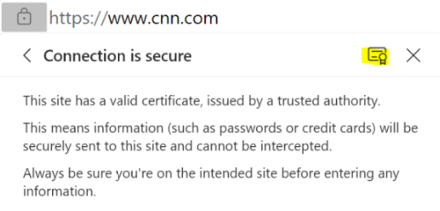

# Sample: WolfSSL high-level app

This sample application demonstrates how to use the wolfSSL API with Azure Sphere to download a web page over HTTPS. For details about using the wolfSSL library with Azure Sphere, see [Use wolfSSL for TLS connections](https://learn.microsoft.com/azure-sphere/app-development/wolfssl-tls).

The sample has four stages, each of which is handled asynchronously:

1. It connects to `example.com`port 443 (HTTPS) using a Linux AF_INET socket.
1. It uses wolfSSL to perform the TLS handshake.
1. It sends an HTTP GET request to retrieve a web page.
1. It reads the HTTP response and prints it to the console.

The sample uses the following Azure Sphere libraries.

| Library | Purpose |
|---------|---------|
| [eventLoop](https://learn.microsoft.com/azure-sphere/reference/applibs-reference/applibs-eventloop/eventloop-overview) | Invokes handlers for timer events. |
| [log](https://learn.microsoft.com/azure-sphere/reference/applibs-reference/applibs-log/log-overview)     | Displays messages in the **Device Output** window during debugging. |
| [networking](https://learn.microsoft.com/azure-sphere/reference/applibs-reference/applibs-networking/networking-overview) | Gets the network connectivity status. |
| [storage](https://learn.microsoft.com/azure-sphere/reference/applibs-reference/applibs-storage/storage-overview)    | Gets the path to the certificate file that is used to authenticate the server. |
| [wolfssl](https://learn.microsoft.com/azure-sphere/app-development/wolfssl-tls) | Handles the SSL handshake. |

## Contents

| File/folder           | Description |
|-----------------------|-------------|
| `app_manifest.json`   | Application manifest file, which describes the resources. |
| `CMakeLists.txt`      | CMake configuration file, which Contains the project information and is required for all builds. |
| `CMakePresets.json`   | CMake presets file, which contains the information to configure the CMake project. |
| `launch.vs.json`      | JSON file that tells Visual Studio how to deploy and debug the application. |
| `LICENSE.txt`         | The license for this sample application. |
| `main.c`              | Main C source code file. |
| `README.md`           | This README file. |
| `.vscode`             | Folder containing the JSON files that configure Visual Studio Code for deploying and debugging the application. |

## Prerequisites

The sample requires the following hardware:

- An [Azure Sphere development board](https://aka.ms/azurespheredevkits)

## Setup

Complete the following steps to set up this sample.

1. Ensure that your Azure Sphere device is connected to your computer, and your computer is connected to the internet.
1. Ensure that you have Azure Sphere SDK version 24.03 or above. At the command prompt, run `az sphere show-sdk-version` to check. Upgrade the Azure Sphere SDK for [Windows](https://learn.microsoft.com/azure-sphere/install/install-sdk) or [Linux](https://learn.microsoft.com/azure-sphere/install/install-sdk-linux) as needed.
1. Ensure that the [Azure CLI](https://learn.microsoft.com/cli/azure/install-azure-cli) is installed. At a minimum, the Azure CLI version must be 2.45.0 or later.
1. Install the [Azure Sphere extension](https://learn.microsoft.com/azure-sphere/reference/cli/overview?view=azure-sphere-integrated).
1. Enable application development, if you have not already done so, by entering the `az sphere device enable-development` command in the [command prompt](https://learn.microsoft.com/azure-sphere/reference/cli/overview?view=azure-sphere-integrated).
1. Clone the [Azure Sphere samples](https://github.com/Azure/azure-sphere-samples) repository and find the *WolfSSL_HighLevelApp* sample in the *WolfSSL* folder or download the zip file from the [Microsoft samples browser](https://learn.microsoft.com/samples/azure/azure-sphere-samples/wolfssl/).

1. Note that the sample can connect only to websites listed in the **AllowedConnections** capability of the [app_manifest.json](https://learn.microsoft.com/azure-sphere/app-development/app-manifest) file. The sample is set up to connect to the website `example.com`:

    ```json
    "Capabilities": {
        "AllowedConnections": [ "example.com" ],
      },
    ```

    You can revise the sample to connect to a different website for downloading, as described in the [Rebuild the sample to download from a different website](#rebuild-the-sample-to-download-from-a-different-website) section of this README.

1. Configure networking on your device. You must either [set up WiFi](https://learn.microsoft.com/azure-sphere/install/configure-wifi#set-up-wi-fi-on-your-azure-sphere-device) or [set up Ethernet](https://learn.microsoft.com/azure-sphere/network/connect-ethernet) on your development board, depending on the type of network connection you are using.

## Build and run the sample

To build and run this sample, follow the instructions in [Build a sample application](../../../BUILD_INSTRUCTIONS.md).

This sample sends an HTTP GET request to retrieve a web page and prints the HTTP response to the console. If an error occurs, use the [wolfSSL manual](https://www.wolfssl.com/docs/wolfssl-manual/) to interpret error codes.

## Rebuild the sample to download from a different website

To download data from a website other than the default website, you'll need to get the root CA certificate from the website, modify the sample to use the new website and its certificate, and build and run the modified sample.

Complete the steps described in the following sections.

### Download the root CA certificate

If the website uses SSL/TLS, you may need to use a different root CA certificate. To download the certificate from the website, the following steps are provided for users of recent Edge or Chrome(ium) browsers:

1. Open the browser and click the **Secure** icon, which is a padlock in the address bar.
1. Select **Connection is secure**; then click the certificate icon (highlighted yellow), if using Edge, otherwise select **Certificate is valid** (not pictured), if using Chrome(ium):

    

1. Select the **Details** tab.
1. Select the top certificate in the hierarchy and then select **Export**.
1. In the **Save As** window, select the **Base64-encoded ASCII, single certificate (*.pem;*.crt)** option, from the **Save as type** drop-down.
1. Type the file name to which to export the certificate and then click **Save**.
1. Rename the downloaded certificate file to have the .pem extension.

### Modify the sample to use the new website

Complete the following steps to modify the sample to use the new website.

1. In the `app_manifest.json` file, add the hostname of the new website to the **AllowedConnections** capability. For example, the following adds `Contoso.com` to the list of allowed websites.

    ```json
    "Capabilities": {
        "AllowedConnections": [ "example.com", "Contoso.com"],
      },
    ```

    **Note:** Sometimes there may be more than one hostname for the same website. For example, a website may have the hostnames `www.contoso.com` and `contoso.com`, both of which will resolve to the same IP address. In this case, you must choose which hostname to use and use it consistently throughout your code.

1. Open `main.c`, go to the following statement, and change **SERVER_NAME** to the hostname of the website you want to connect to, **PORT_NUM** to the port number and **certPath[]** to the certificate path.

    Ensure that your server name and **AllowedConnections** hostname are identical. For example, if you specified `contoso.com` in **AllowedConnections**, you must also specify `contoso.com` (not `www.contoso.com`) for the server name:

     ```c
     #define SERVER_NAME "example.com"
     static const uint16_t PORT_NUM = 443;
     static const char certPath[] = "certs/DigiCertGlobalRootCA.pem";
     ```

1. Update the sample to use a different root CA certificate, if necessary:

     1. Put the trusted root CA certificate in the `certs/` folder (and optionally remove the existing DigiCert Global Root CA certificate).
     1. Update `CMakeLists.txt` to include the new trusted root CA certificate in the image package, instead of the DigiCert Global Root CA certificate. Pass the new the certificate file name to **azsphere_target_add_image_package**.
     1. In `main.c`, pass the certificate file name to **Storage_GetAbsolutePathInImagePackage**.
     1. In `main.c`, the function `HandleConnection` makes a call to `wolfSSL_UseSNI`, this may be needed if the website hosts multiple SSL sites on the same IP address, the call can be removed if this is not the case - More information on Server Name Indication can be found [here](https://en.wikipedia.org/wiki/Server_Name_Indication)

1. If the website uses TLS version 1.2, use **wolfTLSv1_2_client_method** instead of **wolfTLSv1_3_client_method** to initialize the pointer to the **WOLFSSL_METHOD** structure.

    In `main.c`, find the following line of code:

    ```c
    WOLFSSL_METHOD *wolfSslMethod = wolfTLSv1_3_client_method();
    ```

    Change the code to use **wolfTLSv1_2_client_method** as shown in the following code:

    ```c
    WOLFSSL_METHOD *wolfSslMethod = wolfTLSv1_2_client_method();
    ```

    **Note:** Exit 17 will be returned if the TLS handshake fails. A possible cause could be an incorrect TLS version.

### Build and run the sample modified to use the new website

To build and run the modified sample, follow the instructions in the [Build and run the sample](#build-and-run-the-sample) section of this README.

## Rebuild the sample to use a different protocol

To rebuild the sample to use a protocol other than HTTP, complete the following steps:

1. Modify the sample by replacing the **WriteData** and **ReadData** functions, which send the HTTP request and read the response, with the appropriate logic for another protocol.
1. Follow the instructions in the [Build and run the sample](#build-and-run-the-sample) section of this README.

## Rebuild the sample to use SNI with wolfSSL

In this sample, wolfSSL is used to perform the TLS handshake. TLS supports server name indication (SNI), which is useful when a server hosts multiple websites. The **wolfSSL_CTX_UseSNI** function is used to perform a TLS handshake with a server that uses SNI.

To rebuild the sample to use SNI with wolfSSL, complete the following steps:

1. Modify the sample to call **wolfSSL_CTX_UseSNI** after allocating the context with **wolfSSL_CTX_new**. For more information, see [Using Server Name Indication (SNI) with wolfSSL](https://www.wolfssl.com/using-server-name-indication-sni-with-wolfssl/).
1. Follow the instructions in the [Build and run the sample](#build-and-run-the-sample) section of this README.

## Next steps

- For an overview of Azure Sphere, see [What is Azure Sphere](https://learn.microsoft.com/azure-sphere/product-overview/what-is-azure-sphere).
- To learn more about Azure Sphere application development, see [Overview of Azure Sphere applications](https://learn.microsoft.com/azure-sphere/app-development/applications-overview).
- For network troubleshooting, see [Troubleshoot network problems](https://learn.microsoft.com/azure-sphere/network/troubleshoot-network-problems).
